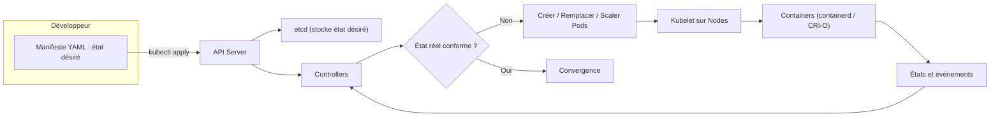
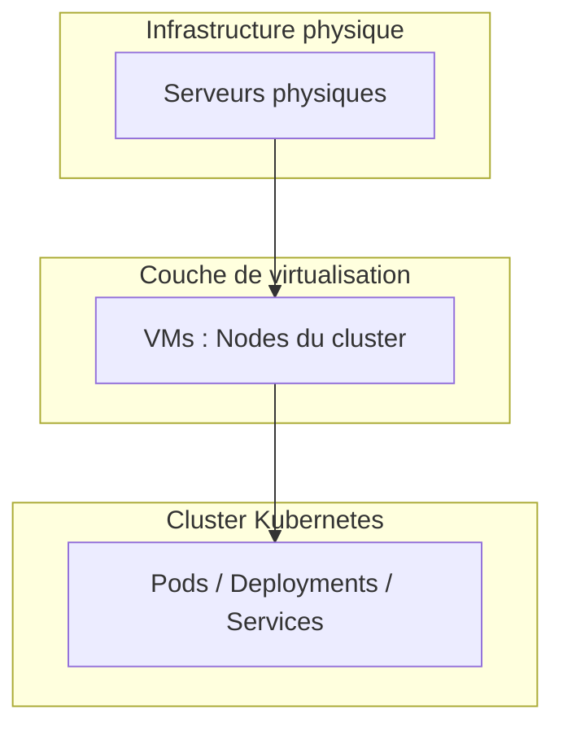
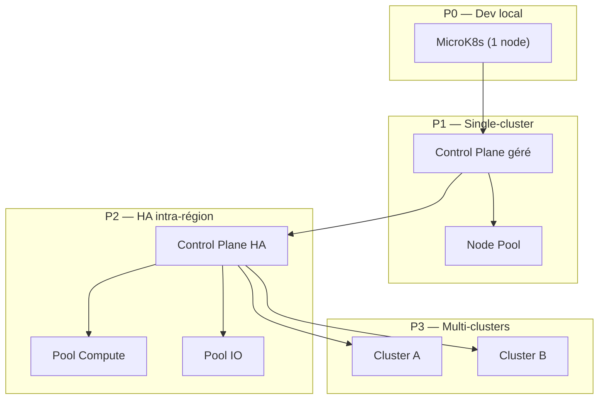

# 📘 Table des matières

- [1️⃣ – Du monolithe aux microservices](#1️⃣--du-monolithe-aux-microservices)
- [2️⃣ – Virtualisation : l’isolation matérielle](#2️⃣--virtualisation--lisolation-matérielle)
- [3️⃣ – Conteneurisation : l’isolation logique](#3️⃣--conteneurisation--lisolation-logique)
- [4️⃣ – Kubernetes : orchestrer les conteneurs virtualisés](#4️⃣--kubernetes--orchestrer-les-conteneurs-virtualisés)
- [5️⃣ – La virtualisation au service de l’orchestration](#5️⃣--la-virtualisation-au-service-de-lorchestration)

---

# 1️⃣ – Du monolithe aux microservices

> **Une application monolithique** regroupe toutes les fonctionnalités dans un seul programme.

---

## ⚙️ Caractéristiques

- Une **base de code unique**, un seul processus, un seul cycle de déploiement.
- Simplicité initiale ✅ mais forte **dépendance interne** ❌ entre les modules.
- Tout changement ou panne impacte **l’ensemble du système**.

📚 **Lien recommandé :**  
[BD Kubernetes par Google Cloud](https://cloud.google.com/kubernetes-engine/kubernetes-comic/)

---

## 🕰️ Historique et contexte d’évolution

Dans les années **1990–2000**, la majorité des applications d’entreprise étaient **monolithiques** :

- Architecture **client-serveur**
- Mises à jour nécessitant l’arrêt complet du service 🛑
- Scalabilité **verticale** (plus de matériel)

---

### 🚀 Les causes de l’évolution

- **Complexification** des systèmes
- **Émergence du web** et besoin d’intégration
- Nouveaux modèles **DevOps / CI/CD**

---

### 🌐 Les premières interconnexions

| Technologie | Année | Description                                  |
| ----------- | ----- | -------------------------------------------- |
| **SOAP**    | 1999  | Web Services XML (interopérabilité initiale) |
| **REST**    | 2000  | Communication simple HTTP (JSON / XML)       |
| **gRPC**    | 2015  | Protocole binaire performant basé sur HTTP/2 |

💬 Ces standards ont permis la communication entre modules indépendants, amorçant la **transition vers les microservices**.

---

## 🔍 Qu’est-ce qu’un microservice ?

Un **microservice** = une **unité fonctionnelle autonome** d’une application.

🧩 Il :

- Implémente une **fonction métier unique** (ex : facturation, login…)
- S’exécute **indépendamment**
- Possède son **cycle de vie propre**

---

### 🌉 Communication

Les microservices échangent via des **APIs légères**, favorisant :

- la **modularité** du code 🧠
- la **tolérance aux pannes** ⚡
- la **scalabilité horizontale** 📈

> ⚠️ Mais cette liberté ajoute une **complexité d’infrastructure** : réseau, monitoring, orchestration…

---

## 🐳 Microservice vs Conteneur

| ❌ Mythe                       | ✔️ Réalité                                                                                     |
| ------------------------------ | ---------------------------------------------------------------------------------------------- |
| Un microservice = un conteneur | Le microservice est **une idée logicielle**, le conteneur est **un environnement d’exécution** |

---

### 🧠 En résumé :

- **Microservice** → concept fonctionnel
- **Conteneur** → mécanisme technique

💡 Un conteneur **héberge souvent** un microservice :

- Inclut code + dépendances + runtime
- Assure **cohérence** entre environnements
- Garantit **immutabilité** et **interopérabilité**

---

## 🚢 Pourquoi la conteneurisation est essentielle

La conteneurisation répond aux limites du déploiement manuel.

✅ Avantages :

- Environnement **portable, standardisé, isolé**
- **Remplacement** plutôt que modification
- **Interopérabilité** multi-plateforme
- **Déploiement simplifié** et **résilient**

💡 Ces propriétés — _immutabilité_ et _interopérabilité_ — sont la base du **cloud-native** orchestré par **Kubernetes**.

---

## ⚠️ Limites du modèle monolithique

- Difficulté d’évolution et de correction
- Scalabilité **verticale uniquement**
- Déploiement **lent et risqué**
- **Couplage fort** entre équipes et technologies

Exemple :

```bash
java -jar application-complete.jar
```

> 🧱 Un seul binaire contenant API, UI, logique métier et données.

---

## 🧩 Vers la modularité : l’idée des microservices

- Chaque service = **code + dépendances + base de données**
- Communication via **API (HTTP, gRPC, message bus)**
- **Scalabilité horizontale** ciblée
- **CI/CD** facilité 🎯

---

## 🧠 Vue architecturale

| Aspect            | 🧱 Monolithe  | 🧩 Microservices     |
| ----------------- | ------------- | -------------------- |
| Couplage          | Fort 🔗       | Faible 🔓            |
| Déploiement       | Unique        | Indépendant          |
| Scalabilité       | Verticale     | Horizontale          |
| Résilience        | Panne globale | Isolement des pannes |
| Complexité réseau | Faible        | Élevée ⚙️            |

> 👉 Les microservices déplacent la complexité **du code vers l’infrastructure**.

---

## 🧰 Problème nouveau : l’exécution de tous ces services

Chaque microservice doit :

- Être **isolé** de manière fiable 🧳
- **Communiquer** avec les autres services 🌐
- Être **mis à jour** sans perturber le reste ♻️

➡️ Cela demande un **mécanisme d’isolation et de gestion** :

- **Virtualisation** pour séparer les environnements 💻
- **Conteneurisation** pour isoler les processus 🧱

Les deux sont **complémentaires** :

- Virtualisation → base matérielle ⚙️
- Conteneurisation → flexibilité logicielle 🧩

---

## 💡 Exemple de transition pratique

```bash
# Monolithe initial
java -jar monolith.jar

# Microservice isolé
python3 -m http.server 8080
```

> Le service devient indépendant, mais pour en gérer **des dizaines ou centaines**, il faut les **isoler**, les **connecter** et les **orchestrer**.

➡️ Ce besoin mènera naturellement vers la **virtualisation et la conteneurisation**.

---

# 2️⃣ – Virtualisation : l’isolation matérielle

> La virtualisation permet d’exécuter plusieurs environnements sur une même machine physique.

## 🔍 Définition

La **virtualisation** crée plusieurs **machines virtuelles (VM)** à partir de ressources physiques :

- Chaque VM possède son propre **OS**, mémoire, stockage, réseau.
- Un **hyperviseur** gère la répartition des ressources.

---

## 🧩 Types d’hyperviseurs

### Type 1 — _Bare Metal_

- Fonctionne **directement sur le matériel**.
- Haute performance et fiabilité.
- Utilisé dans les **data centers**.

> Exemples : VMware ESXi, Hyper-V, KVM, Xen.

### Type 2 — _Hébergé_

- Fonctionne **au-dessus d’un OS hôte**.
- Simplicité d’installation.
- Idéal pour **tests ou postes de travail**.

> Exemples : VirtualBox, VMware Workstation, Parallels.

---

## 🧠 Rôle de l’hyperviseur

- Alloue dynamiquement les ressources 💾
- Isole les environnements 🔒
- Agrège ou fractionne le matériel selon les besoins ⚙️

```
Matériel physique (CPU, RAM, disque)
   ↓
Hyperviseur
   ↓ ↓ ↓
VM1 (Linux) | VM2 (Windows) | VM3 (Ubuntu)
```

---

## ✅ Avantages de la virtualisation

- Isolation complète 🧱
- Mutualisation du matériel 💰
- Portabilité 🧳
- Flexibilité 🧠
- Abstraction matérielle 🔌

💡 Exemple : un serveur physique héberge plusieurs VMs (DB, web, stockage).

---

## ⚠️ Limites

- **Surcharge mémoire** (chaque VM a son OS)
- **Démarrage lent** 🐢
- **Gestion complexe** ⚙️

➡️ Naissance de l’**Infrastructure as Code (IaC)** 💻

---

## ⚙️ Infrastructure as Code (IaC)

> L’IaC décrit l’infrastructure comme du **code déclaratif**.

- Décrit l’**état attendu** (VMs, réseaux, services)
- Automatisation de la **création et configuration**
- Facilite **versionnage, reproductibilité, CI/CD**

🧰 **Outils IaC :** Terraform, OpenTofu, Ansible, Puppet, Chef, CloudFormation, Pulumi.

---

## 🐳 De la virtualisation à la conteneurisation

> La conteneurisation **ne remplace pas** la virtualisation, elle s’appuie dessus.

- Les **VMs** assurent l’isolation matérielle 🔒
- Les **conteneurs** assurent l’isolation logicielle 🧩

💡 Kubernetes combine la **robustesse** des VMs et la **légèreté** des conteneurs.

---

# 3️⃣ – Conteneurisation : l’isolation logique

> **But** — Comprendre comment la conteneurisation isole les processus applicatifs dans un même système d’exploitation, prépare la modularisation des applications et introduit la logique d’orchestration.

---

## 🧠 Définition & objectifs

Un **conteneur** = un **processus isolé** + son environnement d’exécution minimal (bibliothèques, configuration, dépendances).  
Contrairement à une VM, il **partage le noyau** du système hôte, ce qui le rend **léger** et **rapide**.

🎯 Objectifs principaux :

- **Portabilité** → un même conteneur fonctionne sur tout hôte compatible.
- **Immutabilité** → le conteneur ne change pas : on le reconstruit plutôt que le modifier.
- **Rapidité** → démarrage en secondes.
- **Densité** → plusieurs conteneurs peuvent cohabiter sur la même machine.

---

## 🧩 Mécanismes Linux

Les conteneurs reposent sur des fonctionnalités natives du noyau Linux :

- **Namespaces** → isolent les espaces d’exécution :
  - `pid` (processus), `net` (réseau), `mnt` (système de fichiers), `uts` (nom d’hôte), `ipc`, `user`.
- **cgroups** → contrôlent les ressources CPU, mémoire, I/O, etc.
- **UnionFS / OverlayFS** → superposent les couches de fichiers (lecture seule + overlay d’écriture).
- **Capabilities / seccomp / AppArmor** → restreignent les permissions et appels systèmes.

💡 Ces mécanismes sont transparents à l’utilisateur : Docker, Podman ou containerd les utilisent sous le capot.

---

## 🧱 Image et exécution

Une **image de conteneur** contient :

- le code de l’application,
- ses dépendances,
- un système minimal (souvent basé sur Debian, Alpine, Distroless),
- et un point d’entrée (`ENTRYPOINT`).

```bash
# Exemple simple : image NGINX
sudo docker run -d -p 8080:80 nginx:1.25
curl http://localhost:8080
```

➡️ Le conteneur expose un service HTTP isolé, sans affecter l’hôte.

---

## 🧰 Dockerfile : construction d’une image

```dockerfile
# Exemple : application minimale Node.js
FROM node:20-slim
WORKDIR /app
COPY package*.json ./
RUN npm install --only=production
COPY . .
EXPOSE 5000
CMD ["npm", "start"]
```

Commandes associées :

```bash
# Construction de l’image
docker build -t myapp:1.0 .

# Lancement du conteneur
docker run -d -p 5000:5000 myapp:1.0
```

> L’image devient un **artefact versionné** et partageable sur un registre (Docker Hub, GitLab Registry, GHCR…).

---

## ⚙️ Composition de services (Docker Compose)

Quand plusieurs conteneurs doivent collaborer (ex. application + base de données), on utilise un **fichier de composition** (`docker-compose.yml`).

```yaml
version: "3.9"
services:
  web:
    build: .
    ports:
      - "5000:5000"
    depends_on:
      - db
    environment:
      DATABASE_URL: postgres://app:example@db:5432/appdb
  db:
    image: postgres:15
    environment:
      POSTGRES_DB: appdb
      POSTGRES_USER: app
      POSTGRES_PASSWORD: example
    volumes:
      - data:/var/lib/postgresql/data
volumes:
  data:
```

Commandes principales :

```bash
docker compose up -d --build
docker compose ps
docker compose logs -f
```

🧩 Compose introduit la **déclaration d’un état attendu** (déjà une approche “déclarative”) et la **gestion de dépendances entre services**.

---

## 🔒 Bonnes pratiques (conteneurs en production)

- Utiliser des **images minimales** (`alpine`, `distroless`).
- Éviter l’exécution en `root` dans le conteneur.
- Externaliser la configuration (fichiers `.env`, variables d’environnement).
- Définir des **volumes** pour la persistance (pas écrire dans l’image).
- Versionner les images et les pousser dans un registre privé ou public.

---

## 🧩 Transition vers l’orchestration

Lorsque le nombre de conteneurs augmente :

- Il devient nécessaire de gérer leur **cycle de vie**, leur **réseau** et leur **mise à jour**.
- Docker Compose atteint ses limites pour les clusters multi-hôtes.

➡️ C’est ce besoin qui mène à des orchestrateurs comme **Kubernetes**.

---

## 🔁 Parallèle Docker Compose ↔️ Manifeste Kubernetes

| Concept                       | Docker Compose                          | Kubernetes                  |
| ----------------------------- | --------------------------------------- | --------------------------- |
| **Service**                   | Définit un conteneur et ses dépendances | `Pod` / `Deployment`        |
| **Port mapping**              | `ports:`                                | `containerPort` / `Service` |
| **Volumes**                   | `volumes:`                              | `PersistentVolumeClaim`     |
| **Variables d’environnement** | `environment:`                          | `env:`                      |
| **Réseau**                    | `bridge` interne                        | `CNI` (réseau de cluster)   |
| **Fichier**                   | `docker-compose.yml`                    | `manifestes YAML`           |

💡 Kubernetes généralise et distribue les concepts de Compose à grande échelle (cluster multi-nœuds, haute disponibilité, auto-guérison).

---

## 🧭 À retenir

- Un conteneur isole un **processus** dans un **même noyau Linux**.
- Docker et Podman exploitent des mécanismes système (namespaces, cgroups, overlayfs).
- Docker Compose introduit une première **déclaration d’infrastructure applicative**.
- La montée en complexité des environnements distribués conduit naturellement à **Kubernetes**, qui orchestre ces conteneurs à l’échelle du cluster.

---

# 4️⃣ – Kubernetes : orchestrer les conteneurs virtualisés

Quand plusieurs conteneurs doivent coopérer :

- Automatiser les déploiements ⚙️
- Gérer le réseau et les dépendances 🌐
- Assurer la tolérance aux pannes 💪
- Monter en charge 📈

➡️ Apparition des **orchestrateurs** : Docker Swarm, Mesos, **Kubernetes** 🚀

## Orchestration & Kubernetes — "état désiré" et réconciliation

> **Objectif** — Comprendre comment Kubernetes orchestre des applications conteneurisées en appliquant un **modèle déclaratif** ("état désiré") et des **boucles de réconciliation**. Découvrir les **objets clés** (Pod, Deployment, Service, Ingress) et la mécanique d'auto-rétablissement (_self‑healing_).

---

## 🎯 Résultats d'apprentissage

- Expliquer le principe **déclaratif** : on décrit _ce qu'on veut_, pas _comment le faire_.
- Décrire le cycle **réconciliation → action → observation** dans Kubernetes.
- Identifier les **composants** : API Server, etcd, Scheduler, Controllers, Kubelet, Runtime.
- Lire/écrire des **manifestes YAML** pour Pods / Deployments / Services / Ingress.
- Mettre à l'échelle (scaling) et comprendre l'**auto‑guérison** (remplacement de Pods).

---

## 🧠 Déclaratif vs impératif

- **Impératif** : "exécute ces commandes dans cet ordre" → fragile, non idempotent.
- **Déclaratif** : "voici **l'état désiré** du système" → le contrôleur converge vers cet état.

> **Parallèle IaC** : Terraform/Ansible décrivent l'infra ; **Kubernetes** décrit l'état applicatif (et réseau/stockage associés) au niveau **service**.

---

## 🔁 Boucle de réconciliation (vue système)



---

## 🧱 Objets fondamentaux

- **Pod** : plus petite unité déployable (un ou plusieurs conteneurs + réseau/volumes partagés).
- **ReplicaSet** : garantit _n_ réplicas identiques d'un Pod (généré par un Deployment).
- **Deployment** : stratégie de mise à jour (rolling update), historique, rollback.
- **Service** : point d'accès réseau stable vers un ensemble de Pods (ClusterIP / NodePort / LoadBalancer).
- **Ingress** : règles HTTP(S) vers des Services (via un _Ingress Controller_ — ex. Traefik).
- **Namespace** : cloisonnement logique (quotas, RBAC, isolation).
- **ConfigMap/Secret** : configuration externe & données sensibles.

---

## 📄 Pod minimal (lecture seule)

```yaml
apiVersion: v1
kind: Pod
metadata:
  name: demo-pod
  labels: { app: demo }
spec:
  containers:
    - name: web
      image: nginx:1.25
      ports: [{ containerPort: 80 }]
      resources:
        requests: { cpu: "100m", memory: "64Mi" }
        limits: { cpu: "300m", memory: "128Mi" }
      readinessProbe:
        httpGet: { path: "/", port: 80 }
        initialDelaySeconds: 3
        periodSeconds: 5
```

---

## 📦 Deployment (état désiré réplicas=3)

```yaml
apiVersion: apps/v1
kind: Deployment
metadata:
  name: web-deploy
  labels: { app: web }
spec:
  replicas: 3
  selector: { matchLabels: { app: web } }
  strategy:
    type: RollingUpdate
    rollingUpdate: { maxUnavailable: 1, maxSurge: 1 }
  template:
    metadata: { labels: { app: web } }
    spec:
      containers:
        - name: web
          image: nginx:1.25
          ports: [{ containerPort: 80 }]
          resources:
            requests: { cpu: "100m", memory: "64Mi" }
            limits: { cpu: "300m", memory: "128Mi" }
          livenessProbe:
            httpGet: { path: "/", port: 80 }
            initialDelaySeconds: 5
            periodSeconds: 10
```

---

## 🌐 Service + Ingress (exposition HTTP locale)

```yaml
apiVersion: v1
kind: Service
metadata:
  name: web-svc
spec:
  type: ClusterIP
  selector: { app: web }
  ports:
    - port: 80
      targetPort: 80
---
apiVersion: networking.k8s.io/v1
kind: Ingress
metadata:
  name: web-ing
  annotations:
    kubernetes.io/ingress.class: traefik
spec:
  rules:
    - host: web.local
      http:
        paths:
          - path: /
            pathType: Prefix
            backend:
              service:
                name: web-svc
                port:
                  number: 80
```

# 5️⃣ – La virtualisation au service de l’orchestration

> **Objectif** — Comprendre comment la virtualisation soutient les mécanismes d’orchestration des conteneurs et pourquoi Kubernetes repose encore sur elle pour garantir isolation, élasticité et abstraction des ressources.

---

## ⚙️ Virtualisation et orchestration : une relation de dépendance

Kubernetes ne remplace pas la virtualisation — il **s’appuie** dessus.

- La **virtualisation** fournit le **socle d’isolation matérielle** : chaque nœud du cluster (control plane ou worker) tourne souvent sur une **machine virtuelle (VM)**.
- Elle permet la **gestion des ressources physiques** : CPU, RAM, disque, réseau.
- Elle offre la **flexibilité** nécessaire à l’orchestrateur pour :
  - créer ou supprimer des nœuds selon la charge,
  - migrer des workloads,
  - allouer dynamiquement les ressources.

---

## 💻 Exemple selon les environnements

- **Sur un laptop** : `MicroK8s` ou `Minikube` virtualisent implicitement les composants Kubernetes (API Server, Scheduler, kubelet…) dans des VM ou conteneurs isolés.
- **Sur un cloud provider** : Kubernetes planifie les Pods sur des VM orchestrées par le fournisseur (AWS EC2, GCP Compute Engine, Azure VM, OpenStack…).



➡️ **Virtualisation** = fondation matérielle abstraite.  
➡️ **Conteneurisation** = unité d’exécution logique.  
➡️ **Orchestration (K8s)** = pilotage global et automatisé.

---

## 🧠 Complémentarité des couches

| Niveau          | Technologie      | Rôle principal                                | Exemple                 |
| --------------- | ---------------- | --------------------------------------------- | ----------------------- |
| **Matériel**    | Virtualisation   | Isolation des OS et gestion CPU/RAM           | KVM, VMware, Hyper‑V    |
| **Système**     | Conteneurisation | Isolation des processus applicatifs           | Docker, LXC, containerd |
| **Application** | Orchestration    | Gestion de l’état désiré, scaling, résilience | Kubernetes              |

---

## 🌐 L’élasticité grâce à la virtualisation

La virtualisation permet à Kubernetes d’être **élastique** et **résilient** :

- Ajout ou suppression automatique de **nœuds virtuels** selon la charge.
- **Migration à chaud** possible sur certaines plateformes.
- Répartition des ressources matérielles sans redéployer tout le cluster.

> Kubernetes exploite ces capacités pour **auto‑scaler** horizontalement ses nœuds ou pods selon la demande.

---

## 🔍 Conclusion scientifique

- La **virtualisation** opère au **niveau de l’infrastructure** : découple le matériel du logiciel.
- La **conteneurisation** opère au **niveau du processus** : isole les applications et leurs dépendances.
- L’**orchestration** opère au **niveau du système applicatif** : décrit et maintient un état désiré.

> 🧩 Les trois couches sont **interdépendantes** et forment la base du cloud‑native :  
> Virtualisation → Conteneurisation → Orchestration.

---

## 🏗️ Hiérarchie de clusters : du laptop à la production

> **But** — Donner aux étudiants une grille de lecture : _ce qu’ils manipulent en TD avec MicroK8s_ vs _ce qu’une équipe opère en production_.

### 1) Paliers d’évolution

- **P0 — Dev local (laptop)** : MicroK8s/Minikube, 1 nœud, stockage local, Ingress simple.
- **P1 — Single‑cluster non‑critique** : 3 nœuds (VM), Control Plane géré, StorageClass basique, Ingress HA.
- **P2 — HA intra‑région** : 3+ nœuds workers, Control Plane redondé, CSI managé, HPA+Cluster Autoscaler, Registry privé.
- **P3 — Multi‑clusters / multi‑régions** : fédération logique, DR/BCP, politiques réseau et sécurité inter‑clusters, GitOps global.

### 2) Ce que MicroK8s masque vs ce qu’on gère en prod

| Domaine           | En TD (MicroK8s)              | En production                                                |
| ----------------- | ----------------------------- | ------------------------------------------------------------ |
| **Control Plane** | Mononœud, composants packagés | Plans de contrôle HA / gérés (managed K8s)                   |
| **Workers**       | 1 VM / machine                | Pools de nœuds, types de VM, autoscaling                     |
| **Réseau (CNI)**  | CNI par défaut                | CNI choisi (Calico, Cilium…), **NetworkPolicy**              |
| **Stockage**      | stockage local / hostpath     | **CSI** managé (RWO/RWX), classes, snapshots                 |
| **Ingress**       | Ingress simple                | Ingress controller HA (Traefik/Nginx), LB, WAF               |
| **Certificats**   | auto‑signé / non utilisé      | cert‑manager, ACME, PKI interne                              |
| **Sécurité**      | par défaut                    | RBAC fin, **PSA/PodSecurity**, Secrets KMS, image policies   |
| **Images**        | tirées du hub public          | registres privés, **ImagePullSecrets**, scannage, signatures |
| **Observabilité** | minimale                      | Prometheus/Grafana, logs centralisés, traces, alerting       |
| **Déploiements**  | kubectl apply                 | **GitOps** (Flux/Argo), releases Helm, approvals             |

### 3) Topologie visuelle



> **Lecture** : on passe d’un _monocluster mononœud_ à des **pools de nœuds** avec HA, puis à des **multi‑clusters** pour la résilience géographique.

### 4) Vocabulaire minimal « prod »

- **Node pool** (tailles/machines dédiées), **Cluster Autoscaler** (ajoute/retire des nœuds).
- **HPA/VPA** (scaling des Pods), **PDB** (budgets de disruptions), **PodAntiAffinity** (répartition).
- **StorageClass/CSI**, **RWX/RWO**, **snapshot** & **backup**.
- **Ingress Controller** + **LoadBalancer**; **DNS** externe; **cert‑manager**.
- **RBAC**, **NetworkPolicy**, **PSA**, **Secret management** (KMS/External Secrets).

### 5) Checklist : passer de MicroK8s → Prod

1. **Images** : base durcie, scans, registry privé, tags immuables (digest).
2. **Réseau** : choisir une **CNI** et définir des **NetworkPolicy**.
3. **Stockage** : sélectionner un **CSI** adapté (performances / modes d’accès).
4. **Sécurité** : RBAC, PSA, secrets chiffrés, pull secrets, politiques d’images.
5. **Exposition** : Ingress HA + certificat valide, DNS.
6. **Observabilité** : métriques, logs, traces + alertes.
7. **Déploiements** : Helm + GitOps (environnement dev/stage/prod).
8. **Résilience** : autoscaling nœuds/Pods, PDB, backups, tests de reprise (DR).

> **Message clé pour les TD** : MicroK8s donne la **même API** que la prod. Ce qui change, c’est **l’échelle** et les **composants gérés** (réseau, stockage, sécurité, HA).
