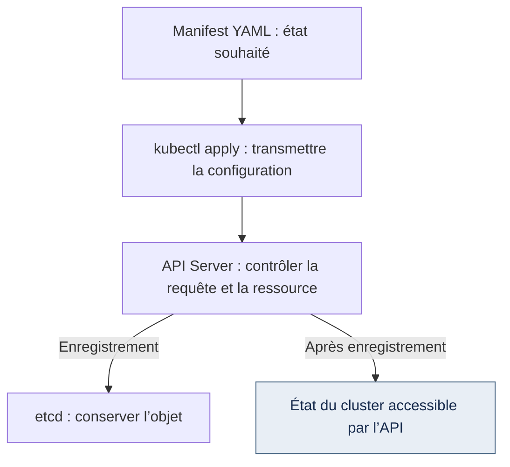
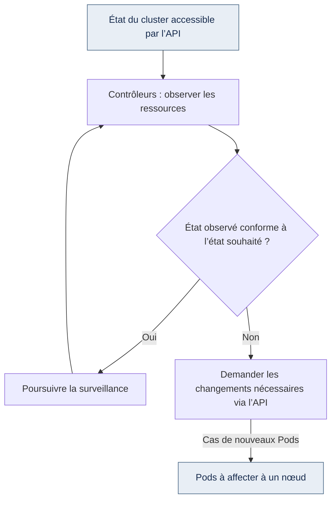
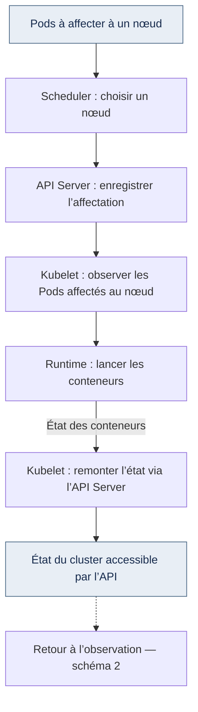
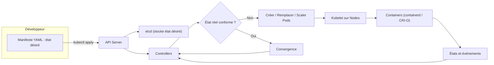
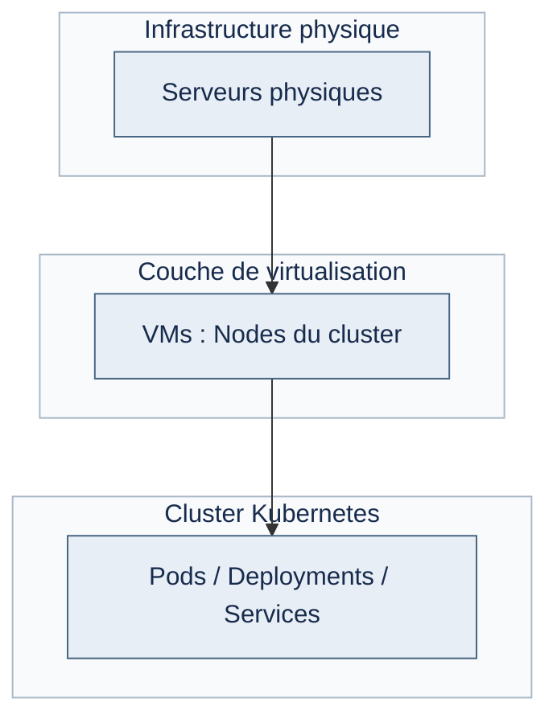
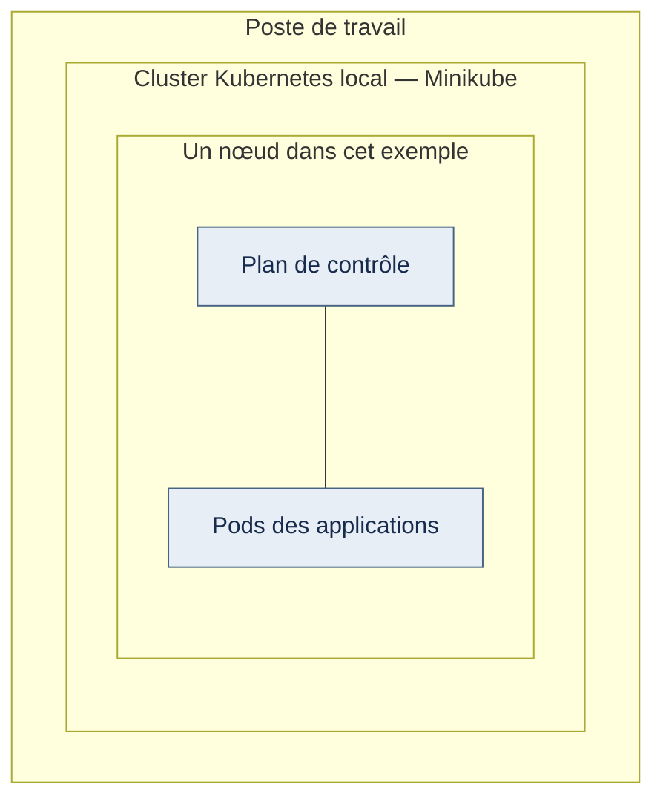
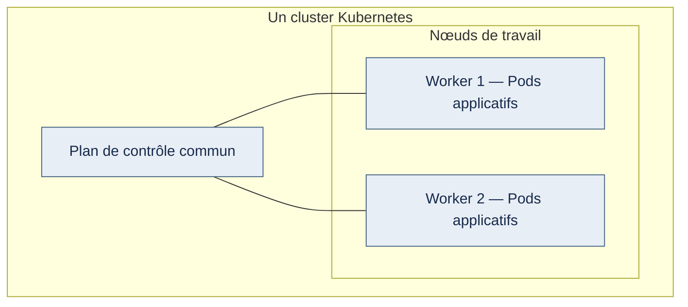
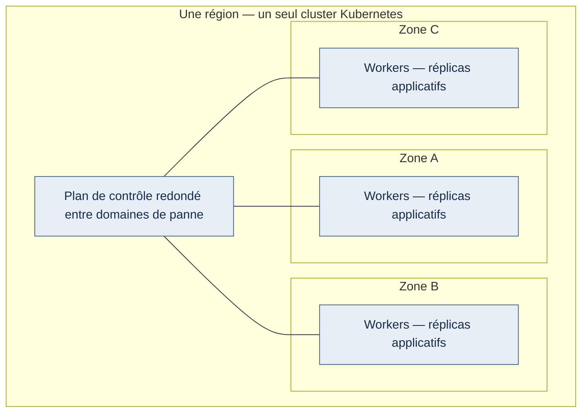
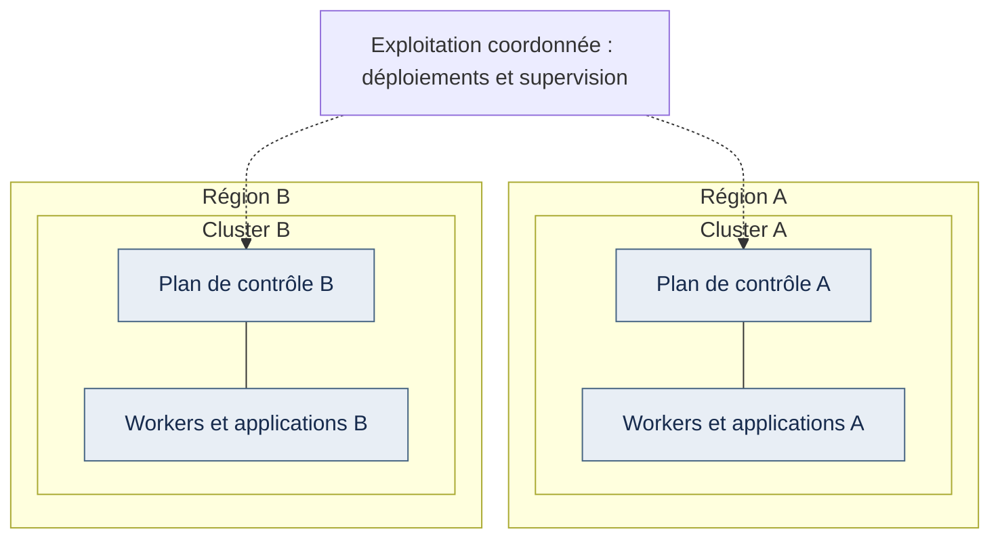

# Table des matières

- [1 – Du monolithe aux microservices](#1--du-monolithe-aux-microservices)
- [2 – Virtualisation : l’isolation matérielle](#2--virtualisation--lisolation-matérielle)
- [3 – Conteneurisation : l’isolation logique](#3--conteneurisation--lisolation-logique)
- [4 – Kubernetes : orchestrer les conteneurs virtualisés](#4--kubernetes--orchestrer-les-conteneurs-virtualisés)
- [5 – La virtualisation au service de l’orchestration](#5--la-virtualisation-au-service-de-lorchestration)

---

# 1 – Du monolithe aux microservices

> Une application monolithique regroupe toutes les fonctionnalités dans un seul programme.

---

## Caractéristiques

- Une base de code unique, un seul processus, un seul cycle de déploiement.
- Simplicité initiale mais forte dépendance interne entre les modules.
- Tout changement ou panne impacte l’ensemble du système.

**Lien recommandé :**\
[BD Kubernetes par Google Cloud](https://cloud.google.com/kubernetes-engine/kubernetes-comic/)

---

## Historique et contexte d’évolution

Dans les années 1990–2000, la majorité des applications d’entreprise étaient monolithiques :

- Architecture client-serveur.
- Mises à jour nécessitant l’arrêt complet du service.
- Scalabilité verticale (plus de matériel).

---

### Les causes de l’évolution

- Complexification des systèmes.
- Émergence du web et besoin d’intégration.
- Nouveaux modèles DevOps / CI/CD.

---

### Les premières interconnexions

| Technologie | Année | Description                                  |
| ----------- | ----- | -------------------------------------------- |
| **SOAP**    | 1999  | Web Services XML (interopérabilité initiale) |
| **REST**    | 2000  | Communication simple HTTP (JSON / XML)       |
| **gRPC**    | 2015  | Protocole binaire performant basé sur HTTP/2 |

Ces standards ont permis la communication entre modules indépendants, amorçant la transition vers les microservices.

---

## Qu’est-ce qu’un microservice ?

Un **microservice** = une unité fonctionnelle autonome d’une application.

Il :

- Implémente une fonction métier unique (ex : facturation, login…).
- S’exécute indépendamment.
- Possède son cycle de vie propre.

---

### Communication

Les microservices échangent via des APIs légères, favorisant :

- la modularité du code.
- la tolérance aux pannes.
- la scalabilité horizontale.

> Mais cette liberté ajoute une complexité d’infrastructure : réseau, monitoring, orchestration…

---

## Microservice vs Conteneur

| Mythe                          | Réalité                                                                                |
| ------------------------------ | -------------------------------------------------------------------------------------- |
| Un microservice = un conteneur | Le microservice est une idée logicielle, le conteneur est un environnement d’exécution |

---

### En résumé

- **Microservice** → concept fonctionnel.
- **Conteneur** → mécanisme technique.

Un conteneur héberge souvent un microservice :

- Inclut code + dépendances + runtime.
- Assure cohérence entre environnements.
- Favorise la reproductibilité et l’interopérabilité.

---

## Pourquoi la conteneurisation est essentielle

La conteneurisation répond aux limites du déploiement manuel.

**Avantages :**

- Environnement portable, standardisé, isolé.
- Remplacement plutôt que modification.
- Interopérabilité multi-plateforme.
- Déploiement simplifié et résilient.

Ces propriétés — _immutabilité_ et _interopérabilité_ — sont la base du cloud-native orchestré par Kubernetes.

---

## Limites du modèle monolithique

- Difficulté d’évolution et de correction.
- Mise à l’échelle de l’application entière.
- Déploiement lent et risqué.
- Couplage fort entre équipes et technologies.

**Exemple :**

```bash
java -jar application-complete.jar
```

> Un seul binaire contenant API, UI, logique métier et données.

---

## Vers la modularité : l’idée des microservices

- Chaque service = code + dépendances + base de données.
- Communication via API (HTTP, gRPC, message bus).
- Scalabilité horizontale ciblée.
- CI/CD facilité.

---

## Vue architecturale

| Aspect            | Monolithe     | Microservices        |
| ----------------- | ------------- | -------------------- |
| Couplage          | Fort          | Faible               |
| Déploiement       | Unique        | Indépendant          |
| Scalabilité       | Application entière | Par microservice |
| Résilience        | Panne globale | Isolement des pannes |
| Complexité réseau | Faible        | Élevée               |

> Les microservices déplacent la complexité du code vers l’infrastructure.

---

## Problème nouveau : l’exécution de tous ces services

Chaque microservice doit :

- Être isolé de manière fiable.
- Communiquer avec les autres services.
- Être mis à jour sans perturber le reste.

Cela demande un mécanisme d’isolation et de gestion :

- Virtualisation pour séparer les environnements.
- Conteneurisation pour isoler les processus.

Les deux sont complémentaires :

- Virtualisation → base matérielle.
- Conteneurisation → flexibilité logicielle.

---

## Exemple de transition pratique

```bash
# Monolithe initial
java -jar monolith.jar

# Microservice isolé
python3 -m http.server 8080
```

> Le service devient indépendant, mais pour en gérer des dizaines ou centaines, il faut les isoler, les connecter et les orchestrer.

Ce besoin mènera naturellement vers la virtualisation et la conteneurisation.

---

# 2 – Virtualisation : l’isolation matérielle

> La virtualisation permet d’exécuter plusieurs environnements sur une même machine physique.

## Définition

La **virtualisation** crée plusieurs machines virtuelles (VM) à partir de ressources physiques :

- Chaque VM possède son propre OS, mémoire, stockage, réseau.
- Un hyperviseur gère la répartition des ressources.

---

## Types d’hyperviseurs

### Type 1 — Bare Metal

- Fonctionne directement sur le matériel.
- Haute performance et fiabilité.
- Utilisé dans les data centers.

> **Exemples :** VMware ESXi, Hyper-V, KVM, Xen.

### Type 2 — Hébergé

- Fonctionne au-dessus d’un OS hôte.
- Simplicité d’installation.
- Idéal pour tests ou postes de travail.

> **Exemples :** VirtualBox, VMware Workstation, Parallels.

---

## Rôle de l’hyperviseur

- Alloue dynamiquement les ressources.
- Isole les environnements.
- Agrège ou fractionne le matériel selon les besoins.

```
Matériel physique (CPU, RAM, disque)
   ↓
Hyperviseur
   ↓ ↓ ↓
VM1 (Linux) | VM2 (Windows) | VM3 (Ubuntu)
```

---

## Avantages de la virtualisation

- Isolation complète.
- Mutualisation du matériel.
- Portabilité.
- Flexibilité.
- Abstraction matérielle.

**Exemple :** un serveur physique héberge plusieurs VMs (DB, web, stockage).

---

## Limites

- Surcharge mémoire (chaque VM a son OS).
- Démarrage lent.
- Gestion complexe.

Naissance de l’Infrastructure as Code (IaC)

---

## Infrastructure as Code (IaC)

> L’IaC décrit l’infrastructure comme du code déclaratif.

- Décrit l’état attendu (VMs, réseaux, services).
- Automatisation de la création et configuration.
- Facilite versionnage, reproductibilité, CI/CD.

**Outils IaC :** Terraform, OpenTofu, Ansible, Puppet, Chef, CloudFormation, Pulumi.

---

## De la virtualisation à la conteneurisation

> La conteneurisation et la virtualisation peuvent être utilisées ensemble.

- Les VMs assurent l’isolation matérielle.
- Les conteneurs assurent l’isolation logicielle.

Kubernetes peut exécuter les conteneurs sur des machines physiques ou virtuelles.

---

# 3 – Conteneurisation : l’isolation logique

> **But** — Comprendre comment la conteneurisation isole les processus applicatifs dans un même système d’exploitation, prépare la modularisation des applications et introduit la logique d’orchestration.

---

## Définition & objectifs

Un **conteneur** = un processus isolé + son environnement d’exécution minimal (bibliothèques, configuration, dépendances).\
Contrairement à une VM, il partage le noyau du système hôte, ce qui le rend léger et rapide.

**Objectifs principaux :**

- **Portabilité** → un même conteneur fonctionne sur tout hôte compatible.
- **Immutabilité** → on privilégie le remplacement du conteneur à partir d’une image versionnée.
- **Rapidité** → démarrage en secondes.
- **Densité** → plusieurs conteneurs peuvent cohabiter sur la même machine.

---

## Mécanismes Linux

Les conteneurs reposent sur des fonctionnalités natives du noyau Linux :

- **Namespaces** → isolent les espaces d’exécution :
  - `pid` (processus), `net` (réseau), `mnt` (système de fichiers), `uts` (nom d’hôte), `ipc`, `user`.
- **cgroups** → contrôlent les ressources CPU, mémoire, I/O, etc.
- **UnionFS / OverlayFS** → superposent les couches de fichiers (lecture seule + overlay d’écriture).
- **Capabilities / seccomp / AppArmor** → restreignent les permissions et appels systèmes.

Ces mécanismes sont transparents à l’utilisateur : Docker, Podman ou containerd les utilisent sous le capot.

---

## Image et exécution

Une image de conteneur contient :

- le code de l’application,
- ses dépendances,
- un système minimal (souvent basé sur Debian, Alpine, Distroless),
- et un point d’entrée (`ENTRYPOINT`).

```bash
# Exemple simple : image NGINX
sudo docker run -d -p 8080:80 nginx:1.25
curl http://localhost:8080
```

Le conteneur expose un service HTTP isolé, sans affecter l’hôte.

---

## Dockerfile : construction d’une image

```dockerfile
# Exemple : application minimale Node.js
FROM node:20-slim
WORKDIR /app
COPY package*.json ./
RUN npm install --only=production
COPY . .
EXPOSE 5000
CMD ["npm", "start"]
```

**Commandes associées :**

```bash
# Construction de l’image
docker build -t myapp:1.0 .

# Lancement du conteneur
docker run -d -p 5000:5000 myapp:1.0
```

> L’image devient un artefact versionné et partageable sur un registre (Docker Hub, GitLab Registry, GHCR…).

---

## Composition de services (Docker Compose)

Quand plusieurs conteneurs doivent collaborer (ex. application + base de données), on utilise un fichier de composition (`docker-compose.yml`).

```yaml
version: "3.9"
services:
  web:
    build: .
    ports:
      - "5000:5000"
    depends_on:
      - db
    environment:
      DATABASE_URL: postgres://app:example@db:5432/appdb
  db:
    image: postgres:15
    environment:
      POSTGRES_DB: appdb
      POSTGRES_USER: app
      POSTGRES_PASSWORD: example
    volumes:
      - data:/var/lib/postgresql/data
volumes:
  data:
```

**Commandes principales :**

```bash
docker compose up -d --build
docker compose ps
docker compose logs -f
```

Compose introduit la déclaration d’un état attendu (déjà une approche « déclarative ») et la gestion de dépendances entre services.

---

## Bonnes pratiques (conteneurs en production)

- Utiliser des images minimales (`alpine`, `distroless`).
- Éviter l’exécution en `root` dans le conteneur.
- Externaliser la configuration (fichiers `.env`, variables d’environnement).
- Définir des volumes pour la persistance (pas écrire dans l’image).
- Versionner les images et les pousser dans un registre privé ou public.

---

## Transition vers l’orchestration

Lorsque le nombre de conteneurs augmente :

- Il devient nécessaire de gérer leur cycle de vie, leur réseau et leur mise à jour.
- Docker Compose atteint ses limites pour les clusters multi-hôtes.

C’est ce besoin qui mène à des orchestrateurs comme Kubernetes.

---

## Parallèle Docker Compose ↔ Manifeste Kubernetes

| Concept                       | Docker Compose                          | Kubernetes                  |
| ----------------------------- | --------------------------------------- | --------------------------- |
| **Service**                   | Définit un conteneur et ses dépendances | `Pod` / `Deployment`        |
| **Port mapping**              | `ports:`                                | `containerPort` / `Service` |
| **Volumes**                   | `volumes:`                              | `PersistentVolumeClaim`     |
| **Variables d’environnement** | `environment:`                          | `env:`                      |
| **Réseau**                    | `bridge` interne                        | `CNI` (réseau de cluster)   |
| **Fichier**                   | `docker-compose.yml`                    | `manifestes YAML`           |

Kubernetes généralise et distribue les concepts de Compose à grande échelle (cluster multi-nœuds, haute disponibilité, auto-guérison).

---

## À retenir

- Un conteneur isole un processus dans un même noyau Linux.
- Docker et Podman exploitent des mécanismes système (namespaces, cgroups, overlayfs).
- Docker Compose introduit une première déclaration d’infrastructure applicative.
- La montée en complexité des environnements distribués conduit naturellement à Kubernetes, qui orchestre ces conteneurs à l’échelle du cluster.

---

# 4 – Kubernetes : orchestrer les conteneurs virtualisés

Quand plusieurs conteneurs doivent coopérer :

- Automatiser les déploiements.
- Gérer le réseau et les dépendances.
- Assurer la tolérance aux pannes.
- Monter en charge.

Apparition des orchestrateurs : Docker Swarm, Mesos, Kubernetes

## Orchestration & Kubernetes — « état désiré » et réconciliation

> **Objectif** — Comprendre comment Kubernetes orchestre des applications conteneurisées en appliquant un modèle déclaratif (« état désiré ») et des boucles de réconciliation. Découvrir les objets clés (Pod, Deployment, Service, Ingress) et la mécanique d’auto-rétablissement (_self‑healing_).

---

## Résultats d’apprentissage

- Expliquer le principe déclaratif : on décrit _ce qu’on veut_, pas _comment le faire_.
- Décrire le cycle réconciliation → action → observation dans Kubernetes.
- Identifier les composants : API Server, etcd, Scheduler, Controllers, Kubelet, Runtime.
- Lire/écrire des manifestes YAML pour Pods / Deployments / Services / Ingress.
- Mettre à l’échelle (scaling) et comprendre l’auto‑guérison (remplacement de Pods).

---

## Déclaratif vs impératif

- **Impératif** : « exécute ces commandes dans cet ordre » → décrit les opérations à effectuer.
- **Déclaratif** : « voici l’état désiré du système » → le contrôleur converge vers cet état.

> **Parallèle IaC** : Terraform/Ansible décrivent l’infra ; Kubernetes décrit l’état applicatif (et réseau/stockage associés) au niveau service.

---

## Boucle de réconciliation (vue système)

La boucle est présentée en trois étapes pour suivre le passage de la déclaration à l’exécution. Le point d’arrivée d’un schéma est repris au début du suivant. Cette décomposition sert à la lecture : les composants travaillent en continu, de manière asynchrone, en échangeant des informations par l’API.

### 1. Déclarer l’état souhaité

L’utilisateur décrit une ressource, par exemple un Deployment, dans un manifest. `kubectl apply` transmet la configuration à l’API Server. Si la requête est autorisée et la ressource valide, l’API Server enregistre l’objet dans etcd. Les autres composants consultent cet état par l’API, sans accéder directement à etcd.


```mermaid
flowchart TB
  A["Manifest YAML : état souhaité"]
  B["kubectl apply : transmettre la configuration"]
  C["API Server : contrôler la requête et la ressource"]
  D["etcd : conserver l’objet"]
  E["État du cluster accessible par l’API"]

  A --> B --> C
  C -->|"Enregistrement"| D
  C -->|"Après enregistrement"| E

  classDef raccord fill:#e8eef5,stroke:#466482,color:#172b4d;
  class E raccord;
```

**Point de passage :** l’objet existe dans le cluster. Cela ne signifie pas encore que les conteneurs correspondants sont en cours d’exécution.

---

### 2. Observer et décider

Les contrôleurs observent les objets et leurs changements via l’API Server. Chacun rapproche l’état observé de l’état souhaité pour les ressources dont il a la charge. Lorsqu’un écart nécessite de nouveaux Pods, ils en demandent la création par l’API. Pour un Deployment, cette action passe par un ReplicaSet, qui maintient le nombre de Pods attendu.


```mermaid
flowchart TB
  A["État du cluster accessible par l’API"]
  B["Contrôleurs : observer les ressources"]
  C{"État observé conforme à l’état souhaité ?"}
  D["Poursuivre la surveillance"]
  E["Demander les changements nécessaires via l’API"]
  F["Pods à affecter à un nœud"]

  A --> B --> C
  C -->|"Oui"| D
  D --> B
  C -->|"Non"| E
  E -->|"Cas de nouveaux Pods"| F

  classDef raccord fill:#e8eef5,stroke:#466482,color:#172b4d;
  class A,F raccord;
```

**Point de passage :** le troisième schéma suit le cas de nouveaux Pods à exécuter. D’autres écarts peuvent demander une mise à jour ou une suppression de ressources. La conformité ne met pas fin à la surveillance.

---

### 3. Exécuter et réobserver

Le Scheduler repère les Pods sans affectation, choisit un nœud et enregistre cette affectation par l’API. Le kubelet du nœud concerné observe les Pods qui lui sont affectés et demande au runtime de lancer leurs conteneurs. Il remonte ensuite leur état à l’API Server, afin que les contrôleurs puissent poursuivre la réconciliation.


```mermaid
flowchart TB
  A["Pods à affecter à un nœud"]
  B["Scheduler : choisir un nœud"]
  C["API Server : enregistrer l’affectation"]
  D["Kubelet : observer les Pods affectés au nœud"]
  E["Runtime : lancer les conteneurs"]
  F["Kubelet : remonter l’état via l’API Server"]
  G["État du cluster accessible par l’API"]
  H["Retour à l’observation — schéma 2"]

  A --> B --> C --> D --> E
  E -->|"État des conteneurs"| F
  F --> G
  G -.-> H

  classDef raccord fill:#e8eef5,stroke:#466482,color:#172b4d;
  class A,G raccord;
```

**Point de passage :** les informations remontées alimentent une nouvelle observation. Les flèches présentent la succession logique des actions ; elles ne représentent pas une chaîne d’appels directs entre tous les composants.

**Références :** [Contrôleurs Kubernetes](https://kubernetes.io/docs/concepts/architecture/controller/) et [composants du cluster](https://kubernetes.io/docs/concepts/overview/components/).

---

### Vue d’ensemble

Le schéma suivant conserve la vue synthétique du mécanisme. Les trois étapes précédentes explicitent les échanges par l’API et le placement des Pods, simplifiés dans cette représentation. La convergence est un état atteint, et non l’arrêt de la boucle.


```mermaid
flowchart LR
  subgraph User[Développeur]
    A["Manifeste YAML : état désiré"]
  end
  A -->|"kubectl apply"| B["API Server"]
  B --> C["etcd (stocke état désiré)"]
  B --> D[Controllers]
  D --> E{État réel conforme ?}
  E -- "Non" --> F["Créer / Remplacer / Scaler Pods"]
  F --> G["Kubelet sur Nodes"]
  G --> H["Containers (containerd / CRI-O)"]
  H --> I["États et événements"]
  I --> D
  E -- "Oui" --> J[Convergence]
  J --> D

```

---

## Objets fondamentaux

- **Pod** : plus petite unité déployable (un ou plusieurs conteneurs + réseau/volumes partagés).
- **ReplicaSet** : garantit _n_ réplicas identiques d’un Pod (généré par un Deployment).
- **Deployment** : stratégie de mise à jour (rolling update), historique, rollback.
- **Service** : point d’accès réseau stable vers un ensemble de Pods (ClusterIP / NodePort / LoadBalancer).
- **Ingress** : règles HTTP(S) vers des Services (via un _Ingress Controller_ — ex. Traefik).
- **Namespace** : cloisonnement logique (quotas, RBAC, isolation).
- **ConfigMap/Secret** : configuration externe & données sensibles.

---

## Pod minimal (lecture seule)

```yaml
apiVersion: v1
kind: Pod
metadata:
  name: demo-pod
  labels: { app: demo }
spec:
  containers:
    - name: web
      image: nginx:1.25
      ports: [{ containerPort: 80 }]
      resources:
        requests: { cpu: "100m", memory: "64Mi" }
        limits: { cpu: "300m", memory: "128Mi" }
      readinessProbe:
        httpGet: { path: "/", port: 80 }
        initialDelaySeconds: 3
        periodSeconds: 5
```

---

## Deployment (état désiré réplicas=3)

```yaml
apiVersion: apps/v1
kind: Deployment
metadata:
  name: web-deploy
  labels: { app: web }
spec:
  replicas: 3
  selector: { matchLabels: { app: web } }
  strategy:
    type: RollingUpdate
    rollingUpdate: { maxUnavailable: 1, maxSurge: 1 }
  template:
    metadata: { labels: { app: web } }
    spec:
      containers:
        - name: web
          image: nginx:1.25
          ports: [{ containerPort: 80 }]
          resources:
            requests: { cpu: "100m", memory: "64Mi" }
            limits: { cpu: "300m", memory: "128Mi" }
          livenessProbe:
            httpGet: { path: "/", port: 80 }
            initialDelaySeconds: 5
            periodSeconds: 10
```

---

## Service + Ingress (exposition HTTP locale)

```yaml
apiVersion: v1
kind: Service
metadata:
  name: web-svc
spec:
  type: ClusterIP
  selector: { app: web }
  ports:
    - port: 80
      targetPort: 80
---
apiVersion: networking.k8s.io/v1
kind: Ingress
metadata:
  name: web-ing
  annotations:
    kubernetes.io/ingress.class: traefik
spec:
  rules:
    - host: web.local
      http:
        paths:
          - path: /
            pathType: Prefix
            backend:
              service:
                name: web-svc
                port:
                  number: 80
```

# 5 – La virtualisation au service de l’orchestration

> **Objectif** — Comprendre comment la virtualisation peut soutenir l’orchestration des conteneurs : isolation, élasticité et abstraction des ressources.

---

## Virtualisation et orchestration : une complémentarité

Kubernetes peut s’appuyer sur la virtualisation, sans l’exiger.

- La virtualisation fournit le socle d’isolation matérielle : chaque nœud du cluster (control plane ou worker) tourne souvent sur une machine virtuelle (VM).
- Elle permet la gestion des ressources physiques : CPU, RAM, disque, réseau.
- Elle offre la flexibilité nécessaire à l’orchestrateur pour :
  - créer ou supprimer des nœuds selon la charge,
  - migrer des workloads,
  - allouer dynamiquement les ressources.

---

## Exemple selon les environnements

- **Sur un laptop** : Minikube crée un cluster local dans des VM ou des conteneurs selon le driver utilisé.
- **Sur un cloud provider** : les nœuds sont souvent des VM fournies par l’infrastructure (AWS EC2, GCP Compute Engine, Azure VM, OpenStack…), comme dans le schéma ci-dessous.


```mermaid
flowchart TB
  subgraph Infra["Infrastructure physique"]
    A1["Serveurs physiques"]
  end

  subgraph Virt["Couche de virtualisation"]
    V1["VMs : Nodes du cluster"]
  end

  subgraph K8s["Cluster Kubernetes"]
    N1["Pods / Deployments / Services"]
  end

  A1 --> V1 --> N1

  classDef couche fill:#e8eef5,stroke:#466482,color:#172b4d;
  class A1,V1,N1 couche;

  style Infra fill:#f8fafc,stroke:#a8b8c8,color:#172b4d
  style Virt fill:#f8fafc,stroke:#a8b8c8,color:#172b4d
  style K8s fill:#f8fafc,stroke:#a8b8c8,color:#172b4d
```

Virtualisation = fondation matérielle abstraite.\
Conteneurisation = unité d’exécution logique.\
Orchestration (K8s) = pilotage global et automatisé.

---

## Complémentarité des couches

| Niveau          | Technologie      | Rôle principal                                | Exemple                 |
| --------------- | ---------------- | --------------------------------------------- | ----------------------- |
| **Matériel**    | Virtualisation   | Isolation des OS et gestion CPU/RAM           | KVM, VMware, Hyper‑V    |
| **Système**     | Conteneurisation | Isolation des processus applicatifs           | Docker, LXC, containerd |
| **Application** | Orchestration    | Gestion de l’état désiré, scaling, résilience | Kubernetes              |

---

## L’élasticité grâce à la virtualisation

La virtualisation facilite l’adaptation de l’infrastructure :

- Ajout ou suppression de nœuds virtuels avec un outil d’autoscaling configuré.
- Migration à chaud des VM possible sur certaines plateformes.
- Répartition des ressources matérielles sans redéployer tout le cluster.

> L’autoscaling des Pods et celui des nœuds sont des mécanismes distincts, à configurer selon les besoins.

---

## Conclusion scientifique

- La virtualisation opère au niveau de l’infrastructure : découple le matériel du logiciel.
- La conteneurisation opère au niveau du processus : isole les applications et leurs dépendances.
- L’orchestration opère au niveau du système applicatif : décrit et maintient un état désiré.

> Ces couches peuvent se combiner dans une infrastructure cloud-native :\
> Virtualisation → Conteneurisation → Orchestration.

---

## Hiérarchie de clusters : du laptop à la production

> **But** — Donner aux étudiants une grille de lecture : _ce qu’ils manipulent en TD avec Minikube_ vs _ce qu’une équipe opère en production_.

### 1) Paliers d’évolution

- **P0 — Apprentissage local** : un cluster Minikube sur un poste.
- **P1 — Cluster multinœud** : répartir les applications entre plusieurs nœuds.
- **P2 — Haute disponibilité** : limiter les points de panne au sein d’un cluster.
- **P3 — Multicluster** : exploiter et coordonner plusieurs clusters indépendants.

### 2) Apprentissage, développement et production

Minikube fournit un cluster Kubernetes local pour apprendre, développer et tester avant déploiement. En production, l’objectif est de fournir un service fiable aux utilisateurs.

| Domaine | Apprentissage et développement avec Minikube | Kubernetes en production |
| --- | --- | --- |
| **Infrastructure** | Un ou plusieurs nœuds sur le poste. | Capacité et disponibilité adaptées au service. |
| **Réseau et accès** | Tester Services, Ingress et règles réseau. | Maîtriser l’exposition, le DNS et les certificats. |
| **Stockage** | Données de test, souvent stockées localement. | Persistance, sauvegardes et restauration. |
| **Sécurité** | Expérimenter les droits et l’isolation. | Appliquer le moindre privilège et protéger les Secrets. |
| **Images** | Construire et tester les images applicatives. | Déployer des versions identifiées et contrôlées. |
| **Supervision** | Observer et diagnostiquer avec les logs et métriques. | Surveiller le service et traiter les alertes. |
| **Déploiements** | Essayer les manifests et les mises à jour. | Automatiser, tracer et prévoir le retour arrière. |

**Et la préproduction ?** Elle sert à valider une version avant sa mise en production, dans un environnement représentatif de la cible. Minikube permet au développeur de préparer cette validation localement ; il ne reproduit pas à lui seul les conditions de disponibilité, de charge et d’intégration de la production.

**À retenir :** les mécanismes Kubernetes restent les mêmes ; le niveau de validation et les exigences d’exploitation changent selon l’usage.

**Références :** [Usages de Minikube](https://minikube.sigs.k8s.io/docs/faq/) et [Kubernetes en production](https://kubernetes.io/docs/setup/production-environment/).

### 3) Comprendre les topologies : du poste local à plusieurs clusters

Le tableau précédent décrit les exigences d’exploitation. Les schémas suivants montrent leur traduction dans l’organisation des machines : **où se trouvent les composants, qui pilote les applications et quelle panne peut affecter l’ensemble**.

Les repères P0 à P3 sont des scénarios pédagogiques, pas des catégories officielles de Kubernetes ni des étapes obligatoires. On peut exploiter durablement un seul cluster si cela répond aux besoins. Le nombre de machines, leur hébergement et les outils associés dépendent de l’architecture retenue.

**Repères de lecture :** le plan de contrôle (*Control Plane*) pilote le cluster ; les nœuds de travail (*workers*) exécutent les Pods. Les cadres représentent les limites d’un poste, d’un cluster ou d’un site. Les traits entre le plan de contrôle et les workers représentent leur relation de gestion, pas le trajet des requêtes applicatives. Le stockage et l’accès des utilisateurs ne sont pas dessinés ici.

#### P0 — Apprendre sur un poste local

Minikube permet d’étudier les objets et les mécanismes Kubernetes sur son ordinateur. Dans cet exemple à un nœud, le plan de contrôle et les applications partagent le même nœud. Celui-ci s’exécute dans une VM ou un conteneur selon le driver.


```mermaid
flowchart TB
  subgraph Poste["Poste de travail"]
    subgraph Cluster["Cluster Kubernetes local — Minikube"]
      subgraph Noeud["Un nœud dans cet exemple"]
        CP["Plan de contrôle"]
        APP["Pods des applications"]
        CP --- APP
      end
    end
  end

  classDef composant fill:#e8eef5,stroke:#466482,color:#172b4d;
  class CP,APP composant;
```

**Apport :** manipuler un véritable cluster avec peu de moyens. **Limite :** si le poste est indisponible, tout le cluster local l’est aussi. Créer plusieurs nœuds Minikube sur ce même poste ne supprime pas cette dépendance.

---

#### P1 — Répartir les applications dans un cluster multinœud

On conserve un seul cluster, mais ses workers peuvent maintenant être hébergés sur plusieurs machines. Le plan de contrôle dispose de plusieurs destinations pour les Pods. Un *pool de nœuds* désigne un groupe de workers ayant des caractéristiques communes ; ce regroupement n’est pas obligatoire.


```mermaid
flowchart TB
  subgraph Cluster["Un cluster Kubernetes"]
    CP["Plan de contrôle commun"]
    subgraph Workers["Nœuds de travail"]
      W1["Worker 1 — Pods applicatifs"]
      W2["Worker 2 — Pods applicatifs"]
    end
    CP --- W1
    CP --- W2
  end

  classDef composant fill:#e8eef5,stroke:#466482,color:#172b4d;
  class CP,W1,W2 composant;
```

**Apport :** davantage de capacité et la possibilité de répartir les applications. **Limite :** plusieurs workers ne suffisent pas à assurer la haute disponibilité. Il faut aussi examiner le plan de contrôle et les dépendances communes : deux VM sur un même serveur physique peuvent tomber ensemble. Un service managé peut prendre en charge le plan de contrôle, mais ce n’est pas une obligation de cette topologie.

---

#### P2 — Réduire les points de panne dans une région

L’objectif devient de continuer à fonctionner malgré certaines défaillances. On répartit les composants sur des **domaines de panne distincts**, c’est-à-dire des ensembles qui ne dépendent pas tous du même équipement ou du même site. Dans le cloud, une région peut contenir plusieurs zones de disponibilité.


```mermaid
flowchart TB
  subgraph Region["Une région — un seul cluster Kubernetes"]
    CP["Plan de contrôle redondé entre domaines de panne"]
    subgraph Z1["Zone A"]
      W1["Workers — réplicas applicatifs"]
    end
    subgraph Z2["Zone B"]
      W2["Workers — réplicas applicatifs"]
    end
    subgraph Z3["Zone C"]
      W3["Workers — réplicas applicatifs"]
    end
    CP --- W1
    CP --- W2
    CP --- W3
  end

  classDef composant fill:#e8eef5,stroke:#466482,color:#172b4d;
  class CP,W1,W2,W3 composant;
```

**Apport :** limiter l’impact d’une panne de machine ou de zone, selon la conception du cluster. Le bloc « plan de contrôle » représente ici plusieurs instances, dont le détail est volontairement omis. **Limite :** la disponibilité de l’application dépend aussi du placement de ses réplicas, de la capacité restante, du réseau et des données. Des pools spécialisés, par exemple pour le calcul ou les entrées-sorties, répondent à des besoins de charge ; ils ne prouvent pas à eux seuls une redondance.

---

#### P3 — Exploiter plusieurs clusters indépendants

On franchit une nouvelle frontière : chaque cluster possède son propre plan de contrôle, ses workers et son état. Les clusters peuvent être dans une même région ou, comme dans l’exemple ci-dessous, dans des régions différentes. Aucun n’est automatiquement le contrôleur de l’autre.


```mermaid
flowchart TB
  subgraph R1["Région A"]
    subgraph C1["Cluster A"]
      CP1["Plan de contrôle A"]
      W1["Workers et applications A"]
      CP1 --- W1
    end
  end

  subgraph R2["Région B"]
    subgraph C2["Cluster B"]
      CP2["Plan de contrôle B"]
      W2["Workers et applications B"]
      CP2 --- W2
    end
  end

  OPS["Exploitation coordonnée : déploiements et supervision"]
  OPS -.-> CP1
  OPS -.-> CP2

  classDef composant fill:#e8eef5,stroke:#466482,color:#172b4d;
  class CP1,W1,CP2,W2 composant;
```

**Apport :** séparer les périmètres d’exploitation et préparer, si nécessaire, une reprise sur un autre cluster ou une autre région. Les pointillés indiquent une coordination à mettre en place, par exemple avec des outils de déploiement communs. **Limite :** plusieurs clusters ne répliquent pas automatiquement les données et ne basculent pas spontanément le trafic. La continuité ou la reprise d’activité demande une stratégie explicite et des tests.

**Lecture d’ensemble :** P0 privilégie l’apprentissage local ; P1 distribue l’exécution ; P2 traite les défaillances au sein d’un cluster ; P3 sépare plusieurs clusters et pose la question de leur coordination. Chaque choix doit répondre à un besoin, car il augmente aussi les responsabilités d’exploitation.

**Références :** [Minikube multinœud](https://minikube.sigs.k8s.io/docs/tutorials/multi_node/), [architecture d’un cluster Kubernetes](https://kubernetes.io/docs/concepts/architecture/), [conception d’un environnement de production](https://kubernetes.io/docs/setup/production-environment/) et [répartition sur plusieurs zones](https://kubernetes.io/docs/setup/best-practices/multiple-zones/).

### 4) Vocabulaire minimal « prod »

- Node pool (tailles/machines dédiées), Cluster Autoscaler (ajoute/retire des nœuds).
- HPA (nombre de réplicas), VPA (ressources des Pods), PDB (budgets de disruptions), PodAntiAffinity (répartition).
- StorageClass/CSI, RWX/RWO, snapshot & backup.
- Ingress Controller + LoadBalancer; DNS externe; cert‑manager.
- RBAC, NetworkPolicy, PSA, Secret management (KMS/External Secrets).

### 5) Points à vérifier : de Minikube à la production

1. **Images** : base durcie, scans, registry privé, tags immuables (digest).
2. **Réseau** : vérifier la connectivité et les politiques réseau nécessaires.
3. **Stockage** : choisir une solution adaptée aux données et aux modes d’accès.
4. **Sécurité** : RBAC, PSA, secrets chiffrés, pull secrets, politiques d’images.
5. **Exposition** : routage, certificats, DNS et disponibilité attendue.
6. **Observabilité** : métriques, logs, traces + alertes.
7. **Déploiements** : procédure reproductible et retour arrière ; Helm ou GitOps selon les besoins.
8. **Résilience** : sauvegardes et tests de reprise ; redondance et autoscaling selon les besoins.

> **Message clé pour les TD** : Minikube permet d’apprendre Kubernetes. En production, la configuration et l’exploitation doivent répondre aux besoins des applications.
