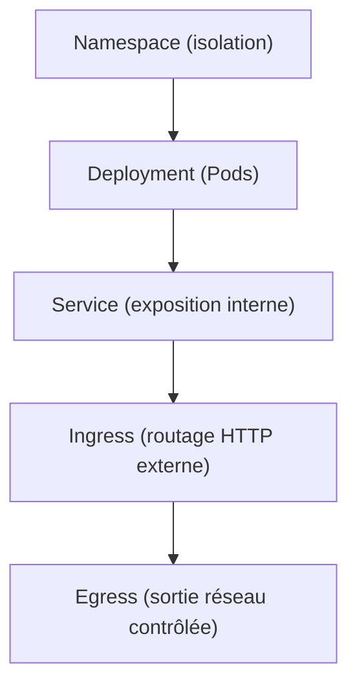

# CM2 – Structure, isolation et exposition dans Kubernetes

## 📘 Du YAML au réseau : comprendre la logique déclarative de K8s

---

## 1. Pourquoi YAML ?

### Le langage de la déclaration d'état

Kubernetes est **déclaratif** : on ne décrit pas _comment faire_, mais _ce que l’on veut obtenir_.
Le fichier YAML (Yet Another Markup Language) permet d’exprimer cet **état désiré**.

### Principe de base

- Chaque fichier YAML décrit **un ou plusieurs objets Kubernetes**.
- Chaque objet possède trois clés fondamentales :
  - `apiVersion` → version de l’API utilisée
  - `kind` → type d’objet (Pod, Deployment, Service, etc.)
  - `metadata` → informations descriptives (nom, labels, namespace)
  - `spec` → le cœur fonctionnel (comportement de l’objet)

### Exemple minimal : ConfigMap

```yaml
---
apiVersion: v1
kind: ConfigMap
metadata:
  name: demo-config
data:
  message: "Bonjour Kubernetes"
  version: "1.0"
```

> Ce fichier déclare une ressource de type ConfigMap appelée `demo-config` qui contient deux clés/valeurs.

---

## 2. Règles de base YAML

### Couples clé/valeur

Chaque clé est suivie de `:` et d’un espace.

```yaml
apiVersion: "v1"
data: "42"
```

Les guillemets évitent les erreurs de typage (ex. `version: "1.0"` au lieu de `1.0`).

### Tableaux et dictionnaires

**Liste :**

```yaml
ports:
  - 80
  - 443
```

**Objet imbriqué :**

```yaml
metadata:
  name: web
  labels:
    app: demo
```

Les **espaces sont obligatoires** (pas de tabulations).
L’indentation = hiérarchie logique.

### YAML multi-documents

Un fichier YAML peut contenir **plusieurs objets** séparés par `---`.

```yaml
---
kind: Namespace
metadata:
  name: demo
---
kind: Deployment
metadata:
  name: web
  namespace: demo
```

Cela permet d’appliquer plusieurs ressources en une seule commande :

```bash
kubectl apply -f demo-stack.yml
```

---

## 3. Pourquoi plusieurs fichiers dans un déploiement ?

Kubernetes déploie des systèmes **modulaires et interconnectés** :
chaque objet a une **responsabilité distincte**.

| Objet         | Rôle                                   | Exemple         |
| ------------- | -------------------------------------- | --------------- |
| Namespace     | Isolation logique                      | `namespace.yml` |
| Deployment    | Décrit les Pods (containers, replicas) | `app.yml`       |
| Service       | Accès réseau interne                   | `service.yml`   |
| Ingress       | Accès externe HTTP                     | `ingress.yml`   |
| NetworkPolicy | Sécurité réseau                        | `policy.yml`    |

### Logique séquentielle du déploiement



> Chaque étape ajoute une "couche de visibilité" au sein du cluster.

---

## 4. L’isolation avec les Namespaces

Les **namespaces** permettent de segmenter le cluster en environnements logiques :

- Par équipe (`dev`, `test`, `prod`)
- Par projet (`frontend`, `backend`)
- Par niveau de sécurité

### Commandes pratiques

```bash
kubectl get ns
kubectl create ns demo
kubectl config set-context --current --namespace=demo
```

**Observation :**

```bash
kubectl get all -n demo
kubectl get pods -A    # tous les namespaces
```

> Toujours spécifier le namespace dans vos fichiers :

```yaml
metadata:
  name: web
  namespace: demo
```

---

## 5. Exemple de déploiement complet (multi-fichiers)

### namespace.yml

```yaml
apiVersion: v1
kind: Namespace
metadata:
  name: demo
```

### deployment.yml

```yaml
apiVersion: apps/v1
kind: Deployment
metadata:
  name: web
  namespace: demo
spec:
  replicas: 2
  selector:
    matchLabels:
      app: web
  template:
    metadata:
      labels:
        app: web
    spec:
      containers:
        - name: web
          image: nginx:1.25
          ports:
            - containerPort: 80
```

### service.yml

```yaml
apiVersion: v1
kind: Service
metadata:
  name: web-svc
  namespace: demo
spec:
  selector:
    app: web
  ports:
    - port: 80
      targetPort: 80
  type: ClusterIP
```

### ingress.yml

```yaml
apiVersion: networking.k8s.io/v1
kind: Ingress
metadata:
  name: web-ing
  namespace: demo
  annotations:
    kubernetes.io/ingress.class: traefik
spec:
  rules:
    - host: web.local
      http:
        paths:
          - path: /
            pathType: Prefix
            backend:
              service:
                name: web-svc
                port:
                  number: 80
```

### networkpolicy.yml

```yaml
apiVersion: networking.k8s.io/v1
kind: NetworkPolicy
metadata:
  name: restrict-egress
  namespace: demo
spec:
  podSelector:
    matchLabels:
      app: web
  policyTypes:
    - Egress
  egress:
    - to:
        - ipBlock:
            cidr: 192.168.0.0/16
```

---

## 6. Vérification étape par étape

| Étape                 | Commande                          | Attendu                     |
| --------------------- | --------------------------------- | --------------------------- |
| Création du namespace | `kubectl apply -f namespace.yml`  | `namespace/demo created`    |
| Déploiement app       | `kubectl apply -f deployment.yml` | Pods créés                  |
| Vérification          | `kubectl get pods -n demo`        | READY = 2/2                 |
| Ajout du service      | `kubectl apply -f service.yml`    | Service `web-svc` actif     |
| Test réseau interne   | `kubectl get svc -n demo`         | IP interne ClusterIP        |
| Ajout de l’ingress    | `kubectl apply -f ingress.yml`    | Routage web disponible      |
| Observation finale    | `kubectl get all -n demo`         | Pods, Svc, Ingress visibles |

---

## 7. Schéma récapitulatif de la pile réseau Kubernetes

```mermaid
graph LR
  subgraph Cluster "Cluster Kubernetes (namespace: demo)"
    subgraph Node1
      P1["Pod: web-1"]
      P2["Pod: web-2"]
    end
    subgraph Service["Service ClusterIP (web-svc)"]
      S1["Load-balancing interne"]
    end
    subgraph Ingress["Ingress Controller (Traefik)"]
      I1["Règles HTTP / DNS"]
    end
  end
  User["Navigateur : http://web.local"] --> I1 --> S1 --> P1 & P2
```

---

## 8. Pour aller plus loin : Egress et Policies

Les **NetworkPolicies** permettent :

- De limiter le trafic sortant (Egress)
- De restreindre les communications entrantes (Ingress)
- De renforcer la sécurité inter-pods

En production, ces règles sont essentielles pour :

- isoler les namespaces,
- empêcher la fuite de données,
- restreindre les accès à certaines IP internes.

---

## 9. Synthèse

| Couche | Objet         | Rôle                             |
| ------ | ------------- | -------------------------------- |
| 1      | Namespace     | Isolation logique                |
| 2      | Deployment    | Gestion des Pods                 |
| 3      | Service       | Communication interne            |
| 4      | Ingress       | Exposition externe               |
| 5      | NetworkPolicy | Sécurité réseau (egress/ingress) |

---

## 10. Conclusion du CM2

Kubernetes **compose les couches réseau et applicatives** à partir de fichiers **YAML déclaratifs**.
Ces fichiers décrivent un **état souhaité**, que le cluster maintient automatiquement.

Le **namespace isole**,
le **service connecte**,
l’**ingress expose**,
et la **policy protège**.

Le **TD4** prolongera cette logique avec :

- Installation de **Traefik** (Ingress Controller)
- Exploration du **réseau entre pods**
- Introduction à **Lens** et **Prometheus**
- Observation en temps réel de la charge et du trafic.
