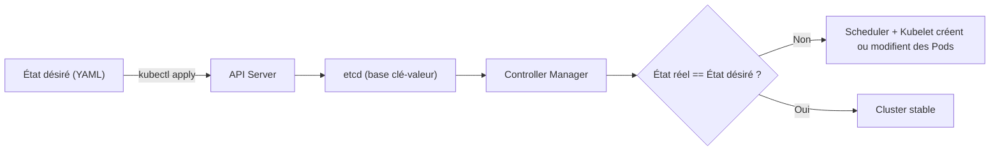
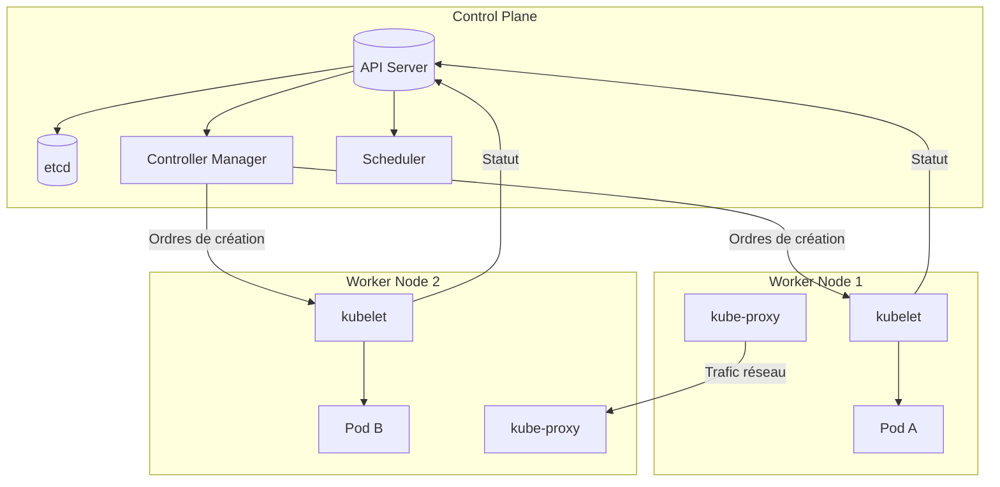
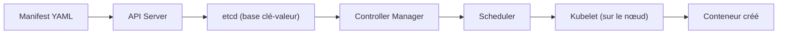
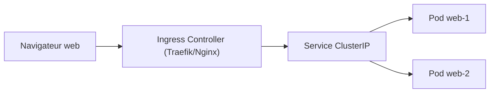
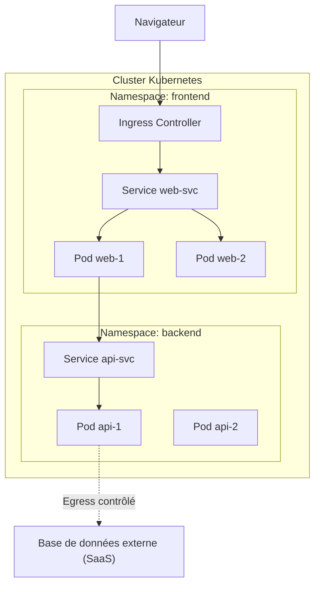

# CM2 - Partie 1 : Genèse et architecture interne de Kubernetes

---

## 1. Origine et philosophie de Kubernetes

Kubernetes est né au sein de **Google** en 2014, inspiré d'un outil interne appelé **Borg**. Borg était l'orchestrateur interne qui gérait des millions de conteneurs au sein de l'infrastructure Google. Kubernetes en reprend les idées fondamentales tout en les ouvrant à la communauté open source.

L'objectif de Kubernetes est de **gérer automatiquement le cycle de vie d'applications conteneurisées**, quel que soit l'environnement (local, cloud, hybride).

> Kubernetes n'exécute pas vos applications directement — il orchestre leur exécution sur un ensemble de machines.

### Principes fondateurs

1. **Déclaratif** : on décrit _l'état souhaité_, Kubernetes s'assure que le système y converge.
2. **Automatisé** : planification, récupération et redéploiement sans intervention humaine.
3. **Distribué** : composé de plusieurs services coopérants par API.
4. **Extensible** : chaque composant peut être remplacé ou augmenté par un contrôleur personnalisé.

---

## 2. Le cluster Kubernetes

Un cluster Kubernetes est constitué de deux grandes parties :

### 🧠 Le **Control Plane** (Plan de contrôle)

C'est le cerveau du cluster. Il prend les décisions d'orchestration et maintient la cohérence de l'état global.

| Composant                        | Rôle                                                                                       |
| -------------------------------- | ------------------------------------------------------------------------------------------ |
| **API Server**                   | Point d'entrée unique du cluster. Reçoit toutes les requêtes `kubectl` ou des contrôleurs. |
| **etcd**                         | Base de données clé/valeur distribuée, stocke l'état souhaité du cluster.                  |
| **Controller Manager**           | Compare l'état réel et l'état désiré, et agit en conséquence.                              |
| **Scheduler**                    | Détermine sur quel nœud exécuter chaque Pod selon les ressources disponibles.              |
| **Cloud Controller (optionnel)** | Intègre Kubernetes avec les APIs d'un fournisseur cloud.                                   |

### ⚙️ Les **Worker Nodes** (Nœuds de travail)

Chaque nœud exécute les conteneurs réels. Il contient :

| Composant             | Rôle                                                                                   |
| --------------------- | -------------------------------------------------------------------------------------- |
| **kubelet**           | Agent local. Reçoit les instructions du Control Plane et gère les Pods sur la machine. |
| **container runtime** | Exécute les conteneurs (Docker, containerd, CRI-O...).                                 |
| **kube-proxy**        | Gère le routage et les règles de communication réseau entre Pods et Services.          |

---

## 3. Communication interne et API

Tout dans Kubernetes passe par **l'API Server**. Il s'agit d'un serveur HTTP/JSON qui reçoit des requêtes REST :

- `kubectl get pods` → **GET /api/v1/pods**
- `kubectl apply -f deploy.yml` → **POST /apis/apps/v1/deployments**

Les autres composants (Controller, Scheduler, Kubelet) **ne communiquent qu'avec l'API Server**, jamais directement entre eux. Ce modèle permet :

- une **isolation fonctionnelle** entre les processus,
- un **contrôle d'accès centralisé**,
- une **extensibilité** naturelle (Custom Controllers, CRDs).

> Kubernetes expose une API unique, que l’on interroge et modifie comme une base de données d’état du cluster.

---

## 4. Le cycle de réconciliation

Kubernetes fonctionne selon une logique de **réconciliation continue** :



### Les étapes principales

1. L'utilisateur applique un **manifest YAML** (ex : Deployment).
2. L'**API Server** valide et enregistre la ressource dans `etcd`.
3. Le **Controller Manager** détecte qu'aucun Pod n'existe encore pour ce Deployment.
4. Le **Scheduler** assigne les Pods à des nœuds.
5. Les **kubelets** créent les conteneurs correspondants.
6. Le cluster atteint un **état stable** lorsque la réalité correspond au YAML.

> Cette boucle tourne en permanence. Kubernetes s'auto-répare dès qu'un écart est détecté (self-healing).

---

## 5. Schéma d'ensemble



---

## 6. Points à retenir

- Kubernetes est un **système distribué** basé sur une API unique.
- Le **Control Plane** décide, les **nœuds appliquent**.
- L'état du cluster est stocké dans **etcd**, source de vérité.
- Le **Scheduler** et le **Controller Manager** maintiennent la cohérence.
- Le **kubelet** est le lien entre la théorie (manifest YAML) et la réalité (conteneurs en exécution).

---

**Prochaine partie :** Le modèle déclaratif et la structure des manifests YAML.

# CM2 - Partie 2 : Le modèle déclaratif et les manifests YAML

---

## 1. Le modèle déclaratif de Kubernetes

Kubernetes repose sur une approche **déclarative**. Cela signifie que l’administrateur ou le développeur **ne décrit pas les étapes à exécuter**, mais **l’état final souhaité** du système.

Autrement dit :

> On déclare _ce que l’on veut obtenir_, pas _comment l’obtenir_.

C’est le **Control Plane** (API Server + Controller Manager + Scheduler) qui se charge de faire converger le cluster vers cet état.

### ⚙️ Exemple conceptuel

Imaginons que vous écriviez :

```yaml
replicas: 3
```

Cela ne dit pas _comment_ créer trois conteneurs, mais indique simplement à Kubernetes :

> « Assure-toi qu’il y ait toujours trois réplicas de ce Pod actifs. »

Si un conteneur tombe, Kubernetes en relance un automatiquement pour maintenir cet état.

### 🧠 Ce que cela implique

- L’utilisateur **n’exécute pas des commandes d’infrastructure** ; il **modifie des objets dans une base d’état**.
- L’orchestrateur **surveille en continu** les écarts entre l’état désiré et l’état réel.
- Le cluster est donc **auto-réparant** (self-healing) et **auto-adaptatif** (scaling, update, rollback).

---

## 2. Le rôle du YAML dans cette logique

Le YAML (Yet Another Markup Language) est le format privilégié pour décrire les ressources Kubernetes. Il agit comme **la syntaxe du contrat** entre le développeur et le cluster.

Chaque fichier YAML représente un ou plusieurs **objets Kubernetes** (souvent appelés _manifests_).

### 🧩 Structure de base

```yaml
apiVersion: v1
kind: ConfigMap
metadata:
  name: app-config
data:
  MODE: "production"
  TIMEOUT: "30"
```

Cette ressource exprime l’intention : « crée un objet de type ConfigMap nommé `app-config` contenant des données de configuration. »

### Les quatre sections fondamentales

| Clé          | Rôle                                  | Exemple                                  |
| ------------ | ------------------------------------- | ---------------------------------------- |
| `apiVersion` | indique la version de l’API utilisée  | `v1`, `apps/v1`, `batch/v1`              |
| `kind`       | type d’objet à créer                  | `Pod`, `Service`, `Deployment`, `Job`... |
| `metadata`   | identifiants (nom, labels, namespace) | `name: webapp`, `labels: app=web`        |
| `spec`       | spécification fonctionnelle (le cœur) | `replicas`, `containers`, `ports`, etc.  |

### 🧱 Notion de hiérarchie et indentation

L’indentation en YAML reflète la structure de l’objet : chaque niveau décrit un sous-champ ou un bloc d’attributs. **Les espaces sont obligatoires** et **les tabulations interdites**.

```yaml
spec:
  replicas: 2
  selector:
    matchLabels:
      app: web
```

> En YAML, l’espace **porte le sens**. Une simple erreur d’indentation change la signification du document.

---

## 3. Du manifest au cluster : la chaîne de traitement



### 🔍 Étapes détaillées

1. **kubectl apply -f fichier.yaml** → Envoie le manifest à l’API Server.
2. **Validation** → L’API vérifie la conformité (syntaxe, permissions, version d’API).
3. **Stockage dans etcd** → L’état souhaité est écrit dans la base d’état.
4. **Controller Manager** → Compare cet état à la réalité et crée les objets manquants.
5. **Scheduler** → Assigne chaque Pod à un nœud selon les ressources.
6. **kubelet** → Télécharge l’image, crée le conteneur, et signale le statut.

Le système entre alors dans sa boucle de **réconciliation continue**.

> Kubernetes se comporte comme un automate d’état : tant que la réalité diffère du manifest, il agit.

---

## 4. `kubectl create` vs `kubectl apply`

Il est fréquent de confondre les commandes `create` et `apply`. Elles semblent similaires, mais elles participent toutes deux du modèle déclaratif.

### ✳️ `kubectl create`

Crée un nouvel objet à partir d’un fichier ou d’un modèle direct :

```bash
kubectl create deployment web --image=nginx
```

Cette commande **génère implicitement un manifest YAML** qui est immédiatement transmis à l’API Server. L’objet créé devient alors une entrée dans `etcd`, et le Controller Manager se charge de sa réconciliation comme pour tout autre objet.

On peut ensuite **retrouver la description déclarative** de cet objet :

```bash
kubectl get deployment web -o yaml
```

> Même si la commande `create` semble impérative, Kubernetes la traduit en une **déclaration d’état**. Ce qui est sauvegardé et réconcilié, c’est un objet YAML, pas un ordre exécutable.

### 🧩 `kubectl apply`

Applique ou met à jour un manifest existant. Il crée l’objet s’il n’existe pas encore, sinon il modifie uniquement les champs nécessaires pour atteindre l’état souhaité.

```bash
kubectl apply -f deployment.yaml
```

Kubernetes conserve une copie de la configuration appliquée (dans l’annotation `kubectl.kubernetes.io/last-applied-configuration`), ce qui permet de **comparer les différences** et d’**effectuer des mises à jour progressives**.

### 💡 En résumé

| Commande | Nature                  | Utilisation typique                  | Gestion de l’état                 |
| -------- | ----------------------- | ------------------------------------ | --------------------------------- |
| `create` | Déclaratif (instantané) | Créer une ressource unique ou rapide | Enregistrement immédiat dans etcd |
| `apply`  | Déclaratif (continu)    | Créer ou mettre à jour via YAML      | Suivi et réconciliation continue  |

Dans les deux cas, Kubernetes fonctionne toujours selon le même principe : le **Controller Manager** compare en permanence l’état déclaré à l’état observé et agit jusqu’à leur convergence.

---

## 5. Typologie des objets Kubernetes

Tous les objets Kubernetes dérivent de la même structure, mais ils ont des finalités différentes.

| Catégorie            | Type d’objet                                  | Rôle                                           |
| -------------------- | --------------------------------------------- | ---------------------------------------------- |
| **Workload**         | Pod, ReplicaSet, Deployment, StatefulSet, Job | Déploient et maintiennent des conteneurs       |
| **Service & Réseau** | Service, Ingress, Endpoint                    | Assurent la connectivité interne/externe       |
| **Configuration**    | ConfigMap, Secret, Volume                     | Fournissent des données de configuration       |
| **Infrastructure**   | Node, Namespace, PV, PVC                      | Décrivent les ressources physiques ou logiques |
| **Sécurité**         | NetworkPolicy, ServiceAccount, Role, RBAC     | Gèrent l’accès et l’isolation                  |

### Exemple : un Deployment complet

```yaml
apiVersion: apps/v1
kind: Deployment
metadata:
  name: web-deploy
  labels:
    app: web
spec:
  replicas: 2
  selector:
    matchLabels:
      app: web
  template:
    metadata:
      labels:
        app: web
    spec:
      containers:
        - name: web
          image: nginx:1.25
          ports:
            - containerPort: 80
```

> Ce manifest déclare l’existence d’un ensemble de Pods gérés par un contrôleur de type Deployment. Le champ `replicas` indique la quantité attendue, et `selector` lie ce Deployment aux Pods correspondants.

---

## 6. Manifests multi-documents

Il est possible de combiner plusieurs ressources dans un seul fichier séparé par `---`.

```yaml
---
apiVersion: v1
kind: Namespace
metadata:
  name: demo
---
apiVersion: apps/v1
kind: Deployment
metadata:
  name: web
  namespace: demo
spec:
  replicas: 1
  selector:
    matchLabels:
      app: web
  template:
    metadata:
      labels:
        app: web
    spec:
      containers:
        - name: web
          image: nginx:1.25
---
apiVersion: v1
kind: Service
metadata:
  name: web-svc
  namespace: demo
spec:
  selector:
    app: web
  ports:
    - port: 80
      targetPort: 80
```

> Cette approche permet de déployer un mini-écosystème complet en une seule commande.

```bash
kubectl apply -f stack-demo.yaml
```

---

## 7. Vérification et inspection

Quelques commandes essentielles pour observer l’état du cluster après déploiement :

| Action                | Commande                                  | Résultat                          |
| --------------------- | ----------------------------------------- | --------------------------------- |
| Lister les ressources | `kubectl get all -n demo`                 | Tous les objets du namespace      |
| Détails d’un objet    | `kubectl describe deployment web -n demo` | Informations, événements          |
| Contenu YAML actuel   | `kubectl get deploy web -o yaml`          | État courant du manifest appliqué |
| État des Pods         | `kubectl get pods -o wide`                | IPs, nœuds, statuts               |

Ces commandes permettent de relier la **théorie (fichier YAML)** à la **réalité (conteneurs actifs)**.

---

## 8. Points pédagogiques clés

- Kubernetes est **piloté par des manifests** : tout est un objet API décrit en YAML.
- L’utilisateur **ne manipule pas les conteneurs**, mais les objets qui les représentent.
- Le **Control Plane** maintient la cohérence entre l’état désiré et l’état réel.
- Le YAML est **la grammaire du dialogue** entre l’humain et l’orchestrateur.
- Même les commandes `create` sont **déclaratives**, car elles produisent un objet persistant que le Controller Manager réconcilie.

---

**Prochaine partie :** Isolation logique, exposition réseau et structure applicative (Namespaces, Services, Ingress).

# CM2 – Partie 3 : Isolation, organisation et exposition dans Kubernetes

---

## 1. Introduction : du manifest à la structure du cluster

Après avoir découvert comment décrire les objets Kubernetes (Pods, Deployments, Services) via YAML, nous abordons maintenant la **structure logique et réseau** du cluster.

Kubernetes est un système **déclaratif et auto-régulé** : le Control Plane s'assure que l'état du cluster correspond en permanence à l'état déclaré. Cette réconciliation s'applique non seulement aux objets applicatifs, mais également à la façon dont les applications sont organisées, exposées et isolées.

Dans cette partie, nous allons comprendre comment Kubernetes :

- **organise** les ressources avec les namespaces ;
- **connecte** les composants via les services internes ;
- **expose** les applications vers l’extérieur avec les ingress ;
- **protège** le trafic avec les politiques réseau.

---

## 2. Les Namespaces : l'isolation logique du cluster

### 2.1. Rôle fondamental

Un **namespace** est un espace logique d'isolation à l'intérieur d'un cluster. Il ne sert **pas à représenter un environnement (dev/test/prod)**, mais à **segmenter et organiser** les ressources en fonction de domaines fonctionnels, d'équipes, ou d'applications.

Chaque namespace constitue un **domaine d'administration et de sécurité** distinct :

- les noms de ressources doivent y être uniques ;
- les règles d'accès (RBAC) et quotas peuvent être appliqués de manière spécifique ;
- certaines ressources (Nodes, ClusterRoles, PersistentVolumes) sont globales et ne dépendent d'aucun namespace.

> ✨ Un cluster Kubernetes = une ville partagée. Les namespaces = les quartiers isolés avec leurs propres règles, habitants et ressources.

### 2.2. Bonnes pratiques d'organisation

Plutôt que d'utiliser les namespaces pour simuler des environnements, on les emploie pour :

- **isoler des applications** : `frontend`, `backend`, `database`, `monitoring` ;
- **isoler des équipes ou clients** : `team-a`, `client-x`, `client-y` ;
- **gérer la sécurité et la gouvernance** : attribution de rôles, quotas, limites CPU/mémoire, secrets.

En revanche, les environnements **dev / staging / prod** devraient être **sur des clusters distincts** pour éviter les fuites de sécurité et garantir la résilience.

### 2.3. Commandes pratiques

```bash
kubectl get ns
kubectl create ns analytics
kubectl config set-context --current --namespace=analytics
kubectl get all -n analytics
```

### 2.4. Namespace par défaut et objets globaux

Si aucun namespace n'est spécifié, Kubernetes crée l'objet dans le namespace **default**.
Certains objets sont dits **non namespacés** (globaux) :

- `Node`, `Namespace`, `ClusterRole`, `PersistentVolume`.

---

### 2.5. Discussion critique : Namespaces, Zero Trust et architecture

Une idée fausse très répandue consiste à assimiler les namespaces à des environnements (dev/test/prod). En réalité :

- Kubernetes est **une plateforme de production**, pas un outil de sandbox pour le développement.
- Les environnements séparés reposent sur des **clusters distincts**, pas des namespaces.

#### 🔒 Rôle sécuritaire des namespaces

- Les namespaces servent à **limiter la surface d'attaque** en cloisonnant les ressources et les accès.
- Les communications inter-namespaces peuvent être **restreintes** par des `NetworkPolicies`.
- Dans une approche **Zero Trust**, rien n'est implicitement autorisé.

#### 🕵️‍♂️ Schémas d'isolation possibles

1. **Namespace unique** : tous les composants d'une application dans un seul espace (simple, mais exposé).
2. **Multi-namespaces applicatifs** : front / back / data dans des namespaces différents avec des règles de communication précises.
3. **Multi-clusters (production)** : un cluster par environnement (dev/staging/prod) pour une isolation totale.

> En production, c'est la troisième approche qui correspond à la réalité cloud-native.

---

## 3. Les Services : connecter et stabiliser le réseau interne

### 3.1. Problématique

Les Pods sont éphémères : leurs adresses IP changent à chaque recréation. Les Services assurent une **adresse stable et un mécanisme de découverte interne (DNS)**.

### 3.2. Types de Services

| Type           | Portée            | Rôle                                   | Cas d’usage                       |
| -------------- | ----------------- | -------------------------------------- | --------------------------------- |
| `ClusterIP`    | Interne           | Point d'accès interne au cluster       | Communication entre microservices |
| `NodePort`     | Interne + externe | Exposition sur chaque nœud (port fixe) | Démonstrations locales            |
| `LoadBalancer` | Externe (cloud)   | Exposition publique                    | Production                        |
| `ExternalName` | DNS externe       | Redirection vers ressource externe     | API, base de données distante     |

### 3.3. Exemple YAML

```yaml
apiVersion: v1
kind: Service
metadata:
  name: api-svc
  namespace: backend
spec:
  selector:
    app: api
  ports:
    - port: 8080
      targetPort: 8080
  type: ClusterIP
```

### 3.4. Résolution DNS interne

Chaque Service obtient automatiquement un nom DNS :
`api-svc.backend.svc.cluster.local`

Les Pods peuvent ainsi se contacter via le nom du Service, sans jamais connaître son adresse IP.

> Le DNS interne est géré par **CoreDNS**, déployé comme un Pod dans le namespace `kube-system`.

---

## 4. L’Ingress : exposer les applications vers l’extérieur

### 4.1. Pourquoi un Ingress ?

Les Services exposés en `NodePort` ou `LoadBalancer` sont pratiques mais limités :

- `NodePort` nécessite un port ouvert sur chaque nœud,
- `LoadBalancer` dépend du cloud provider.

✨ L'objet `Ingress` décrit des **règles de routage HTTP(S)** gérées par un **Ingress Controller** (Traefik, Nginx, Istio Gateway, etc.).

### 4.2. Exemple YAML

```yaml
apiVersion: networking.k8s.io/v1
kind: Ingress
metadata:
  name: web-ingress
  namespace: frontend
  annotations:
    kubernetes.io/ingress.class: traefik
spec:
  rules:
    - host: web.example.com
      http:
        paths:
          - path: /
            pathType: Prefix
            backend:
              service:
                name: web-svc
                port:
                  number: 80
```

### 4.3. Schéma logique



> L'Ingress agit comme un proxy inverse HTTP/TLS, appliquant les règles de routage et les certificats.

---

## 5. L’Egress et les NetworkPolicies : contrôler le trafic sortant

### 5.1. Par défaut : tout est ouvert

Dans Kubernetes, les Pods peuvent, par défaut, communiquer librement vers l'extérieur et entre eux.

Pour des raisons de sécurité et de conformité, il est essentiel de **fermer ces canaux par défaut** et d'appliquer le principe du moindre privilège.

### 5.2. Exemple de NetworkPolicy

```yaml
apiVersion: networking.k8s.io/v1
kind: NetworkPolicy
metadata:
  name: restrict-egress
  namespace: backend
spec:
  podSelector:
    matchLabels:
      app: api
  policyTypes:
    - Egress
  egress:
    - to:
        - ipBlock:
            cidr: 10.0.0.0/8
```

> Cette politique interdit tout trafic sortant sauf vers le réseau interne 10.0.0.0/8.

### 5.3. Principes à retenir

- `Ingress` = flux **entrant** vers les Pods.
- `Egress` = flux **sortant** des Pods.
- `NetworkPolicy` = pare-feu logique au niveau du Pod.
- En Zero Trust, tout est **fermé par défaut**, puis **ouvert par exception**.

---

## 6. Schéma récapitulatif



---

## 7. Conclusion de la Partie 3

- Les **namespaces** délimitent des domaines d'administration et de sécurité au sein d'un cluster.
- Les **services** stabilisent les connexions internes entre pods.
- Les **ingress** exposent les applications vers l'extérieur via un contrôleur HTTP/TLS.
- Les **network policies** assurent un contrôle fin des flux entrants et sortants.

Ensemble, ces mécanismes composent une **infrastructure segmentée, déclarative et sécurisée**, orchestrée par le **Control Plane** de Kubernetes.

> Le TD4 prolongera cette approche avec la mise en place concrète de **Traefik (Ingress Controller)**, l'exploration du **réseau inter-pods**, et l'observation en temps réel via **Lens** et **Prometheus**.
