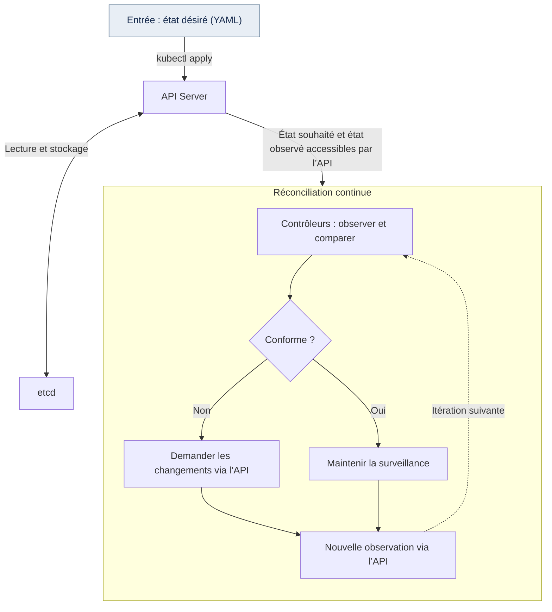
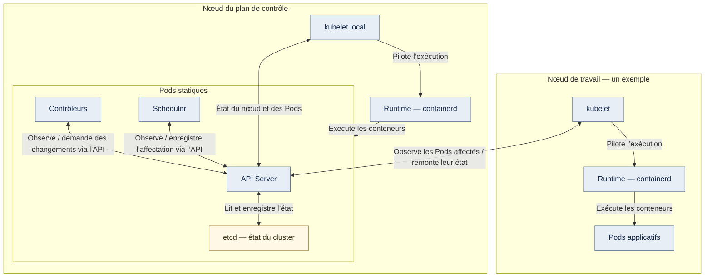
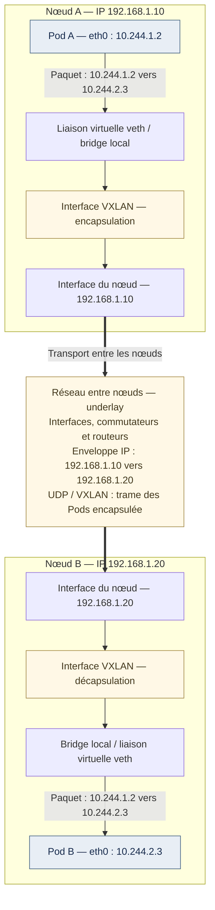
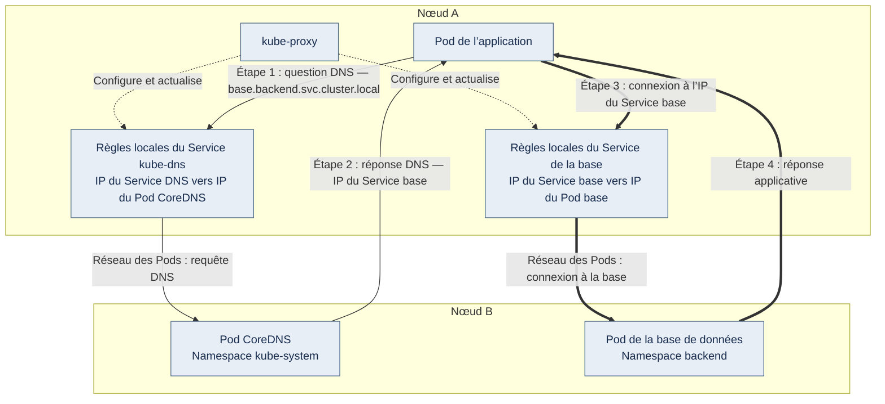
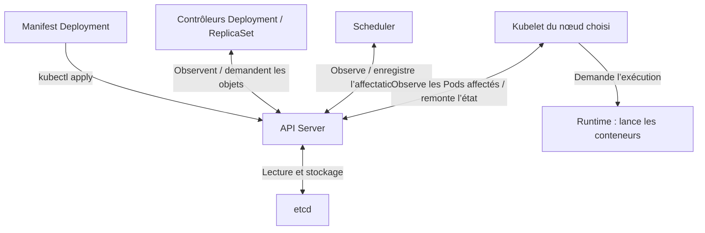
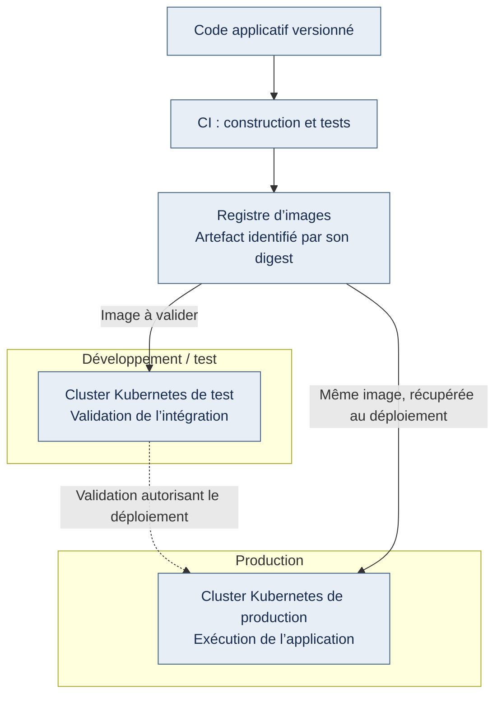
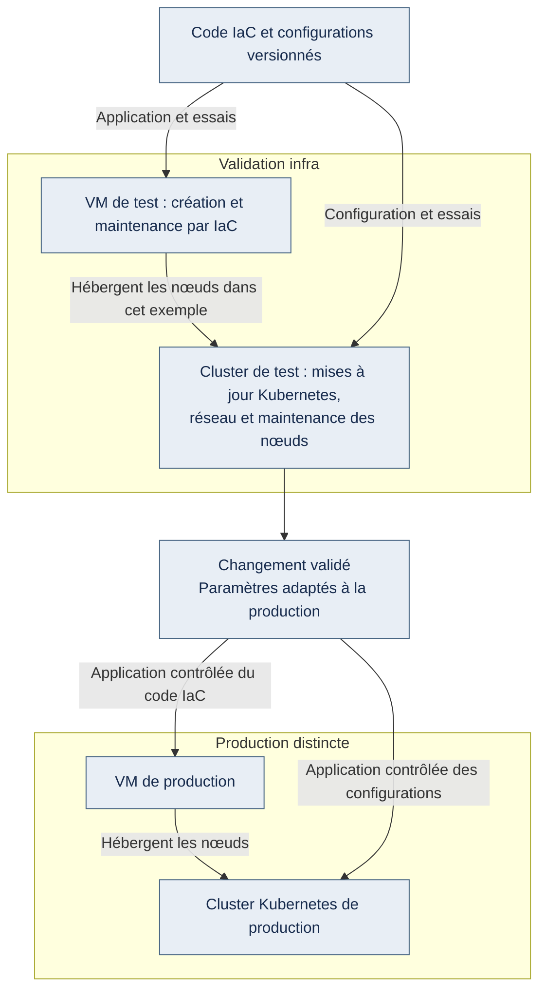
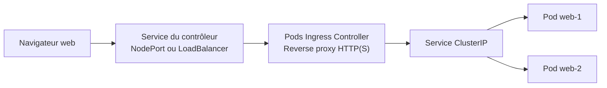
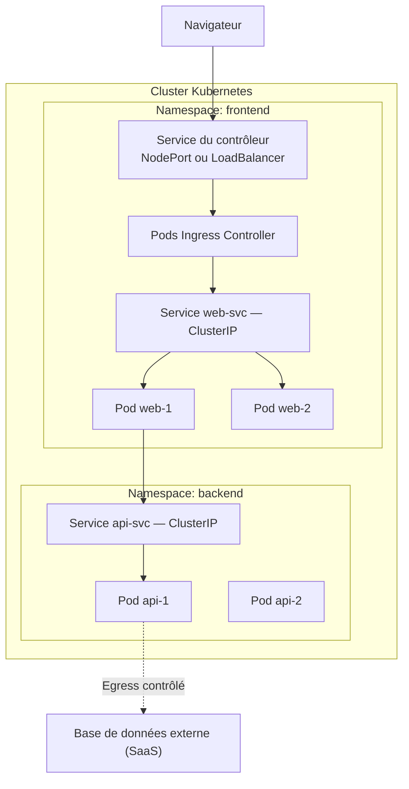

# CM2 – Partie 1 : Genèse et architecture interne de Kubernetes

## 1. Origine et philosophie de Kubernetes

Kubernetes est né au sein de **Google** en 2014, inspiré d’un outil interne appelé **Borg**. Borg était\
l’orchestrateur interne qui gérait des millions de conteneurs au sein de l’infrastructure Google. Kubernetes\
en reprend les idées fondamentales tout en les ouvrant à la communauté open source.

L’objectif de Kubernetes est de **gérer automatiquement le cycle de vie d’applications conteneurisées**, quel que soit l’environnement (local, cloud, hybride).

> Kubernetes n’exécute pas vos applications directement — il orchestre leur exécution sur un ensemble de machines.

### Principes fondateurs

1. **Déclaratif** : on décrit _l’état souhaité_, Kubernetes s’assure que le système y converge.
2. **Automatisé** : planification, récupération et redéploiement sans intervention humaine.
3. **Distribué** : composé de plusieurs services coopérants par API.
4. **Extensible** : chaque composant peut être remplacé ou augmenté par un contrôleur personnalisé.

---

## 2. Le cluster Kubernetes

Un cluster Kubernetes est constitué de deux grandes parties :

### Le Control Plane (Plan de contrôle)

C’est le cerveau du cluster. Il prend les décisions d’orchestration et maintient la cohérence de l’état global.

| Composant                        | Rôle                                                                                       |
| -------------------------------- | ------------------------------------------------------------------------------------------ |
| **API Server**                   | Point d’entrée unique du cluster. Reçoit toutes les requêtes `kubectl` ou des contrôleurs. |
| **etcd**                         | Base de données clé/valeur distribuée, stocke l’état souhaité du cluster.                  |
| **Controller Manager**           | Compare l’état réel et l’état désiré, et agit en conséquence.                              |
| **Scheduler**                    | Détermine sur quel nœud exécuter chaque Pod selon les ressources disponibles.              |
| **Cloud Controller (optionnel)** | Intègre Kubernetes avec les APIs d’un fournisseur cloud.                                   |

---

### Les Worker Nodes (Nœuds de travail)

Les workers exécutent les Pods applicatifs. Les composants de nœud ci-dessous ne leur sont pas exclusifs :\
un nœud du plan de contrôle en utilise également pour exécuter ses Pods système.

| Composant             | Rôle                                                                                    |
| --------------------- | --------------------------------------------------------------------------------------- |
| **kubelet**           | Agent local. Reçoit les instructions du Control Plane et gère les Pods sur la machine.  |
| **container runtime** | Exécute les conteneurs (Docker, containerd, CRI-O…).                                    |
| **kube-proxy**        | Configure les règles réseau qui dirigent le trafic des Services vers leurs Pods cibles. |

---

## 3. Communication interne et API

La gestion des objets Kubernetes passe par **l’API Server**, qui expose une API HTTP acceptant notamment des données JSON :

- `kubectl get pods -n demo` → **GET /api/v1/namespaces/demo/pods**
- `kubectl apply -f deploy.yml` → création ou mise à jour via l’API ; avec le mode client par défaut, **POST** pour créer un objet absent et **PATCH** pour modifier un objet existant.

Les contrôleurs, le scheduler et les kubelets **se coordonnent via l’API Server**. Ils ont aussi des\
échanges propres à leur rôle : le kubelet communique notamment avec le runtime local. Le trafic applicatif\
entre Pods ne passe pas par l’API Server. Cette coordination centralisée permet :

- une **isolation fonctionnelle** entre les processus,
- un **contrôle d’accès centralisé**,
- une **extensibilité** naturelle (Custom Controllers, CRDs).

> Kubernetes expose une API unique, que l’on interroge et modifie comme une base de données d’état du cluster.

---

## 4. Le cycle de réconciliation

Kubernetes fonctionne selon une logique de **réconciliation continue** :


```mermaid
flowchart TB
    A["Entrée : état désiré (YAML)"] -->|"kubectl apply"| B["API Server"]
    B <-->|"Lecture et stockage"| C["etcd"]
    B -->|"État souhaité et état observé accessibles par l’API"| LOOP

    subgraph LOOP["Réconciliation continue"]
      direction TB
      D["Contrôleurs : observer et comparer"] --> E{"Conforme ?"}
      E -->|"Non"| F["Demander les changements via l’API"]
      E -->|"Oui"| G["Maintenir la surveillance"]
      F --> H["Nouvelle observation via l’API"]
      G --> H
      H -.->|"Itération suivante"| D
    end

    classDef entree fill:#e8eef5,stroke:#466482,color:#172b4d;
    class A entree;
```

### Les étapes principales

1. L’utilisateur applique un **manifest YAML** (ex : Deployment).
2. L'**API Server** valide et enregistre la ressource dans `etcd`.
3. Les contrôleurs **Deployment puis ReplicaSet** demandent via l’API la création des objets nécessaires, dont les Pods.
4. Le **Scheduler** choisit un nœud pour chaque Pod non affecté et enregistre ce choix via l’API.
5. Les **kubelets** demandent au runtime de lancer les conteneurs et remontent leur état via l’API.
6. Le cluster atteint un **état stable** lorsque la réalité correspond au YAML.

> Cette boucle tourne en permanence. Kubernetes s’auto-répare dès qu’un écart est détecté (self-healing).

---

## 5. Trois vues complémentaires du cluster

### 5.1. Plan de contrôle : gérer et exécuter les Pods

L’API Server est le point d’échange : les contrôleurs y observent les ressources et demandent les\
changements ; le scheduler y enregistre l’affectation des Pods. Chaque kubelet observe les Pods affectés à\
son nœud, pilote leur exécution via le runtime et remonte leur état.

Dans cet exemple, comme avec kubeadm, les composants principaux du plan de contrôle et etcd sont des Pods\
statiques, exécutés par le runtime sous la supervision du kubelet local. Le kubelet et le runtime sont\
généralement des services de l’hôte. Cette organisation peut varier selon l’installation.


```mermaid
flowchart TB
  subgraph CP["Nœud du plan de contrôle"]
    KCP["kubelet local"]
    RCP["Runtime — containerd"]
    subgraph STATIC["Pods statiques"]
      API["API Server"]
      ETCD["etcd — état du cluster"]
      CTRL["Contrôleurs"]
      SCHED["Scheduler"]
    end
    KCP -->|"Pilote l’exécution"| RCP
    RCP -->|"Exécute les conteneurs"| STATIC
    API <-->|"Lit et enregistre l’état"| ETCD
    CTRL <-->|"Observe / demande des changements via l’API"| API
    SCHED <-->|"Observe / enregistre l’affectation via l’API"| API
    KCP <-->|"État du nœud et des Pods"| API
  end

  subgraph WORKER["Nœud de travail — un exemple"]
    K["kubelet"]
    R["Runtime — containerd"]
    P["Pods applicatifs"]
    K -->|"Pilote l’exécution"| R
    R -->|"Exécute les conteneurs"| P
  end

  K <-->|"Observe les Pods affectés / remonte leur état"| API

  classDef composant fill:#e8eef5,stroke:#466482,color:#172b4d;
  class KCP,RCP,API,CTRL,SCHED,K,R,P composant;
  classDef stockage fill:#fff8e6,stroke:#a68b48,color:#45391d;
  class ETCD stockage;
```

**Lecture :** les doubles flèches représentent les échanges avec l’API, pas le trafic applicatif. Le kubelet\
gère les Pods statiques à partir de leur définition locale, même si l’API est indisponible. Le\
cloud-controller-manager optionnel, présenté plus haut, n’est pas détaillé ici. Le réseau applicatif est\
réservé aux deux vues suivantes.

---

### 5.2. Réseau des Pods : traverser le réseau des nœuds

Le **CNI (Container Network Interface)** définit l’interface utilisée par le runtime pour configurer le\
réseau d’un Pod à l’aide de plugins : interface réseau, adresse IP et routes. La solution réseau choisie\
assure aussi la connectivité entre les nœuds. Ici, on prend l’exemple de\
**Flannel avec un réseau superposé (overlay) VXLAN** ; d’autres solutions ou configurations utilisent du\
routage sans tunnel.

Le Pod A veut joindre le Pod B. Leurs adresses appartiennent au réseau des Pods, distinct du réseau qui\
relie les nœuds. Avec VXLAN, le nœud A encapsule la trame du Pod dans un paquet UDP/IP adressé au nœud B.\
Celui-ci retire cette enveloppe et livre le paquet au Pod destinataire.


```mermaid
flowchart TB
  subgraph NA["Nœud A — IP 192.168.1.10"]
    PA["Pod A — eth0 : 10.244.1.2"]
    LA["Liaison virtuelle veth / bridge local"]
    VA["Interface VXLAN — encapsulation"]
    EA["Interface du nœud — 192.168.1.10"]
    PA -->|"Paquet : 10.244.1.2 vers 10.244.2.3"| LA
    LA --> VA --> EA
  end

  UNDER["Réseau entre nœuds — underlay<br/>Interfaces, commutateurs et routeurs<br/>Enveloppe IP : 192.168.1.10 vers 192.168.1.20<br/>UDP / VXLAN : trame des Pods encapsulée"]

  subgraph NB["Nœud B — IP 192.168.1.20"]
    EB["Interface du nœud — 192.168.1.20"]
    VB["Interface VXLAN — décapsulation"]
    LB["Bridge local / liaison virtuelle veth"]
    PB["Pod B — eth0 : 10.244.2.3"]
    EB --> VB --> LB
    LB -->|"Paquet : 10.244.1.2 vers 10.244.2.3"| PB
  end

  EA ==>|"Transport entre les nœuds"| UNDER
  UNDER ==> EB

  classDef pod fill:#e8eef5,stroke:#466482,color:#172b4d;
  class PA,PB pod;
  classDef tunnel fill:#fff8e6,stroke:#a68b48,color:#45391d;
  class VA,VB,UNDER tunnel;
```

**À retenir :** dans cet exemple, les IP source et destination des Pods sont conservées dans le paquet\
intérieur. L’enveloppe extérieure utilise les IP des nœuds ; elle est ajoutée au départ et retirée à\
l’arrivée. Le même identifiant de réseau VXLAN (VNI) est utilisé aux deux extrémités. Les équipements\
intermédiaires transportent l’enveloppe sans avoir à connaître les routes des Pods.

Les plugins CNI et les agents de la solution réseau configurent les interfaces et les routes ; le noyau\
assure ici l’encapsulation et le transport. Le schéma suit le chemin\
**Pod → nœud → réseau physique → nœud → Pod**. Avec des nœuds virtuels, le réseau sous-jacent comporte\
également les interfaces et commutateurs virtuels de l’infrastructure. Les adresses sont illustratives ; les\
Services et le DNS sont volontairement absents de cette vue.

**Références :** [Plugins réseau Kubernetes](https://kubernetes.io/docs/concepts/extend-kubernetes/compute-storage-net/network-plugins/) et [backend VXLAN de Flannel](https://github.com/flannel-io/flannel/blob/master/Documentation/backends.md#vxlan).

---

### 5.3. Plan de données : découvrir puis joindre la base

On utilise maintenant le réseau des Pods expliqué ci-dessus, sans redessiner ses interfaces ni ses tunnels.\
L’application est sur le nœud A ; la base et un Pod CoreDNS sont ici sur le nœud B. Ce placement est un\
exemple : CoreDNS peut être répliqué sur plusieurs nœuds. Ses Pods sont généralement déployés dans le\
namespace `kube-system` et exposés par le Service **`kube-dns`**.

Deux échanges se succèdent : **résoudre le nom du Service de la base**, puis\
**ouvrir la connexion vers la base**. CoreDNS renvoie une adresse ; il ne relaie pas les requêtes adressées\
à la base.


```mermaid
flowchart TB
  subgraph A["Nœud A"]
    APP["Pod de l’application"]
    PROXY["kube-proxy"]
    RDNS["Règles locales du Service kube-dns<br/>IP du Service DNS vers IP du Pod CoreDNS"]
    RDB["Règles locales du Service de la base<br/>IP du Service base vers IP du Pod base"]
    PROXY -.->|"Configure et actualise"| RDNS
    PROXY -.->|"Configure et actualise"| RDB
    APP -->|"Étape 1 : question DNS — base.backend.svc.cluster.local"| RDNS
    APP ==>|"Étape 3 : connexion à l’IP du Service base"| RDB
  end

  subgraph B["Nœud B"]
    DNS["Pod CoreDNS<br/>Namespace kube-system"]
    DB["Pod de la base de données<br/>Namespace backend"]
  end

  RDNS -->|"Réseau des Pods : requête DNS"| DNS
  DNS -->|"Étape 2 : réponse DNS — IP du Service base"| APP
  RDB ==>|"Réseau des Pods : connexion à la base"| DB
  DB ==>|"Étape 4 : réponse applicative"| APP

  classDef composant fill:#e8eef5,stroke:#466482,color:#172b4d;
  class APP,PROXY,RDNS,RDB,DNS,DB composant;
```

**Lecture :** les traits fins suivent l’échange DNS ; les traits épais suivent l’échange avec la base ; les\
pointillés indiquent la configuration des règles. Les réponses sont représentées logiquement : elles\
empruntent aussi le réseau des Pods, avec le traitement de retour associé aux connexions. Les namespaces\
indiquent l’appartenance logique des Pods ; ils peuvent s’étendre sur plusieurs nœuds.

`kube-proxy` observe les Services et leurs destinations (EndpointSlices) via l’API et actualise les règles\
sur chaque nœud. Seules les règles du nœud source sont détaillées ici. Les Services sont des objets logiques\
avec une IP virtuelle dans cet exemple, pas des processus intermédiaires ; les paquets sont traités par les\
règles du noyau, sans traverser le processus `kube-proxy`. L’API et le détail du CNI sont omis pour suivre\
uniquement ces échanges.

Le plan de contrôle maintient les ressources et leur configuration ; le réseau des Pods assure le transport\
; les Services et le DNS fournissent des points d’accès stables et nommés.

**Référence :** [Service DNS et CoreDNS dans Kubernetes](https://kubernetes.io/docs/tasks/administer-cluster/dns-custom-nameservers/).

---

## 6. Points à retenir

- Kubernetes est un **système distribué** basé sur une API unique.
- Le **Control Plane** décide, les **nœuds appliquent**.
- L’état du cluster est stocké dans **etcd**, source de vérité.
- Le **Scheduler** et le **Controller Manager** maintiennent la cohérence.
- Le **kubelet** est le lien entre la théorie (manifest YAML) et la réalité (conteneurs en exécution).

---

**Prochaine partie :** Le modèle déclaratif et la structure des manifests YAML.

# CM2 – Partie 2 : Le modèle déclaratif et les manifests YAML

## 1. Le modèle déclaratif de Kubernetes

Le modèle déclaratif présenté en partie 1 s’exprime dans les manifests : on décrit **l’état souhaité**, puis le cluster cherche à y converger.

### Exemple conceptuel

Imaginons que vous écriviez :

```yaml
replicas: 3
```

Cette valeur indique à Kubernetes :

> « Assure-toi qu’il y ait toujours trois réplicas de ce Pod actifs. »

Si un conteneur tombe, Kubernetes en relance un automatiquement pour maintenir cet état.

### Ce que cela implique

- L’utilisateur **n’exécute pas des commandes d’infrastructure** ; il **modifie des objets dans une base d’état**.
- Le cluster est donc **auto-réparant** (self-healing) et **auto-adaptatif** (scaling, update, rollback).

---

## 2. Le rôle du YAML dans cette logique

Le YAML (Yet Another Markup Language) est le format privilégié pour décrire les ressources Kubernetes. Il agit comme **la syntaxe du contrat** entre le développeur et le cluster.

Chaque fichier YAML représente un ou plusieurs **objets Kubernetes** (souvent appelés _manifests_).

### Structure de base

```yaml
apiVersion: v1
kind: ConfigMap
metadata:
  name: app-config
data:
  MODE: "production"
  TIMEOUT: "30"
```

Cette ressource exprime l’intention : « crée un objet de type ConfigMap nommé `app-config` contenant des données de configuration. »

### Les champs courants d’un manifest

| Clé          | Rôle                                  | Exemple                                 |
| ------------ | ------------------------------------- | --------------------------------------- |
| `apiVersion` | indique la version de l’API utilisée  | `v1`, `apps/v1`, `batch/v1`             |
| `kind`       | type d’objet à créer                  | `Pod`, `Service`, `Deployment`, `Job`…  |
| `metadata`   | identifiants (nom, labels, namespace) | `name: webapp`, `labels: app=web`       |
| `spec`       | état souhaité, selon le type d’objet  | `replicas`, `containers`, `ports`, etc. |

`spec` n’est pas universel : le ConfigMap ci-dessus utilise `data` pour ses données de configuration.

---

### Notion de hiérarchie et indentation

L’indentation en YAML reflète la structure de l’objet : chaque niveau décrit un sous-champ ou un bloc\
d’attributs. **Les espaces sont obligatoires** et **les tabulations interdites**.

```yaml
spec:
  replicas: 2
  selector:
    matchLabels:
      app: web
```

> En YAML, l’espace **porte le sens**. Une simple erreur d’indentation change la signification du document.

---

## 3. Du manifest au cluster : la chaîne de traitement


```mermaid
flowchart TB
    A["Manifest Deployment"] -->|"kubectl apply"| B["API Server"]
    B <-->|"Lecture et stockage"| C["etcd"]
    D["Contrôleurs Deployment / ReplicaSet"] <-->|"Observent / demandent les objets"| B
    E["Scheduler"] <-->|"Observe / enregistre l’affectation"| B
    F["Kubelet du nœud choisi"] <-->|"Observe les Pods affectés / remonte l’état"| B
    F -->|"Demande l’exécution"| G["Runtime : lance les conteneurs"]
```

### Étapes détaillées

1. **kubectl apply -f fichier.yaml** → Envoie le manifest à l’API Server.
2. **Validation** → L’API vérifie la conformité (syntaxe, permissions, version d’API).
3. **Stockage dans etcd** → L’état souhaité est écrit dans la base d’état.
4. **Contrôleurs** → Pour un Deployment, les contrôleurs Deployment et ReplicaSet demandent les objets manquants via l’API.
5. **Scheduler** → Affecte les nouveaux Pods à des nœuds et enregistre ces affectations via l’API.
6. **kubelet** → Demande au runtime de récupérer l’image et de lancer les conteneurs, puis signale leur état via l’API.

Ces étapes s’inscrivent dans la boucle de réconciliation présentée en partie 1.

---

## 4. `kubectl create` vs `kubectl apply`

Les commandes `create` et `apply` permettent de gérer les objets Kubernetes selon deux approches : impérative pour `create`, déclarative pour `apply`.

### `kubectl create`

Crée un nouvel objet à partir d’un fichier ou d’un modèle direct :

```bash
kubectl create deployment web --image=nginx
```

Cette commande construit un objet Deployment et demande sa création à l’API Server. Celui-ci l’enregistre\
dans `etcd` ; les contrôleurs concernés assurent ensuite sa réconciliation.

On peut ensuite **consulter la description de cet objet au format YAML** :

```bash
kubectl get deployment web -o yaml
```

> La commande `create` est impérative : elle demande une création et échoue si l’objet existe déjà. L’objet\
> créé décrit néanmoins un état souhaité, pris en charge par les contrôleurs concernés.

---

### `kubectl apply`

Applique ou met à jour un manifest existant. Il crée l’objet s’il n’existe pas encore, sinon il modifie uniquement les champs nécessaires pour atteindre l’état souhaité.

```bash
kubectl apply -f deployment.yaml
```

Kubernetes conserve une copie de la configuration appliquée (dans l’annotation `kubectl.kubernetes.io/last-applied-configuration`),
ce qui permet de **comparer les différences** et d’**effectuer des mises à jour progressives**.

### En résumé

| Commande         | Approche    | Comportement                                                      |
| ---------------- | ----------- | ----------------------------------------------------------------- |
| `kubectl create` | Impérative  | Crée un objet ; échoue si cet objet existe déjà.                  |
| `kubectl apply`  | Déclarative | Crée ou met à jour un objet à partir de la configuration fournie. |

Dans les deux cas, les contrôleurs concernés poursuivent la réconciliation après la création de l’objet. La\
différence porte sur la manière de créer ou de mettre à jour sa configuration.

---

## 5. Typologie des objets Kubernetes

Tous les objets Kubernetes dérivent de la même structure, mais ils ont des finalités différentes.

| Catégorie            | Type d’objet                                  | Rôle                                           |
| -------------------- | --------------------------------------------- | ---------------------------------------------- |
| **Workload**         | Pod, ReplicaSet, Deployment, StatefulSet, Job | Déploient et maintiennent des conteneurs       |
| **Service & Réseau** | Service, Ingress, Endpoint                    | Assurent la connectivité interne/externe       |
| **Configuration**    | ConfigMap, Secret, Volume                     | Fournissent des données de configuration       |
| **Infrastructure**   | Node, Namespace, PV, PVC                      | Décrivent les ressources physiques ou logiques |
| **Sécurité**         | NetworkPolicy, ServiceAccount, Role, RBAC     | Gèrent l’accès et l’isolation                  |

---

### Exemple : un Deployment complet

```yaml
apiVersion: apps/v1
kind: Deployment
metadata:
  name: web-deploy
  labels:
    app: web
spec:
  replicas: 2
  selector:
    matchLabels:
      app: web
  template:
    metadata:
      labels:
        app: web
    spec:
      containers:
        - name: web
          image: nginx:1.25
          ports:
            - containerPort: 80
```

> Ce manifest déclare l’existence d’un ensemble de Pods gérés par un contrôleur de type Deployment. Le champ\
> `replicas` indique la quantité attendue, et `selector` lie ce Deployment aux Pods correspondants.

---

## 6. Manifests multi-documents

Il est possible de combiner plusieurs ressources dans un seul fichier séparé par `---`.

```yaml
---
apiVersion: v1
kind: Namespace
metadata:
  name: demo
---
apiVersion: apps/v1
kind: Deployment
metadata:
  name: web
  namespace: demo
spec:
  replicas: 1
  selector:
    matchLabels:
      app: web
  template:
    metadata:
      labels:
        app: web
    spec:
      containers:
        - name: web
          image: nginx:1.25
---
apiVersion: v1
kind: Service
metadata:
  name: web-svc
  namespace: demo
spec:
  selector:
    app: web
  ports:
    - port: 80
      targetPort: 80
```

> Cette approche permet de déployer un mini-écosystème complet en une seule commande.

```bash
kubectl apply -f stack-demo.yaml
```

---

## 7. Vérification et inspection

Quelques commandes essentielles pour observer l’état du cluster après déploiement :

| Action                | Commande                                  | Résultat                                                          |
| --------------------- | ----------------------------------------- | ----------------------------------------------------------------- |
| Lister les ressources | `kubectl get all -n demo`                 | Ressources de la catégorie `all` (liste non exhaustive)           |
| Détails d’un objet    | `kubectl describe deployment web -n demo` | Informations, événements                                          |
| Contenu YAML actuel   | `kubectl get deploy web -n demo -o yaml`  | Objet courant, avec son état et les champs ajoutés par le cluster |
| État des Pods         | `kubectl get pods -n demo -o wide`        | IPs, nœuds, statuts                                               |

Ces commandes permettent de relier la **théorie (fichier YAML)** à la **réalité (conteneurs actifs)**.

---

## 8. Points pédagogiques clés

- Kubernetes est **piloté par des manifests** : tout est un objet API décrit en YAML.
- L’utilisateur **ne manipule pas les conteneurs**, mais les objets qui les représentent.
- Le **Control Plane** maintient la cohérence entre l’état désiré et l’état réel.
- Le YAML est **la grammaire du dialogue** entre l’humain et l’orchestrateur.
- `create` est **impératif** et `apply` **déclaratif** ; les objets créés restent, dans les deux cas, pris en charge par les contrôleurs concernés.

---

**Prochaine partie :** Isolation logique, exposition réseau et structure applicative (Namespaces, Services, Ingress).

# CM2 – Partie 3 : Isolation, organisation et exposition dans Kubernetes

## 1. Introduction : du manifest à la structure du cluster

Après avoir découvert comment décrire les objets Kubernetes (Pods, Deployments, Services) via YAML, nous abordons maintenant la **structure logique et réseau** du cluster.

Dans cette partie, nous allons comprendre comment Kubernetes :

- **organise** les ressources avec les namespaces ;
- **connecte** les composants via les services internes ;
- **expose** les applications vers l’extérieur avec les ingress ;
- **protège** le trafic avec les politiques réseau.

---

## 2. Les Namespaces : l’isolation logique du cluster

### 2.1. Rôle fondamental

Un **namespace** est un espace logique d’isolation à l’intérieur d’un cluster.
Il sert à **segmenter et organiser** les ressources en fonction de domaines fonctionnels, d’équipes, ou d’applications.

Chaque namespace définit un **périmètre d’administration** auquel on peut appliquer des règles de sécurité :

- les noms doivent y être uniques pour un même type de ressource ;
- les règles d’accès (RBAC) et quotas peuvent être appliqués de manière spécifique.

> Un cluster Kubernetes = une ville partagée. Les namespaces = les quartiers qui regroupent les ressources ; leurs règles d’accès et de communication restent à définir.

### 2.2. Bonnes pratiques d’organisation

On peut utiliser les namespaces pour organiser des applications, des équipes ou des environnements :

- **regrouper des applications** : `frontend`, `backend`, `database`, `monitoring` ;
- **séparer les ressources des équipes ou clients** : `team-a`, `client-x`, `client-y` ;
- **gérer la sécurité et la gouvernance** : attribution de rôles, quotas, limites CPU/mémoire, secrets.

Le choix entre namespaces et clusters distincts pour **dev / staging / prod** est précisé au §2.5.

---

### 2.3. Commandes pratiques

```bash
kubectl get ns
kubectl create ns analytics
kubectl config set-context --current --namespace=analytics
kubectl get all -n analytics
```

### 2.4. Namespace par défaut et objets globaux

Avec `kubectl`, si aucun namespace n’est spécifié dans le manifest ou la commande, le namespace du contexte courant est utilisé ; à défaut, c’est **default**.
Certains objets sont dits **non namespacés** (globaux) :

- `Node`, `Namespace`, `ClusterRole`, `PersistentVolume`.

---

### 2.5. Discussion critique : Namespaces, Zero Trust et architecture

Un namespace peut représenter un environnement (dev/test/prod), mais ne fournit pas à lui seul une isolation complète et ne bloque pas les communications réseau :

- Kubernetes sert à **l’apprentissage, au développement et à la production**, avec des exigences différentes.
- Des **clusters distincts** séparent les plans de contrôle et les périmètres de panne ; des namespaces partagent le même cluster.

#### Rôle sécuritaire des namespaces

- Les namespaces servent de périmètre aux règles **RBAC, quotas et politiques réseau** ; leur création seule n’applique pas ces protections.
- Les communications inter-namespaces peuvent être **restreintes** par des `NetworkPolicies`.
- Dans une approche **Zero Trust**, rien n’est implicitement autorisé.

---

#### Schémas d’isolation possibles

1. **Namespace unique** : tous les composants d’une application dans un seul espace, avec des protections adaptées.
2. **Multi-namespaces applicatifs** : front / back / data dans des namespaces différents avec des règles de communication précises.
3. **Multi-clusters** : des clusters distincts par environnement pour renforcer la séparation, sans supprimer les éventuelles dépendances communes.

> Le choix dépend des risques, des besoins d’exploitation et des ressources disponibles ; aucune de ces organisations ne garantit à elle seule la sécurité.

---

#### Exemple : séparer la validation de la production

La séparation peut répondre à deux besoins : valider une version de l’application et tester les changements de l’infrastructure qui l’exécute.

**Application : construire une fois, puis déployer l’artefact validé.** La CI construit et teste une image, puis la publie dans un registre. Un cluster de développement ou de test permet de valider son intégration. Après validation, le déploiement en production référence la même image, identifiée par son digest ; les nœuds la récupèrent depuis le registre. La CI peut s’exécuter sur des runners distincts du cluster de test.


```mermaid
flowchart TB
  CODE["Code applicatif versionné"] --> CI["CI : construction et tests"]
  CI --> REG["Registre d’images<br/>Artefact identifié par son digest"]

  subgraph DEV["Développement / test"]
    TEST["Cluster Kubernetes de test<br/>Validation de l’intégration"]
  end

  subgraph PROD["Production"]
    APP["Cluster Kubernetes de production<br/>Exécution de l’application"]
  end

  REG -->|"Image à valider"| TEST
  TEST -.->|"Validation autorisant le déploiement"| APP
  REG -->|"Même image, récupérée au déploiement"| APP

  classDef composant fill:#e8eef5,stroke:#466482,color:#172b4d;
  class CODE,CI,REG,TEST,APP composant;
```

**Infrastructure : éprouver les changements avant de les appliquer en production.** Un environnement de développement peut aussi servir à tester une mise à jour Kubernetes, un changement de CNI ou la maintenance des nœuds. Avec l’IaC, il peut inclure la création et la modification des VM qui hébergent le cluster.


```mermaid
flowchart TB
  CODE["Code IaC et configurations versionnés"]

  subgraph LAB["Validation infra"]
    VMTEST["VM de test : création et maintenance par IaC"]
    KTEST["Cluster de test : mises à jour Kubernetes,<br/>réseau et maintenance des nœuds"]
    VMTEST -->|"Hébergent les nœuds dans cet exemple"| KTEST
  end

  CHECK["Changement validé<br/>Paramètres adaptés à la production"]

  subgraph PROD["Production distincte"]
    VMPROD["VM de production"]
    KPROD["Cluster Kubernetes de production"]
    VMPROD -->|"Hébergent les nœuds"| KPROD
  end

  CODE -->|"Application et essais"| VMTEST
  CODE -->|"Configuration et essais"| KTEST
  KTEST --> CHECK
  CHECK -->|"Application contrôlée du code IaC"| VMPROD
  CHECK -->|"Application contrôlée des configurations"| KPROD

  classDef composant fill:#e8eef5,stroke:#466482,color:#172b4d;
  class CODE,VMTEST,KTEST,CHECK,VMPROD,KPROD composant;
```

**À retenir :** on promeut une image applicative ou un changement d’infrastructure validé ; on ne transfère pas le cluster de test en production. Les environnements peuvent se trouver sur des machines, des sites ou des fournisseurs différents. Pour protéger la production des essais sur Kubernetes et l’IaC, on privilégie des clusters distincts et on examine aussi leurs dépendances communes : réseau, stockage et hôtes physiques. Les environnements de test applicatif et d’essai de l’infrastructure peuvent eux-mêmes être séparés.

---

## 3. Les Services : connecter et stabiliser le réseau interne

### 3.1. Problématique

Les Pods sont éphémères : leurs adresses IP changent à chaque recréation.
Les Services assurent une **adresse stable et un mécanisme de découverte interne (DNS)**.

### 3.2. Types de Services

| Type           | Portée            | Rôle                                   | Cas d’usage                       |
| -------------- | ----------------- | -------------------------------------- | --------------------------------- |
| `ClusterIP`    | Interne           | Point d’accès interne au cluster       | Communication entre microservices |
| `NodePort`     | Interne + externe | Exposition sur chaque nœud (port fixe) | Démonstrations locales            |
| `LoadBalancer` | Externe (cloud)   | Exposition publique                    | Production                        |
| `ExternalName` | DNS externe       | Redirection vers ressource externe     | API, base de données distante     |

---

### 3.3. Exemple YAML

```yaml
apiVersion: v1
kind: Service
metadata:
  name: api-svc
  namespace: backend
spec:
  selector:
    app: api
  ports:
    - port: 8080
      targetPort: 8080
  type: ClusterIP
```

### 3.4. Résolution DNS interne

Chaque Service obtient automatiquement un nom DNS :
`api-svc.backend.svc.cluster.local`

Les Pods peuvent ainsi se contacter via le nom du Service, sans jamais connaître son adresse IP.

> Le DNS interne est géré par **CoreDNS**, déployé comme un Pod dans le namespace `kube-system`.

---

## 4. L’Ingress : exposer les applications vers l’extérieur

### 4.1. Pourquoi un Ingress ?

Les Services exposés en `NodePort` ou `LoadBalancer` sont pratiques mais limités :

- `NodePort` nécessite un port ouvert sur chaque nœud,
- `LoadBalancer` nécessite une implémentation d’équilibrage de charge, fournie par le cloud ou installée sur l’infrastructure.

L’objet `Ingress` décrit des **règles de routage HTTP(S)** gérées par un **Ingress Controller** (Traefik, Nginx, Istio Gateway, etc.).

Dans le cas présenté ici, l’Ingress Controller est un **reverse proxy exécuté dans des Pods**,\
exposés par un Service **NodePort ou LoadBalancer**. Ce point d’entrée est partagé par plusieurs applications :\
les règles Ingress dirigent les requêtes HTTP(S) selon le nom d’hôte ou le chemin.\
Les Services applicatifs peuvent rester en **ClusterIP** ; chacun conserve son Service interne,\
sans nécessiter un NodePort ou un LoadBalancer dédié.\
D’autres modes d’exposition du contrôleur existent selon l’installation.

### 4.2. Exemple YAML

```yaml
apiVersion: networking.k8s.io/v1
kind: Ingress
metadata:
  name: web-ingress
  namespace: frontend
  annotations:
    kubernetes.io/ingress.class: traefik
spec:
  rules:
    - host: web.example.com
      http:
        paths:
          - path: /
            pathType: Prefix
            backend:
              service:
                name: web-svc
                port:
                  number: 80
```

### 4.3. Schéma logique


```mermaid
graph LR
User["Navigateur web"] --> Entry["Service du contrôleur<br/>NodePort ou LoadBalancer"]
Entry --> Ingress["Pods Ingress Controller<br/>Reverse proxy HTTP(S)"]
Ingress --> Service["Service ClusterIP"]
Service --> Pod1["Pod web-1"]
Service --> Pod2["Pod web-2"]
```

> L’objet Ingress définit les règles ; l’Ingress Controller les applique et assure le routage HTTP(S), ainsi que la terminaison TLS lorsqu’elle est configurée. Les flèches représentent le parcours logique via les Services applicatifs.

---

## 5. L’Egress et les NetworkPolicies : contrôler le trafic sortant

### 5.1. Par défaut : tout est ouvert

Dans Kubernetes, les Pods peuvent, par défaut, communiquer librement vers l’extérieur et entre eux.

Pour des raisons de sécurité et de conformité, il est essentiel de **fermer ces canaux par défaut** et d’appliquer le principe du moindre privilège.

### 5.2. Exemple de NetworkPolicy

```yaml
apiVersion: networking.k8s.io/v1
kind: NetworkPolicy
metadata:
  name: restrict-egress
  namespace: backend
spec:
  podSelector:
    matchLabels:
      app: api
  policyTypes:
    - Egress
  egress:
    - to:
        - ipBlock:
            cidr: 10.0.0.0/8
```

> Cette politique sélectionne les Pods `app: api` du namespace `backend` et autorise leurs connexions\
> sortantes vers `10.0.0.0/8`. Elle nécessite une solution réseau qui applique les NetworkPolicies. En\
> l’absence d’autres politiques ajoutant des autorisations, les autres connexions sortantes de ces Pods sont\
> bloquées. Ce CIDR est un exemple à adapter ; il n’autorise pas nécessairement le DNS du cluster.

---

### 5.3. Principes à retenir

- Dans une NetworkPolicy, `ingress` désigne les flux **entrants** vers les Pods ; c’est distinct de l’objet `Ingress` qui décrit le routage HTTP(S).
- `egress` désigne les flux **sortants** des Pods.
- `NetworkPolicy` = pare-feu logique au niveau du Pod.
- En Zero Trust, tout est **fermé par défaut**, puis **ouvert par exception**.

---

## 6. Schéma récapitulatif


```mermaid
graph TD
  subgraph Cluster["Cluster Kubernetes"]
    subgraph NamespaceA["Namespace: frontend"]
      Entry["Service du contrôleur<br/>NodePort ou LoadBalancer"]
      I["Pods Ingress Controller"]
      S1["Service web-svc — ClusterIP"]
      P1["Pod web-1"]
      P2["Pod web-2"]
    end
    subgraph NamespaceB["Namespace: backend"]
      S2["Service api-svc — ClusterIP"]
      P3["Pod api-1"]
      P4["Pod api-2"]
    end
  end
  User["Navigateur"] --> Entry --> I --> S1 --> P1 & P2
  P1 --> S2 --> P3
  P3 -.->|"Egress contrôlé"| ExternalDB["Base de données externe (SaaS)"]
```

---

## 7. Conclusion de la Partie 3

- Les **namespaces** organisent les ressources et fournissent un périmètre pour appliquer des règles d’accès, des quotas et des politiques réseau.
- Les **services** stabilisent les connexions internes entre pods.
- Les **ingress** exposent les applications vers l’extérieur via un contrôleur HTTP/TLS.
- Les **network policies** assurent un contrôle fin des flux entrants et sortants.

Ensemble, ces mécanismes composent une **infrastructure segmentée, déclarative et sécurisée**, orchestrée par le **Control Plane** de Kubernetes.

> Le TD4 prolongera cette approche avec la mise en place concrète de **Traefik (Ingress Controller)**,\
> l’exploration du **réseau inter-pods**, et l’observation en temps réel via **Lens** et **Prometheus**.
