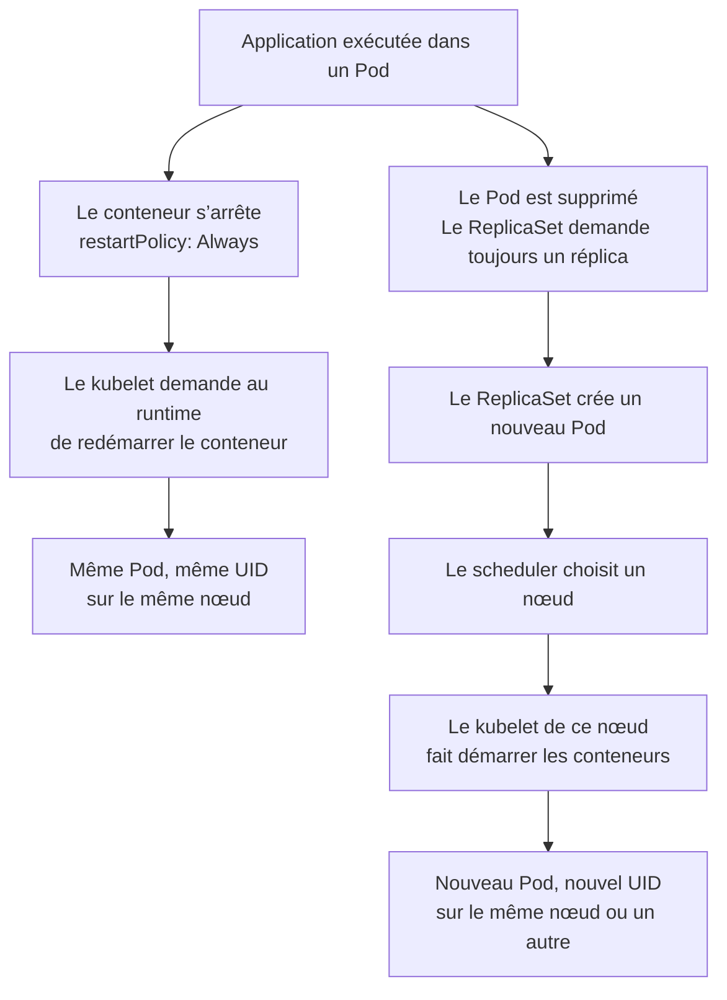
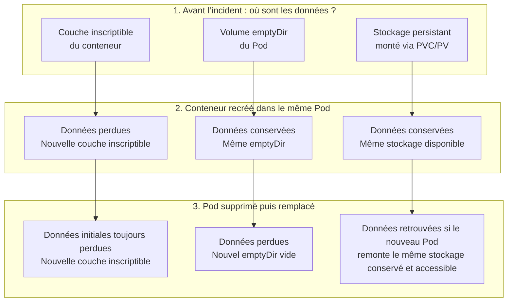
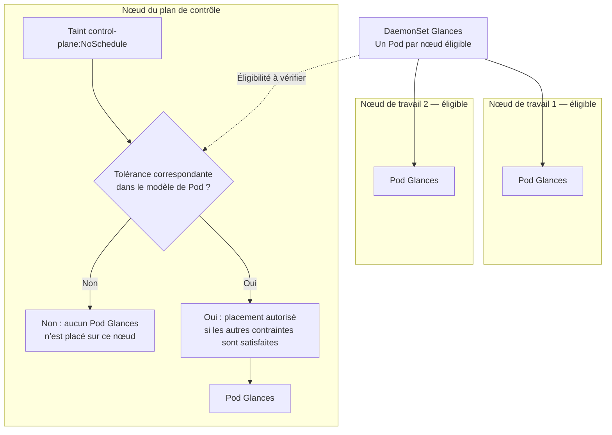
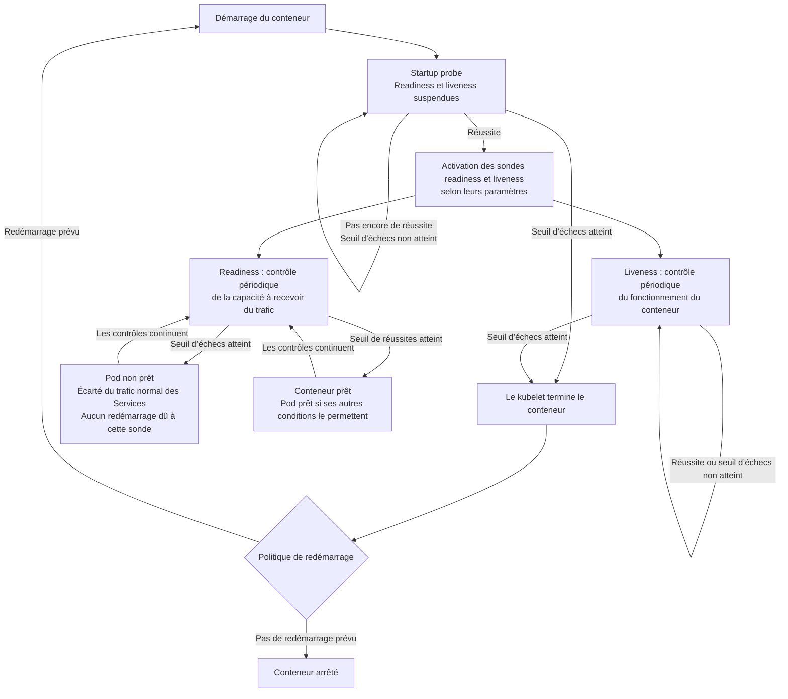
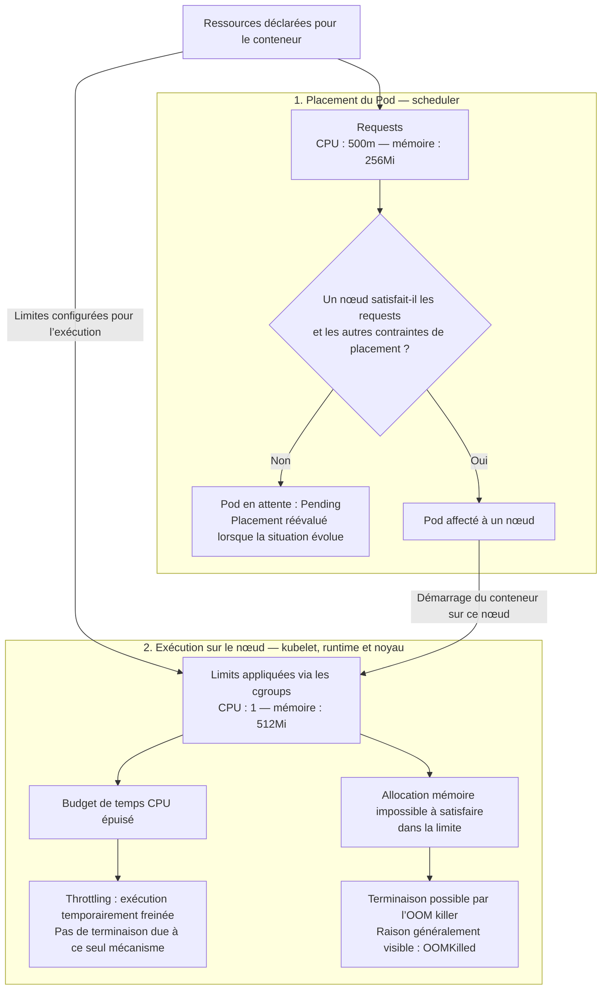

# CM3 – Cycle de vie, surveillance et ressources dans Kubernetes

Ce cours constitue la **première partie : maintenir les applications en fonctionnement**.

La seconde partie, [CM4 — Persistance des données et applications avec état](CM4.md), traite de la conservation des données et des StatefulSets.

---

**Plan du CM3**

- **Bloc 1 — Du déploiement éphémère à la supervision du cluster** : contexte, cycle de vie des Pods, réaction aux crashs, runtime et supervision des composants système.
- **Bloc 2 — Surveillance et gestion des ressources** : sondes applicatives, demandes et limites CPU/mémoire, surallocation et priorités.

---

## Bloc 1 — Du déploiement éphémère à la supervision du cluster

---

## 1. Contexte général : du déploiement éphémère à la production

Dans Kubernetes, **les conteneurs sont par définition éphémères** : ils peuvent être détruits et recréés à tout moment selon les besoins du cluster.
Leur remplacement contribue à la résilience lorsque des contrôleurs et un stockage adaptés sont configurés.

Il ne garantit pas à lui seul la disponibilité ni la conservation des données.

Il impose de comprendre **comment l’état et la durabilité sont gérés**.

> **Objectif du CM3** : comprendre comment Kubernetes réagit aux pannes, évalue la disponibilité des applications et encadre leur consommation de ressources.

Ce cours aborde :

- la **réaction du cluster aux crashs** ;
- la **surveillance des applications** (readiness, liveness) ;
- la **gestion des ressources CPU et mémoire** ;
- et la **supervision du cluster lui-même**.

---

## 2. Gestion des crashs et de l’état des pods

### 2.1 Cycle de vie d’un Pod

Un **Pod** encapsule un ou plusieurs conteneurs.
Ils partagent le même espace réseau et peuvent utiliser des volumes communs.

Sa **phase** décrit globalement son cycle de vie :

| Phase | Description |
| ----- | ----------- |
| **Pending** | Le Pod est accepté, mais un ou plusieurs conteneurs ne sont pas encore prêts à démarrer ; cela peut inclure l’attente du placement ou du téléchargement d’une image. |
| **Running** | Le Pod est affecté à un nœud, ses conteneurs ont été créés et au moins l’un d’eux est en cours d’exécution, de démarrage ou de redémarrage. Cela ne garantit pas que l’application est prête. |
| **Succeeded** | Tous les conteneurs du Pod se sont terminés avec succès et ne seront pas redémarrés. |
| **Failed** | Tous les conteneurs du Pod sont terminés, et au moins l’un d’eux s’est terminé en échec. |
| **Unknown** | L’état du Pod n’a pas pu être obtenu, généralement à cause d’un problème de communication avec le nœud. |

---

Il faut distinguer cette phase des **états des conteneurs** (`Waiting`, `Running`, `Terminated`) et de la colonne **STATUS** affichée par `kubectl get pods`.

Par exemple, `CrashLoopBackOff` décrit une temporisation avant le redémarrage d’un conteneur ; ce n’est pas une phase du Pod.

Pour lire un diagnostic, distinguer quatre informations :

| Information | Question posée |
| ----------- | -------------- |
| Phase du Pod (`status.phase`) | Où en est globalement son cycle de vie ? |
| État de chaque conteneur | Attend-il, s’exécute-t-il ou s’est-il terminé ? |
| Colonne `STATUS` de `kubectl` | Quelle indication synthétique aide au diagnostic ? |
| Colonne `READY` | Combien de conteneurs sont prêts parmi ceux comptabilisés ? |

Un Pod peut rester en phase `Running` alors qu’un conteneur attend son prochain redémarrage et que `kubectl` affiche `CrashLoopBackOff`.

Un processus démarré peut aussi échouer à sa sonde de readiness.

Le fonctionnement du processus et sa capacité à recevoir du trafic sont deux informations distinctes.

---

#### Commandes utiles

```bash
kubectl get pods -w
kubectl describe pod <nom>
kubectl logs <nom>
```

Exemple :

```bash
NAME           READY   STATUS             RESTARTS   AGE
mailpit-7d89   1/1     Running            0          5m
api-5f86d4c    0/1     CrashLoopBackOff   3          2m
```

---

### 2.2 Comportement en cas de crash

Lorsqu’un conteneur échoue :

1. Le **kubelet** (agent de nœud) détecte l’échec.
2. Il consulte la **politique de redémarrage** :

   ```yaml
   restartPolicy: Always
   ```

3. Avec `Always`, il demande au runtime de redémarrer le conteneur dans le **même Pod**, éventuellement après une temporisation.

`OnFailure` prévoit un redémarrage après une terminaison en échec ; `Never` n’en prévoit pas. Les Pods gérés par un Deployment utilisent `Always`.

---

Ce mécanisme assure une **récupération locale du conteneur**.

Si le Pod lui-même disparaît, son remplacement relève d’un contrôleur, par exemple le ReplicaSet d’un Deployment.

Le nouveau Pod a un nouvel UID.

Un Pod existant n’est pas déplacé vers un autre nœud.

Un Pod créé seul ne bénéficie pas de cette recréation automatique par un contrôleur.

---

**Exemple :** le processus d’un conteneur d’API s’arrête.

Avec `Always`, le kubelet relance ce conteneur ; le Pod conserve son UID.

Si ce Pod est supprimé alors que son ReplicaSet demande toujours un réplica, un nouveau Pod est créé puis placé par le scheduler, éventuellement sur un autre nœud.

Son UID change.



---

**À retenir :** redémarrer un conteneur et remplacer un Pod font intervenir des mécanismes différents.

Le déplacement apparent d’une application vers un autre nœud correspond à la création d’un nouveau Pod.

Le schéma présente la succession logique des actions.

Les échanges du plan de contrôle passent par l’API Server.

Pour distinguer les deux situations, comparer l’UID du Pod et le compteur de redémarrages. Le nom seul ne suffit pas toujours.

**Référence :** [Cycle de vie des Pods](https://kubernetes.io/docs/concepts/workloads/pods/pod-lifecycle/).

---

### 2.3 Rôle du runtime (Containerd)

Le kubelet s’appuie sur le **container runtime** (souvent _Containerd_ ou _CRI-O_) pour :

- créer et exécuter les conteneurs ;
- préparer les systèmes de fichiers et l’environnement d’exécution ; le réseau des Pods est configuré avec les plugins CNI ;
- superviser leur état.

---

Sous Minikube :

```bash
minikube ssh
sudo crictl ps -a
```

> `crictl` interroge le runtime via la CRI et convient à l’inspection des conteneurs Kubernetes.
>
> Avec containerd, `sudo ctr -n k8s.io containers list` permet aussi d’observer ses objets internes.
>
> Des traces de conteneurs arrêtés peuvent subsister avant nettoyage ; leur présence ne signifie pas que le Pod fonctionne encore.

---

### 2.4 CrashLoopBackOff

Cette indication signifie qu’un conteneur se termine de façon répétée et que sa politique prévoit son redémarrage.

Le kubelet applique généralement une **temporisation croissante entre les tentatives** (backoff), selon sa configuration.

Elle décrit un symptôme, pas la cause de l’échec.

```bash
Warning  BackOff  kubelet  Back-off restarting failed container
```

---

### 2.5 Nettoyage et persistance

- Les fichiers écrits dans la couche inscriptible du conteneur (ex. `/tmp/data`, si aucun volume n’y est monté) sont **perdus lorsque le conteneur est recréé**.
- Un volume temporaire comme `emptyDir` conserve les données entre les redémarrages de conteneurs dans le même Pod, mais disparaît avec ce Pod.
- Un stockage persistant, notamment monté via un **PVC lié à un PV**, peut conserver les données après le remplacement du Pod. La survie à une panne de nœud dépend du backend de stockage.

---

**Exemple de lecture :** une application écrit un fichier `/tmp/data`.

Sans montage à cet emplacement, le fichier appartient à la couche inscriptible du conteneur.

Si `/tmp` est monté depuis un `emptyDir`, le même chemin désigne un fichier du volume : il reste disponible après un redémarrage du conteneur dans ce Pod.

C’est donc le **montage**, et non le nom du répertoire, qui détermine la durée de vie des données.

---

| Emplacement des données | Conteneur recréé dans le même Pod | Pod supprimé puis remplacé |
| ----------------------- | -------------------------------- | ------------------------- |
| Couche inscriptible du conteneur | Données perdues | Données perdues |
| Volume `emptyDir` | Données conservées | Données perdues |
| Stockage persistant via PVC/PV | Données conservées si le stockage reste disponible | Données retrouvées si le nouveau Pod remonte le même stockage conservé et accessible |

---

Le schéma suit les mêmes données lors de deux événements successifs :

1. Le conteneur est recréé dans son Pod.
2. Ce Pod est supprimé et remplacé.



---

**À retenir :** la durée de vie des données dépend de leur emplacement.

`emptyDir` est lié au Pod ; le stockage persistant peut survivre à son remplacement, sous les conditions indiquées.

Cette comparaison suppose que le stockage lui-même n’a pas subi de panne. Un volume persistant ne remplace pas une sauvegarde.

**Référence :** [Volumes et durée de vie de `emptyDir`](https://kubernetes.io/docs/concepts/storage/volumes/#emptydir).

> 💡 _Le [CM4](CM4.md) expliquera comment configurer la persistance avec les PV, PVC et StorageClasses._

---

## 2 bis. Santé du cluster et supervision des pods systèmes

### 2.6 Namespace `kube-system`

Ce namespace contient les **pods essentiels** au fonctionnement du cluster.
Ils assurent les fonctions de réseau, de planification, de contrôle et de stockage.

```bash
kubectl get pods -n kube-system
```

Exemples, selon l’installation : CoreDNS, kube-proxy et les Pods du plan de contrôle (etcd, kube-apiserver, kube-scheduler, kube-controller-manager).

Le **kubelet est généralement un service du nœud**, pas un Pod de ce namespace.

Tous les composants ne sont pas nécessairement visibles dans `kube-system`, notamment dans les clusters managés.

---

### 2.7 Services vitaux du cluster

| Composant                      | Rôle principal                                                          |
| ------------------------------ | ----------------------------------------------------------------------- |
| **CoreDNS**                    | Résolution interne de noms entre pods et services.                      |
| **etcd**                       | Base de données clé-valeur stockant l’état du cluster.                  |
| **kube-apiserver**             | API du plan de contrôle : interface et cohérence des données dans etcd. |
| **kube-scheduler**             | Affectation des pods aux nœuds disponibles.                             |
| **controller-manager**         | Application des boucles de réconciliation.                              |
| **kube-proxy** | Programmation des règles réseau associant les Services à leurs endpoints ; certaines implémentations réseau le remplacent. |
| **kindnet / calico / flannel** | Gestion du réseau inter-pods.                                           |
| **minikube addons manager**    | Gestion des extensions locales.                                         |
| **kubelet**                    | Agent exécutant les conteneurs sur chaque nœud.                         |

---

Observation :

```bash
kubectl logs <pod> -n kube-system
```

---

### 2.8 Configuration du plan de contrôle

Dans une installation de type kubeadm, comme le bootstrap kubeadm de Minikube, **certains composants du plan de contrôle** sont des Pods statiques.

Ils sont définis dans `/etc/kubernetes/manifests` :

- API server ;
- controller-manager ;
- scheduler ;
- etcd, selon l’installation.

Tous les Pods systèmes ne sont pas définis dans ce répertoire.

Exemple :

```bash
minikube ssh
ls /etc/kubernetes/manifests
sudo cat /etc/kubernetes/manifests/kube-apiserver.yaml
```

- Si un fichier manifest est supprimé → le pod disparaît.
- Si le fichier est restauré → le pod est recréé automatiquement.

> ⚙️ **Le kubelet gère ces pods statiques localement**, indépendamment de l’API server.

---

### 2.9 Monitoring du cluster avec un DaemonSet (ex: Glances)

#### Origine du besoin

Kubernetes fournit des informations sur l’état des objets et des composants.

Les métriques applicatives nécessitent une instrumentation de l’application et une collecte adaptée.

Il est aussi nécessaire de surveiller les **ressources système** de chaque nœud.

---

#### Le DaemonSet

Un **DaemonSet** maintient un Pod sur chaque **nœud éligible** : les sélecteurs, l’affinité et les taints/tolerations peuvent restreindre les nœuds concernés.

---

Exemple pédagogique : déploiement de Glances en mode web pour observer les processus du nœud et des informations système.

Cet exemple ne collecte pas automatiquement les métriques détaillées de chaque conteneur Kubernetes.

```yaml
apiVersion: apps/v1
kind: DaemonSet
metadata:
  name: glances
spec:
  selector:
    matchLabels:
      app: glances
  template:
    metadata:
      labels:
        app: glances
    spec:
      hostPID: true
      containers:
        - name: glances
          image: nicolargo/glances:latest
          env:
            - name: GLANCES_OPT
              value: "-w"
          ports:
            - containerPort: 61208
```

---

`GLANCES_OPT=-w` active le serveur web.

`hostPID: true` donne accès à l’espace des PID du nœud ; cette permission peut être refusée par les politiques de sécurité du cluster.

Les informations disponibles restent liées aux espaces de noms et permissions accordés : ce manifest ne constitue pas une supervision exhaustive du nœud.

Il ne monte pas `docker.sock`, car ce socket n’observe pas les conteneurs d’un runtime containerd.

`containerPort` ne publie pas à lui seul l’interface vers l’extérieur.

---

#### Contrôle du déploiement

```bash
kubectl get daemonsets
kubectl get pods -l app=glances -o wide
```

---

#### Tolérances et taints

Si les nœuds du plan de contrôle portent un taint `NoSchedule`, ajouter des **tolerations correspondant à ce taint** pour y autoriser Glances.

Une toleration autorise le placement ; elle ne le force pas.

---

Dans cet exemple, les deux nœuds de travail sont éligibles.

Le nœud du plan de contrôle porte le taint `node-role.kubernetes.io/control-plane:NoSchedule` : le manifest précédent ne contient pas la tolérance correspondante.



---

**À retenir :** le DaemonSet adapte le nombre de Pods aux nœuds éligibles ; un Deployment vise un nombre de réplicas demandé.

Les branches « Oui » et « Non » représentent deux configurations possibles, pas deux états simultanés.

La tolérance lève l’obstacle de ce taint ; les autres contraintes de placement restent applicables.

---

### Synthèse du bloc 1

- Les Pods sont éphémères ; le kubelet redémarre les conteneurs selon leur politique et les contrôleurs peuvent remplacer les Pods qu’ils gèrent.
- Le **kubelet** et **Containerd** pilotent le cycle de vie des conteneurs.
- Le namespace `kube-system` contient les **services vitaux** du cluster.
- Dans certaines installations, le kubelet maintient localement les composants du plan de contrôle définis par des **manifests statiques**.
- Les **DaemonSets** servent à déployer des agents de monitoring (ex. Glances) sur chaque nœud éligible.

---

## Bloc 2 — Surveillance et gestion des ressources

---

## 3. Surveillance de l’application : readiness et liveness probes

### 3.1 Pourquoi surveiller ?

Un pod peut être **en cours d’exécution** sans être **fonctionnel**.
Les probes (ou sondes) permettent à Kubernetes de **tester automatiquement la santé** et la disponibilité des conteneurs.

Kubernetes définit **trois types de sondes fonctionnelles**, chacune ayant un rôle spécifique :

**Liveness Probe**

Teste si le conteneur fonctionne encore selon le test configuré.

Après le seuil d’échecs, le kubelet termine le conteneur ; son redémarrage dépend de la politique de redémarrage.

---

**Readiness Probe**

Teste si le conteneur est prêt à recevoir du trafic.

Rend le Pod non prêt : il n’est plus utilisé pour le trafic normal des Services, sauf configuration particulière (`publishNotReadyAddresses`).

Le Pod n’est ni supprimé ni redémarré par cette sonde.

---

**Startup Probe**

Teste si le conteneur a terminé son démarrage.

Suspend liveness et readiness jusqu’à sa réussite ; si le seuil d’échecs est atteint, le kubelet termine le conteneur, puis applique sa politique de redémarrage.

---

Le schéma suppose que les trois sondes sont configurées pour le conteneur.



---

**À retenir :** après la réussite de startup, readiness et liveness fonctionnent indépendamment.

Une application peut répondre au test de liveness tout en étant non prête.

Sans startup probe, readiness et liveness commencent selon leurs propres paramètres.

L’exclusion du trafic représentée ici correspond au comportement normal des Services, hors configuration telle que `publishNotReadyAddresses`.

---

### 💡 À propos des chemins `/healthz` et `/ready`

Dans Kubernetes (et dans de nombreux frameworks modernes), les applications exposent souvent des **points d’entrée de supervision** :

| Endpoint                         | Usage courant | Description                                                       |
| -------------------------------- | ------------- | ----------------------------------------------------------------- |
| **`/healthz`**                   | Liveness      | Vérifie que l’application répond encore — elle n’est pas bloquée. |
| **`/ready`** ou **`/readiness`** | Readiness     | Vérifie que l’application est prête à recevoir des requêtes.      |
| **`/metrics`**                   | Monitoring    | Sert à exporter des métriques vers Prometheus ou d’autres outils. |

> Ces noms sont des **conventions**, pas des endpoints imposés ou créés par Kubernetes.
>
> L’application ou son framework doit les implémenter, et les outils doivent être configurés pour les utiliser.
>
> Le test reflète uniquement ce que l’endpoint vérifie réellement.

---

### 3.2 Méthodes techniques de probes

Chaque type de sonde (liveness, readiness, startup) peut utiliser l’une des méthodes suivantes pour effectuer son test :

| Méthode technique | Description                                            | Exemple              |
| ----------------- | ------------------------------------------------------ | -------------------- |
| **HTTP GET** | Effectue une requête HTTP ; un code de 200 à 399 indique une réussite. | `/healthz`, `/ready` |
| **TCP Socket**    | Vérifie qu’un port réseau est accessible.              | port 8080            |
| **Exec Command** | Exécute une commande dans le conteneur ; un code de sortie 0 indique une réussite. | `test -f /tmp/healthy`, si ce fichier représente effectivement l’état de santé |
| **gRPC** | Interroge un service implémentant le protocole standard de vérification de santé gRPC. | Réponse `SERVING` |

---

Exemple de déclaration dans un manifest :

```yaml
livenessProbe:
  httpGet:
    path: /healthz
    port: 8080
  initialDelaySeconds: 10
  periodSeconds: 5

readinessProbe:
  tcpSocket:
    port: 8080
  initialDelaySeconds: 5
  periodSeconds: 5
```

---

### 3.3 Bonnes pratiques

- Prévoir un **délai initial** (`initialDelaySeconds`) si nécessaire ; pour un démarrage long ou variable, envisager une startup probe.
- Adapter la fréquence (`periodSeconds`) et le délai maximal de réponse (`timeoutSeconds`) au test réalisé.
- Définir le seuil d’échecs (`failureThreshold`) ; `successThreshold` doit rester à 1 pour liveness et startup, mais peut être supérieur pour readiness.
- Aligner les endpoints avec la logique applicative réelle : une dépendance indisponible peut rendre l’application non prête sans justifier son redémarrage.
- Un port TCP ouvert indique qu’une connexion peut être établie ; il ne prouve pas que l’application traite correctement les requêtes.

> ⚠️ Évitez les tests superflus : une sonde trop agressive peut redémarrer inutilement un conteneur.

---

### 3.4 Exemple : application Flask

Une application Flask peut **implémenter** un endpoint `/healthz` ou `/ping` pour les probes. Flask ne le crée pas automatiquement :

```python
from flask import Flask
app = Flask(__name__)

@app.route('/healthz')
def health():
    return 'OK', 200
```

---

Extrait de la déclaration du Pod. Deux hypothèses :

- l’application écoute sur `0.0.0.0:5000` ;
- sa politique de redémarrage est `Always`.

```yaml
containers:
  - name: web
    image: myapp:latest
    ports:
      - containerPort: 5000
    livenessProbe:
      httpGet:
        path: /healthz
        port: 5000
      initialDelaySeconds: 5
      periodSeconds: 5
```

Résultat : après le nombre d’échecs consécutifs configuré (3 par défaut), le kubelet termine puis redémarre le conteneur.

Cet endpoint teste la capacité à répondre en HTTP ; il ne vérifie pas toutes les fonctionnalités de l’application.

---

## 4. Gestion des ressources : CPU et mémoire

### 4.1 Pourquoi limiter les ressources ?

Kubernetes mutualise les ressources entre plusieurs pods sur un même nœud.
Définir des **limites** et **demandes** permet :

- d’assurer une **équité de répartition**,
- d’éviter qu’un pod monopolise le CPU ou la RAM,
- d’améliorer la planification et la stabilité du cluster.

---

### 4.2 Déclaration des ressources

```yaml
resources:
  requests:
    cpu: "500m"
    memory: "256Mi"
  limits:
    cpu: "1"
    memory: "512Mi"
```

**`requests` — Placement**

- Ressources prises en compte pour le placement du Pod.
- La demande CPU sert aussi à définir son poids relatif lors d’une contention.
- Ce n’est pas une réservation de mémoire physiquement préallouée ni une garantie de disponibilité applicative.

**`limits` — Consommation**

Plafonds utilisés pour encadrer la consommation CPU et mémoire.
Les mécanismes diffèrent selon la ressource.

> 🧮 1 CPU = 1000m (millicores). Une limite de `500m` correspond à un budget de temps CPU équivalent à un demi-CPU ; elle ne réserve pas un cœur physique précis.

---

Le schéma reprend l’exemple pour un Pod contenant ce seul conteneur, sans ressources supplémentaires à comptabiliser.

Il distingue le placement du Pod et l’application des limites sous Linux.



---

**À retenir :** les requests interviennent dans le choix du nœud ; les limits encadrent la consommation à l’exécution.

Le scheduler ne répartit pas le CPU entre les processus.

La demande CPU joue également sur leur poids relatif en cas de contention, comme indiqué plus haut.

---

### 4.3 Effets des dépassements

- Sous Linux, la limite de **mémoire** est appliquée par les cgroups : une allocation impossible à satisfaire dans cette limite peut déclencher une terminaison par l’OOM killer, généralement visible comme `OOMKilled`.
- La limite **CPU** est appliquée par throttling : lorsque le budget est épuisé, l’exécution est temporairement freinée ; ce dépassement ne provoque pas à lui seul la terminaison du conteneur.

Cas observables :

```bash
kubectl describe pod <nom>
# Vérifier notamment Last State / Reason: OOMKilled et les événements du Pod.
# Le throttling CPU se mesure via des métriques ; il ne figure pas forcément dans describe.
```

---

### 4.4 Réservation et surallocation

Le **scheduler** vérifie que les `requests` des Pods à placer tiennent dans les ressources **allouables** du nœud, en tenant compte des demandes déjà affectées.

Un Pod dont les demandes ne peuvent pas être satisfaites peut rester `Pending`.

---

La somme des **limits** peut en revanche dépasser ces ressources allouables : c’est une forme de **surallocation** (overcommit).

Elle repose sur le fait que tous les conteneurs ne consomment pas nécessairement leur maximum en même temps.

Une consommation simultanée trop élevée peut provoquer une contention CPU ou une pression mémoire.

Le scheduler décide du **placement**. Il ne répartit pas en continu le CPU entre les processus. Cette application des ressources relève du runtime et du noyau du nœud.

---

### 4.5 Priorités des pods

Kubernetes utilise des **PriorityClasses** pour définir la priorité de planification des Pods et permettre, selon la configuration, la préemption de Pods moins prioritaires :

```yaml
apiVersion: scheduling.k8s.io/v1
kind: PriorityClass
metadata:
  name: high-priority
value: 1000
preemptionPolicy: PreemptLowerPriority
```

Déclaration dans un pod :

```yaml
spec:
  priorityClassName: high-priority
```

> 🔹 Si cela permet son placement, un Pod de haute priorité peut provoquer la terminaison de Pods de priorité inférieure.
>
> La préemption n’est pas une garantie de placement et ne règle pas toutes les contraintes.
>
> La priorité ne constitue pas un quota CPU supplémentaire.

---

### Synthèse du bloc 2

- Les **probes** évaluent des critères de santé et de disponibilité et déclenchent les réactions configurées ; elles ne garantissent pas à elles seules le bon fonctionnement de l’application.
- Les **liveness**, **readiness** et **startup** tests contrôlent respectivement la vitalité, la disponibilité et le démarrage.
- Les **requests** et **limits** gèrent la consommation de ressources.
- Les **PriorityClasses** permettent de favoriser le placement de certains Pods, sans garantir la continuité de leurs services.

> 💡 Ces notions contribuent à la gestion des ressources et à la **résilience applicative**.
>
> Les classes **QoS** des Pods (`Guaranteed`, `Burstable`, `BestEffort`) sont déterminées à partir des requests et limits CPU/mémoire ; elles sont distinctes des sondes et de la priorité.

---

**Suite du cours :** le [CM4](CM4.md) reprend la question des données qui doivent survivre au remplacement des Pods, puis celle de l’identité stable des applications avec état.
