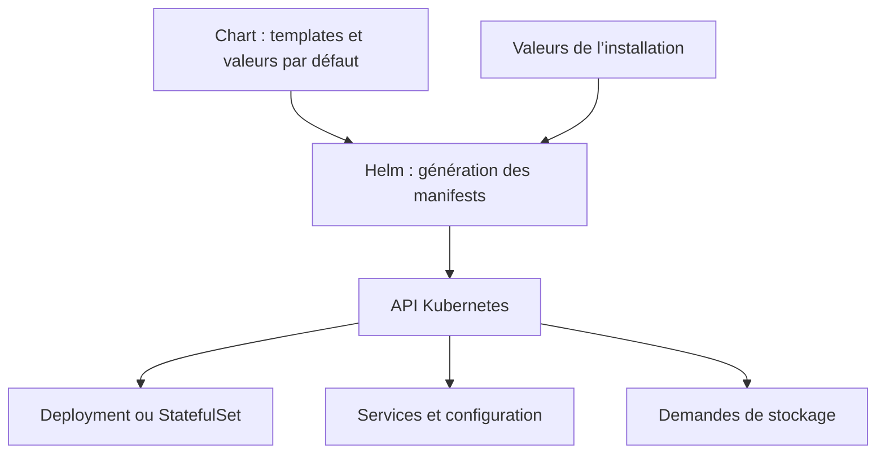
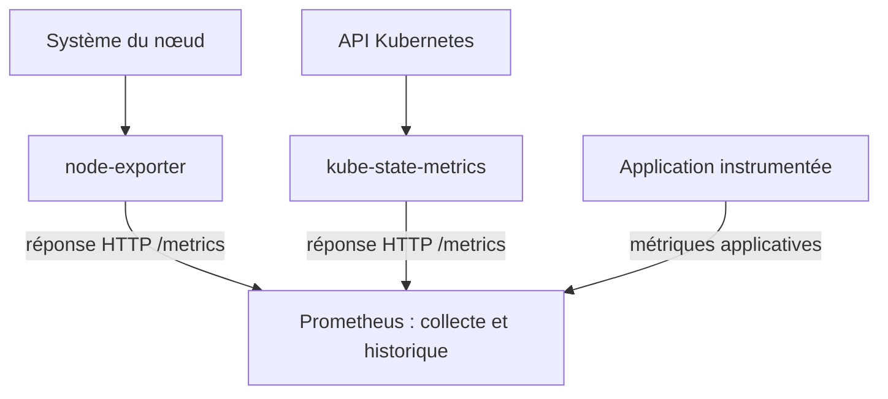
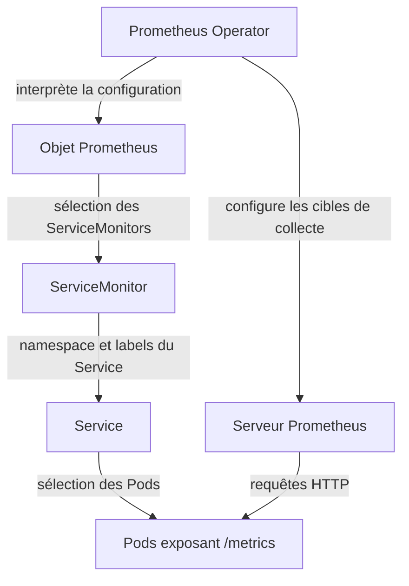
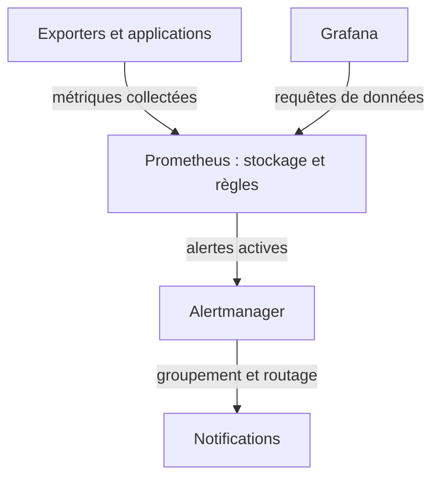
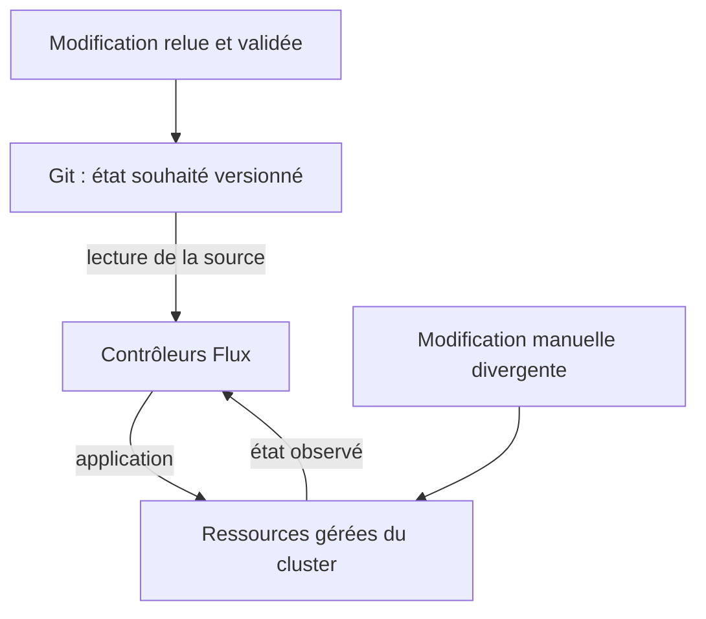
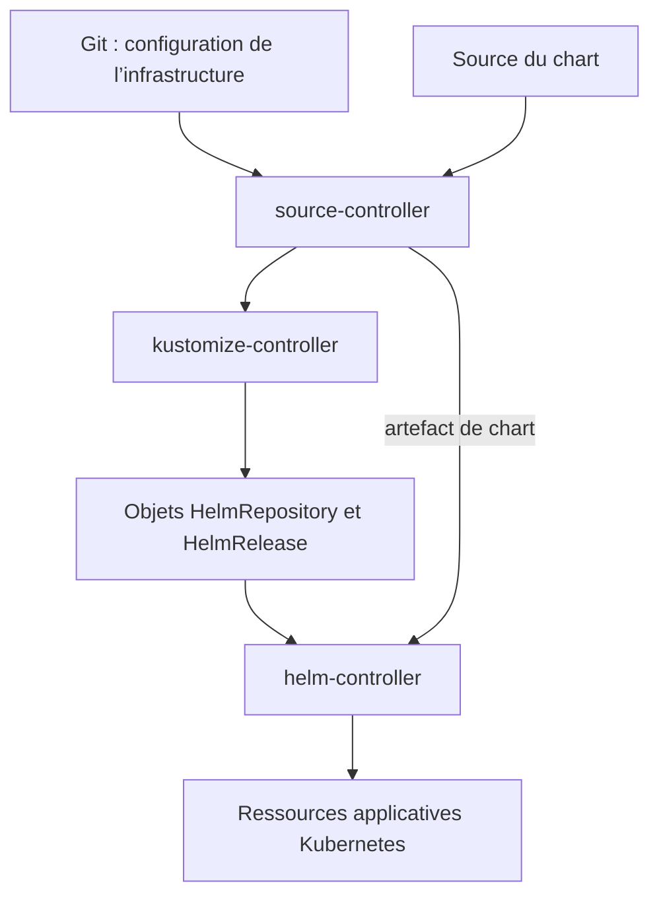

# CM5 — Déployer, superviser et maintenir les applications Kubernetes

---

## Helm, Prometheus et GitOps avec Flux

Ce cours prépare les **TD8 et TD9**. Il prolonge le CM3, consacré au cycle de vie, aux
sondes et aux ressources, et le CM4, consacré au stockage et aux applications avec état.

Une application opérationnelle nécessite plusieurs objets : Deployments ou StatefulSets,
Services, volumes, configuration et éventuellement Ingress. Son exploitation exige aussi
de comprendre ce qui se passe après l’installation : comportement réel, incidents, mises
à jour et cohérence des configurations.

Le fil conducteur du CM5 est donc : **installer une application complète, observer son
fonctionnement, puis maintenir son état souhaité depuis Git**.

---

### Objectifs d’apprentissage

À la fin du cours, vous devez pouvoir :

- distinguer un chart Helm, une release, une révision et les objets Kubernetes générés ;

- expliquer l’origine d’une métrique et son parcours jusqu’à un tableau de bord ;

- distinguer exporter, Operator, CRD, ServiceMonitor et PrometheusRule ;

- différencier collecte, calcul, alerte et notification ;

- expliquer la réconciliation GitOps et le rôle de Flux ;

- lire les objets GitRepository, Kustomization, HelmRepository et HelmRelease ;

- vérifier un déploiement sans confondre « configuration appliquée » et « application opérationnelle ».

---

### Organisation

| Bloc | Question centrale | Application en TD |
| --- | --- | --- |
| 1. Helm | Comment gérer un ensemble de manifests comme une application ? | TD8 : WordPress et MariaDB |
| 2. Métriques | Qui produit les données et qui les collecte ? | TD8 : observation du cluster |
| 3. Prometheus Operator | Comment configurer collecte, calculs et alertes dans Kubernetes ? | TD8 : kube-prometheus-stack |
| 4. GitOps | Comment conserver et faire appliquer l’état souhaité depuis Git ? | TD9 : organisation des dépôts |

---

### Organisation — suite

| Bloc | Question centrale | Application en TD |
| --- | --- | --- |
| 5. Flux | Comment synchroniser des manifests et des releases Helm ? | TD9 : Traefik, Prometheus et OwnCloud |

Les blocs 1 à 3 peuvent être étudiés avant le TD8 ; les blocs 4 et 5 avant le TD9.

---

## Bloc 1 — Helm : gérer une application composée de plusieurs ressources

### 1.1 Pourquoi un gestionnaire de packages ?

Déployer WordPress ne consiste pas seulement à démarrer un conteneur. Il faut une base
de données, des identifiants, des Services et du stockage ; les paramètres varient selon
l’environnement. Maintenir séparément tous ces manifests rend les installations
répétitives et les mises à jour difficiles à suivre.

**Helm** regroupe les descriptions de ressources et leur paramétrage dans un package
appelé **chart**. À partir d’un chart et de valeurs, il génère les manifests, les
transmet à l’API Kubernetes et suit une installation appelée **release**.

Helm ne remplace ni le scheduler ni le kubelet : une fois les objets créés, les
contrôleurs Kubernetes continuent à gérer les Pods et leur exécution.

---

### 1.2 Chart, release et révision

| Terme | Définition | Exemple |
| --- | --- | --- |
| Chart | Package contenant métadonnées, valeurs par défaut, templates et éventuellement dépendances. | Le chart WordPress |
| Dépôt de charts | Source permettant de rechercher ou télécharger des charts. | Dépôt HTTP configuré par `helm repo add` |
| Release | Installation nommée d’un chart, avec une configuration, dans un namespace. | `wordpress-compta` dans `intranet` |

---

### 1.2 Chart, release et révision — suite

| Terme | Définition | Exemple |
| --- | --- | --- |
| Révision | Version de l’historique d’une release après une opération Helm. | Révisions 1, 2, 3 |
| Version du chart | Version du package Helm. | Champ `version` de Chart.yaml |
| Version applicative | Information sur la version de l’application ; les images effectivement utilisées dépendent des templates et des valeurs. | Champ `appVersion`, tags des images |

Un même chart peut produire plusieurs releases. Deux installations de WordPress peuvent
partager le même chart tout en utilisant des noms, domaines et paramètres différents.

---

### 1.2 Chart, release et révision — suite

**Une release n’est pas un Deployment.** Elle peut regrouper plusieurs types d’objets.
Son nom doit être unique dans son namespace ; deux namespaces peuvent contenir des
releases de même nom.

---

### 1.3 Structure d’un chart

Les fichiers courants sont :

| Élément | Rôle |
| --- | --- |
| `Chart.yaml` | Métadonnées du chart, version et dépendances déclarées. |
| `values.yaml` | Valeurs par défaut. |
| `templates/` | Modèles utilisés pour produire les manifests. |
| `charts/` | Dépendances embarquées. |
| `values.schema.json` | Schéma facultatif de validation des valeurs. |

---

### 1.3 Structure d’un chart — suite

Un template peut contenir `{{ .Values.replicaCount }}`. Cette expression est interprétée
par le moteur de templates Helm avant l’envoi du manifest à Kubernetes.

À distinguer de la syntaxe YAML ordinaire : `{ claimName: pvc-mailpit }` est simplement
une écriture compacte d’une association clé/valeur ; elle ne réalise pas une
substitution Helm.

---

### 1.3 Structure d’un chart — schéma



---

### 1.4 Fournir des valeurs

Les paramètres sont propres à chaque chart. Un champ placé dans un fichier de valeurs
n’a un effet que si le chart le prend en compte.

Exemple de fichier `values-compta.yaml`, à comparer aux valeurs de la version du chart
choisie :

```yaml
service:
  type: ClusterIP
persistence:
  enabled: true
```

```bash
helm show values bitnami/wordpress
helm template wordpress-compta bitnami/wordpress \
  --namespace intranet -f values-compta.yaml
helm upgrade --install wordpress-compta bitnami/wordpress \
  --namespace intranet --create-namespace -f values-compta.yaml
```

---

### 1.4 Fournir des valeurs — suite

`-f` charge un fichier de valeurs ; `--set` fournit des surcharges en ligne. En cas de
superposition, les surcharges les plus prioritaires remplacent les valeurs
correspondantes. Pour une configuration durable et lisible, préférer un fichier
versionné et des versions de charts explicitement choisies.

**Un fichier de valeurs n’est pas un manifest Kubernetes.** Son contenu, par exemple
`grafana.persistence.enabled`, est interprété par le chart, pas directement par l’API
Kubernetes.

---

### 1.5 Générer ou installer : deux opérations différentes

`helm template` produit du YAML sans effectuer une installation Helm dans le cluster. On
peut lire ces manifests pour comprendre ce que le chart génère.

Si l’on transmet ensuite ce YAML à `kubectl apply`, les ressources sont appliquées, mais
cela ne crée pas le suivi d’une release par Helm. Il n’existe donc pas automatiquement
d’historique Helm pour cette installation.

L’installation et la mise à jour par Helm créent, elles, un historique de release. Avec
Helm 3, les métadonnées de release sont généralement stockées dans des Secrets du
namespace concerné ; ce sont des révisions de la release, pas nécessairement des
versions différentes du chart.

---

### 1.6 Cycle de gestion

| Commande | But |
| --- | --- |
| `helm install` | Créer une release. |
| `helm upgrade` | Mettre à jour une release existante. |
| `helm upgrade --install` | Mettre à jour ou installer si la release n’existe pas. |
| `helm list -A` | Lister les releases des namespaces. |
| `helm get values` | Voir les valeurs fournies par l’utilisateur. |
| `helm get values --all` | Voir les valeurs calculées, incluant les valeurs par défaut. |

---

### 1.6 Cycle de gestion — suite

| Commande | But |
| --- | --- |
| `helm get manifest` | Voir les manifests enregistrés pour une release. |
| `helm history` | Consulter les révisions. |
| `helm rollback` | Revenir à la configuration d’une révision antérieure. |
| `helm uninstall` | Désinstaller une release. |

Le namespace reste indispensable dans les commandes de gestion : une release située dans
`intranet` ne sera pas trouvée si l’on recherche seulement dans `default`.

---

### 1.7 Ce qu’un rollback ne restaure pas

Un rollback Helm agit sur la configuration et les ressources de la release. Il ne
restaure pas automatiquement les fichiers d’un volume ni le contenu de MariaDB. Une
migration de base déjà exécutée peut nécessiter une procédure applicative de retour
arrière.

De même, désinstaller une release ne signifie pas que toutes les données et toutes les
CRD sont supprimées. Le résultat dépend des ressources, de leurs politiques de
conservation et du chart. Relier ces opérations aux notions `Retain` et `Delete` du CM4.

**À retenir :** Helm organise le packaging et l’historique d’une installation. La
persistance des données et la disponibilité de l’application restent des questions
distinctes.

---

## Bloc 2 — Comprendre l’origine et la collecte des métriques

### 2.1 Santé et observation

Une readiness probe répond à une question opérationnelle : « peut-on envoyer du trafic à
ce conteneur ? ». Elle ne fournit pas l’historique de ses performances. Une métrique
permet, par exemple, d’observer l’évolution du nombre de requêtes ou de la mémoire
consommée.

---

### 2.1 Santé et observation — suite

| Information | Exemple | Utilité |
| --- | --- | --- |
| Sonde de santé | Réponse de `/ready` | Admission du trafic ou décision de redémarrage. |
| Métrique | Mémoire utilisée, durée des requêtes | Suivre des valeurs numériques dans le temps. |
| Log | Message d’erreur d’une requête | Comprendre un fait détaillé dans l’application. |
| Événement Kubernetes | `FailedScheduling` | Comprendre une action ou un problème rencontré par Kubernetes. |

Prometheus traite des métriques ; il n’est pas, à lui seul, un collecteur de tous les
logs et événements Kubernetes.

---

### 2.2 Une métrique et une série temporelle

Exemple de mesure exposée par une application :

```text
http_requests_total{method="GET",code="200"} 1520
http_requests_total{method="GET",code="500"} 12
```

Le nom identifie la grandeur mesurée. Les **labels** distinguent les variantes : méthode
HTTP, code de réponse, instance, etc. Chaque combinaison de nom et de labels définit une
série ; Prometheus conserve ses échantillons avec leur date de collecte.

---

### 2.2 Une métrique et une série temporelle — suite

| Type | Comportement | Exemple |
| --- | --- | --- |
| Counter, compteur | Augmente, sauf remise à zéro, notamment lors d’un redémarrage. | Nombre de requêtes traitées. |
| Gauge, jauge | Peut augmenter ou diminuer. | Mémoire utilisée, nombre de connexions actives. |
| Histogramme | Décrit une distribution de mesures. | Durée des requêtes. |

Un compteur de 1 520 requêtes ne signifie pas 1 520 requêtes par seconde. Pour obtenir
un débit, on calcule sa variation dans le temps, par exemple avec `rate`.

---

### 2.3 Qui produit les métriques ?

Une application instrumentée peut produire directement ses métriques. Sinon, un
**exporter** lit les informations du système surveillé et les expose dans un format
compris par Prometheus.

---

### 2.3 Qui produit les métriques ? — suite

| Source | Informations produites | Ce qu’il ne faut pas lui attribuer |
| --- | --- | --- |
| node-exporter | Statistiques du système du nœud : CPU, mémoire, systèmes de fichiers, réseau. | L’état des Deployments ou la logique métier de l’application. |
| kube-state-metrics | État des objets lu depuis l’API : réplicas demandés, conditions des Pods, informations sur les PVC. | La mesure directe du CPU consommé par les processus. |
| Kubelet et métriques cAdvisor | Informations de ressources des conteneurs et métriques du kubelet, selon les endpoints disponibles. | Les métriques métier non instrumentées. |

---

### 2.3 Qui produit les métriques ? — suite

| Source | Informations produites | Ce qu’il ne faut pas lui attribuer |
| --- | --- | --- |
| Application ou exporter spécialisé | Nombre de requêtes, latences, informations propres à une base de données, etc. | Une connaissance automatique de toute application. |
| metrics-server | Métriques récentes CPU/mémoire mises à disposition par l’API de métriques de ressources. | Une base historique générale de supervision. |

**metrics-server** sert notamment à `kubectl top` et à l’autoscaling basé sur les
métriques de ressources. Il n’est pas la source de `node_cpu_seconds_total` dans le TD8
: cette métrique vient de node-exporter.

---

### 2.3 Qui produit les métriques ? — suite

node-exporter est généralement déployé par DaemonSet pour observer chaque nœud éligible.
Dans Minikube avec le driver Docker, le nœud Kubernetes n’est pas le système macOS ou
Windows lui-même : interpréter les mesures dans le contexte du nœud Linux surveillé.

---

### 2.4 Le chemin `/metrics`

`/metrics` est un **chemin HTTP**, pas un répertoire du système. L’exporter ou
l’application génère une réponse à une URL telle que `http://cible:9100/metrics`.

Le nom du chemin est configurable. Il faut un programme qui expose cette route ;
déclarer un ServiceMonitor ne crée pas cet endpoint dans l’application.

Prometheus vient récupérer les valeurs à intervalle régulier : c’est le modèle **pull**,
et cette opération s’appelle un **scrape**.

---

### 2.4 Le chemin `/metrics` — schéma



---

### 2.4 Le chemin `/metrics` — suite

Les flèches indiquent ici la circulation des données. Les requêtes de collecte sont
initiées par Prometheus.

---

### 2.5 Découverte et état des cibles

Une **target** est une cible de collecte. Dans Kubernetes, les adresses changent lorsque
des Pods sont remplacés ; Prometheus doit mettre à jour la liste des cibles à partir des
mécanismes de découverte configurés.

La page **Targets** permet de vérifier la dernière collecte. La métrique `up` vaut 1 si
le scrape a réussi et 0 s’il a échoué. Un scrape réussi ne prouve pas que toutes les
fonctionnalités de l’application sont disponibles.

Dans le TD8, consulter `/metrics` sur le serveur Prometheus montre ses **propres
métriques internes**. Pour interroger les séries collectées auprès des autres
composants, utiliser l’interface de requête ou l’API de Prometheus.

**À retenir :** la donnée est produite par une source, exposée par HTTP, puis collectée
et conservée par Prometheus. Il faut identifier la source avant d’interpréter la mesure.

---

## Bloc 3 — Prometheus Operator : configurer la supervision dans Kubernetes

### 3.1 Helm, exporter et Operator

Ces trois rôles répondent à des besoins différents :

| Composant | Responsabilité |
| --- | --- |
| Helm | Installer et mettre à jour un package d’objets. |
| Exporter | Produire ou traduire des métriques et les exposer. |
| Operator | Observer des objets de configuration et réconcilier le système qu’il gère. |

---

### 3.1 Helm, exporter et Operator — suite

Un **Operator** est un contrôleur spécialisé. Prometheus Operator automatise la gestion
d’instances et de configurations de l’écosystème Prometheus. Helm peut installer cet
Operator, qui continue ensuite à agir dans le cluster.

Le chart **kube-prometheus-stack** assemble notamment l’Operator, Prometheus,
Alertmanager, Grafana et des sources de métriques. Les composants exacts et leurs
options dépendent de la version et des valeurs retenues.

---

### 3.2 Étendre l’API : CRD et ressources personnalisées

Kubernetes connaît nativement des types comme Deployment, Service et PersistentVolume.
Une **CustomResourceDefinition**, ou **CRD**, ajoute un nouveau type à son API, avec sa
structure et ses règles de validation.

---

### 3.2 Étendre l’API : CRD et ressources personnalisées — suite

| Type | Origine | Fonction |
| --- | --- | --- |
| Deployment | Kubernetes | Gérer des réplicas applicatifs interchangeables. |
| Prometheus | Extension de Prometheus Operator | Déclarer une instance Prometheus. |
| ServiceMonitor | Extension de Prometheus Operator | Décrire la collecte de cibles découvertes via des Services. |
| PrometheusRule | Extension de Prometheus Operator | Déclarer des règles d’enregistrement ou d’alerte. |

---

### 3.2 Étendre l’API : CRD et ressources personnalisées — suite

La CRD définit le **type** ; un manifest `kind: PrometheusRule` crée une **instance** de
ce type. La présence de la CRD ne suffit pas à exécuter le comportement : le contrôleur
spécialisé doit aussi fonctionner.

Prometheus n’est pas le seul outil de supervision utilisable avec Kubernetes. Ces types
viennent de son extension ; ils ne constituent pas une obligation pour toutes les
solutions. Prometheus peut également fonctionner avec ses fichiers de configuration,
sans Operator.

---

### 3.3 Lecture d’un ServiceMonitor

Exemple pédagogique complet, supposant que la CRD est installée et qu’une instance
Prometheus sélectionne cet objet :

---

### 3.3 Lecture d’un ServiceMonitor — suite

```yaml
apiVersion: monitoring.coreos.com/v1
kind: ServiceMonitor
metadata:
  name: api-demo
  namespace: monitoring
  labels:
    release: prometheus
spec:
  namespaceSelector:
    matchNames:
      - applications
  selector:
    matchLabels:
      app: api-demo
  endpoints:
    - port: http-metrics
      path: /metrics
      interval: 30s
```

---

### 3.3 Lecture d’un ServiceMonitor — suite

| Champ | Lecture |
| --- | --- |
| `metadata.namespace` | Namespace où réside le ServiceMonitor. |
| `metadata.labels` | Labels permettant notamment sa sélection par la configuration Prometheus. |
| `spec.namespaceSelector` | Namespaces où rechercher les Services à surveiller. |
| `spec.selector` | Labels des **Services** à sélectionner. |
| `endpoints.port` | **Nom d’un port du Service**, pas directement un numéro de port. |
| `endpoints.path` | Chemin HTTP à interroger. |
| `endpoints.interval` | Fréquence de collecte demandée. |

---

### 3.3 Lecture d’un ServiceMonitor — suite

Le Service sélectionné pourrait définir un port ainsi :

```yaml
apiVersion: v1
kind: Service
metadata:
  name: api-demo
  namespace: applications
  labels:
    app: api-demo
spec:
  selector:
    app: api-demo
  ports:
    - name: http-metrics
      port: 8080
      targetPort: 8080
```

---

### 3.3 Lecture d’un ServiceMonitor — suite

Il existe **plusieurs sélections successives** : Prometheus sélectionne les
ServiceMonitors ; ceux-ci sélectionnent des Services ; les Services identifient les Pods
cibles. Les labels et permissions doivent être cohérents à chaque niveau. Le label
`release: prometheus` n’est pas universel : vérifier les sélecteurs de l’installation
utilisée.

---

### 3.3 Lecture d’un ServiceMonitor — schéma



---

### 3.4 Lire une expression PromQL

PromQL interroge les séries conservées dans Prometheus. Ce langage n’est ni du YAML ni
une commande Kubernetes ; une expression peut toutefois être placée dans un champ YAML.

```promql
up{job="node-exporter"}
```

Cette expression sélectionne les séries `up` dont le label `job` vaut `node-exporter`.
La valeur réelle du label dépend de la configuration de collecte.

```promql
sum by (job) (up)
```

Comme `up` vaut 0 ou 1, cette somme compte les cibles dont la collecte a réussi, par
job. Elle ne compte pas toutes les applications réellement fonctionnelles.

Pour une application exposant le compteur illustratif `http_requests_total` :

```promql
sum(rate(http_requests_total[5m]))
```

---

### 3.4 Lire une expression PromQL — suite

On calcule un débit moyen de requêtes par seconde sur cinq minutes, puis on agrège les
séries. La fenêtre n’est pas une fréquence de collecte.

---

### 3.5 Règle d’enregistrement et règle d’alerte

Une **recording rule** précalcule une expression et conserve son résultat sous un
nouveau nom. Une **alerting rule** évalue une condition susceptible de déclencher une
alerte.

---

### 3.5 Règle d’enregistrement et règle d’alerte — manifest (1/2)

**Fragments d’un même manifest : à réunir dans cet ordre.**

<!-- yaml-fragment: cm5-1 1/2 -->
```yaml
apiVersion: monitoring.coreos.com/v1
kind: PrometheusRule
metadata:
  name: regles-demo
  namespace: monitoring
  labels:
    release: prometheus
spec:
  groups:
    - name: demo.rules
      rules:
        - record: job:up:sum
          expr: sum by (job) (up)
        - alert: CollecteImpossible
          expr: up == 0
          for: 5m
```

---

### 3.5 Règle d’enregistrement et règle d’alerte — manifest (2/2)

**Fragments d’un même manifest : à réunir dans cet ordre.**

<!-- yaml-fragment: cm5-1 2/2 -->
```yaml
          labels:
            severity: warning
          annotations:
            summary: Une cible de collecte ne répond plus depuis cinq minutes.
```

---

### 3.5 Règle d’enregistrement et règle d’alerte — suite

`spec.groups[].rules` désigne une liste de règles dans chaque groupe de la
spécification. Les crochets expriment une liste dans cette notation ; ils ne sont pas
écrits dans les clés du YAML.

---

### 3.5 Règle d’enregistrement et règle d’alerte — suite

| Champ | Fonction |
| --- | --- |
| `expr` | Expression à évaluer. |
| `record` | Nom de la série calculée à enregistrer. |
| `alert` | Nom de l’alerte. |
| `for` | Durée pendant laquelle la condition doit rester active avant que l’alerte passe en déclenchement. |
| `labels` | Informations de classification et de routage. |
| `annotations` | Description destinée au diagnostic. |

---

### 3.5 Règle d’enregistrement et règle d’alerte — suite

Pour une règle avec `for`, on distingue notamment **inactive**, **pending** et
**firing**. Une condition momentanée ne suffit pas à déclencher cette alerte. Prometheus
doit aussi sélectionner la ressource PrometheusRule pour en charger les règles.

---

### 3.6 Exemple du TD8 : compter les CPU logiques

Le TD utilise une règle de la forme suivante :

```yaml
- record: node:node_num_cpu:sum
  expr: |
    count by (node) (sum by (node, cpu) (
      node_cpu_seconds_total{job="node-exporter"}
    * on (namespace, pod) group_left(node)
      node_namespace_pod:kube_pod_info:
    ))
```

Cet extrait est une **entrée de la liste des règles**, pas un manifest Kubernetes
complet. Son fonctionnement suppose que les métriques, labels et règles intermédiaires
existent dans la stack installée.

1. node-exporter expose les temps CPU cumulés par CPU logique et par mode, dans `node_cpu_seconds_total`.

---

### 3.6 Exemple du TD8 : compter les CPU logiques — suite

2. La série intermédiaire `node_namespace_pod:kube_pod_info:` apporte l’association entre namespace, Pod et nœud. Elle est construite à partir des informations de kube-state-metrics, selon les règles installées.

3. La jointure sur `(namespace, pod)` ajoute le label `node` aux séries CPU.

4. `sum by (node, cpu)` regroupe les différents modes de chaque CPU logique.

5. `count by (node)` compte les CPU logiques observés pour chaque nœud.

Pour un nœud avec deux CPU logiques, le résultat peut être :

```text
node:node_num_cpu:sum{node="minikube"} 2
```

---

### 3.6 Exemple du TD8 : compter les CPU logiques — suite

Cette expression compte des CPU ; elle ne calcule pas leur taux d’utilisation. Une
absence de résultat peut venir d’une collecte absente ou de labels incompatibles, et ne
prouve pas que le nœud possède zéro CPU.

---

### 3.7 Du calcul à la notification

Prometheus évalue les règles et transmet les alertes actives à **Alertmanager**. Ce
dernier les groupe, les déduplique, applique des règles de routage et des silences, puis
envoie les notifications aux destinataires configurés.

**Grafana** interroge Prometheus comme source de données pour afficher des tableaux de
bord. Dans la chaîne étudiée ici, Grafana ne produit pas les statistiques du nœud et
Alertmanager ne réalise pas le scrape des exporters.

---

### 3.7 Du calcul à la notification — schéma



---

### 3.7 Du calcul à la notification — suite

Un dashboard vide peut indiquer une mauvaise source de données ou une métrique absente.
Une notification absente peut venir de la règle, de sa durée `for`, du routage ou d’un
silence : diagnostiquer l’étape concernée.

---

### 3.8 Exploiter la stack de monitoring

Le stockage de Prometheus contient l’historique des mesures. Prévoir sa persistance
lorsqu’on veut conserver cet historique après le remplacement d’un Pod ; ne pas déduire
qu’un PVC existe simplement parce que le chart a été installé.

Les PriorityClasses du CM3 peuvent favoriser le placement des agents de monitoring.
Elles ne remplacent ni le dimensionnement CPU/mémoire ni le stockage et ne garantissent
pas la disponibilité de la supervision.

**À retenir :** collecte, stockage, calcul, alerte, notification et visualisation sont
des responsabilités différentes. Les objets ajoutés par l’Operator permettent de les
configurer via l’API Kubernetes.

---

## Bloc 4 — GitOps : faire de Git la référence de l’état souhaité

### 4.1 Limites des modifications manuelles

Une succession de `kubectl apply`, `helm upgrade` et modifications interactives peut
faire fonctionner une application sans fournir une description partagée et vérifiable de
sa configuration. Il devient difficile de déterminer qui a modifié un paramètre ou de
reproduire le cluster.

Git permet de versionner les manifests et les valeurs, de comparer les changements et de
les relire avant application. **GitOps** ajoute un mécanisme automatique de
réconciliation entre l’état déclaré dans les sources et les ressources gérées dans le
cluster.

---

### 4.2 État souhaité et dérive

Git décrit, par exemple, trois réplicas de l’API. Une modification manuelle à un replica
constitue une **dérive** si elle contredit cette référence. Un contrôleur GitOps peut
réappliquer la configuration souhaitée pour les ressources qu’il gère, selon ses règles
de propriété et de réconciliation.

La réconciliation n’est pas une remise à zéro permanente de tout le cluster : seuls les
objets et champs pris en charge sont concernés. Certains champs, comme le nombre de
réplicas piloté par un HPA, demandent une définition claire des responsabilités.

---

### 4.2 État souhaité et dérive — schéma



---

### 4.3 GitOps et intégration continue

| Mécanisme | Rôle typique |
| --- | --- |
| CI | Tester le code, construire une image et la publier dans un registre. |
| Déploiement par pipeline | La pipeline transmet les changements au cluster avec ses accès. |
| GitOps avec Flux | Des contrôleurs du cluster lisent les sources déclarées et appliquent les changements. |

Ces mécanismes peuvent se compléter. Construire une nouvelle image ne change pas
automatiquement le manifest déployé : la référence d’image doit être mise à jour,
manuellement ou par un mécanisme d’automatisation distinct.

---

### 4.4 Pourquoi deux dépôts dans le TD9 ?

| Dépôt | Contenu et responsabilité |
| --- | --- |
| `cluster` | Bootstrap Flux, point d’entrée du cluster, infrastructure Traefik et Prometheus, déclaration du dépôt apps. |
| `apps` | Configuration de l’application OwnCloud et de ses dépendances. |

Cette séparation facilite la distinction entre gestion de la plateforme et livraison
applicative. Elle n’est pas imposée par Flux : un dépôt unique ou une autre organisation
peuvent aussi convenir.

Le dépôt cluster indique à Flux **quel dépôt applicatif suivre**. Le dépôt apps indique
**quelle application déployer**. La configuration d’infrastructure reste distincte de la
configuration propre à OwnCloud.

---

### 4.5 Le bootstrap

Il faut d’abord installer les contrôleurs et leur donner une source à lire. Le
**bootstrap** de Flux initialise cette relation : il installe les composants
nécessaires, écrit leur configuration dans Git et établit leur synchronisation.

Le bootstrap est une opération initiale ; les modifications courantes sont ensuite
livrées par Git. Le client `flux` sert notamment à initialiser, inspecter et accélérer
certaines synchronisations. Les contrôleurs continuent leur travail quand le terminal
est fermé.

---

### 4.6 Accès Git et secrets

Dans le TD9, le token de bootstrap dispose des droits nécessaires à l’initialisation du
dépôt cluster. L’accès de lecture du dépôt apps répond à un besoin différent. Les
identifiants sont fournis aux contrôleurs par des Secrets Kubernetes ou d’autres
mécanismes adaptés.

Un `.gitignore` évite certains ajouts accidentels, mais ne protège pas un secret déjà
commité. Ne pas versionner les tokens en clair ; pour des secrets déclaratifs, utiliser
un mécanisme adapté, par exemple un chiffrement avec SOPS ou un gestionnaire externe.

**À retenir :** GitOps maintient une référence versionnée et un mécanisme d’application
continu. Le simple fait de conserver des YAML dans Git ne suffit pas à assurer cette
synchronisation.

---

## Bloc 5 — Flux : synchroniser des manifests et piloter Helm depuis Git

### 5.1 Des contrôleurs spécialisés

| Contrôleur | Responsabilité dans le scénario du TD |
| --- | --- |
| source-controller | Récupérer les sources Git et les sources de charts et produire les artefacts nécessaires. |
| kustomize-controller | Construire et appliquer les manifests décrits par les Kustomizations Flux. |
| helm-controller | Réconcilier les releases Helm déclarées par les HelmRelease. |
| notification-controller | Gérer les intégrations de notification et les réceptions d’événements configurées. |

---

### 5.1 Des contrôleurs spécialisés — suite

Ces composants utilisent eux aussi des CRD. Les objets Flux déclarent des intentions ;
leurs contrôleurs exécutent les opérations correspondantes.

---

### 5.2 GitRepository : déclarer la source

Exemple pédagogique : l’URL doit être remplacée par celle du dépôt apps ; le Secret
d’accès doit déjà exister dans `flux-system`.

```yaml
apiVersion: source.toolkit.fluxcd.io/v1
kind: GitRepository
metadata:
  name: apps
  namespace: flux-system
spec:
  interval: 1m
  url: https://git.example.invalid/groupe/apps.git
  ref:
    branch: main
  secretRef:
    name: apps-repo-auth
```

---

### 5.2 GitRepository : déclarer la source — suite

Cet objet demande à Flux de récupérer la branche `main`. Il ne précise pas encore quels
manifests appliquer. `interval` définit un rythme de vérification ; un `git push` ne
signifie pas une application instantanée.

---

### 5.3 Deux objets nommés Kustomization : une distinction essentielle

| Élément | API | Rôle |
| --- | --- | --- |
| Fichier `kustomization.yaml` de Kustomize | `kustomize.config.k8s.io/v1beta1` | Décrire l’assemblage ou la transformation des manifests. Ce fichier est une entrée de construction, pas un objet à créer tel quel dans l’API du cluster. |
| Objet Kustomization de Flux | `kustomize.toolkit.fluxcd.io/v1` | Déclarer une synchronisation : source, répertoire, fréquence, suppression et contrôles. |

Exemple du **fichier Kustomize** dans le dépôt apps :

---

### 5.3 Deux objets nommés Kustomization : une distinction essentielle — suite

```yaml
apiVersion: kustomize.config.k8s.io/v1beta1
kind: Kustomization
resources:
  - ./owncloud
```

Il inclut le dossier `owncloud`, qui doit contenir sa propre configuration Kustomize et
les manifests référencés. On peut vérifier le résultat localement :

```bash
kubectl kustomize apps
```

Exemple de l’**objet Flux**, déclaré dans le dépôt cluster :

---

### 5.3 Deux objets nommés Kustomization : une distinction essentielle — suite

```yaml
apiVersion: kustomize.toolkit.fluxcd.io/v1
kind: Kustomization
metadata:
  name: apps
  namespace: flux-system
spec:
  interval: 1m
  path: ./apps
  prune: true
  sourceRef:
    kind: GitRepository
    name: apps
```

---

### 5.3 Deux objets nommés Kustomization : une distinction essentielle — suite

Flux lit le répertoire `apps` de la source Git indiquée, construit les manifests puis
les applique. `prune: true` autorise la suppression des ressources précédemment gérées
qui sont retirées de cette configuration. Ce n’est pas la suppression de toutes les
ressources du namespace.

Un dossier vide n’existe pas dans Git. Une source Git peut être accessible alors que la
Kustomization échoue faute de chemin ou de fichiers valides.

---

### 5.4 HelmRepository et HelmRelease

Dans le TD8, l’utilisateur lance Helm. Dans le TD9, on décrit une release souhaitée dans
Git et **helm-controller** réalise les opérations Helm.

```yaml
apiVersion: source.toolkit.fluxcd.io/v1
kind: HelmRepository
metadata:
  name: prometheus-community
  namespace: monitoring
spec:
  interval: 1m
  url: https://prometheus-community.github.io/helm-charts
```

---

### 5.4 HelmRepository et HelmRelease — manifest (1/2)

**Fragments d’un même manifest : à réunir dans cet ordre.**

<!-- yaml-fragment: cm5-2 1/2 -->
```yaml
apiVersion: helm.toolkit.fluxcd.io/v2
kind: HelmRelease
metadata:
  name: prometheus
  namespace: monitoring
spec:
  interval: 1m
  releaseName: prometheus
  chart:
    spec:
      chart: kube-prometheus-stack
      sourceRef:
        kind: HelmRepository
        name: prometheus-community
        namespace: monitoring
  values:
```

---

### 5.4 HelmRepository et HelmRelease — manifest (2/2)

**Fragments d’un même manifest : à réunir dans cet ordre.**

<!-- yaml-fragment: cm5-2 2/2 -->
```yaml
    grafana:
      ingress:
        enabled: false
```

---

### 5.4 HelmRepository et HelmRelease — suite

Cet exemple suit le TD9 ; le namespace `monitoring` doit être déclaré et les CRD Flux
installées. En l’absence de contrainte `chart.spec.version`, la sélection du chart n’est
pas figée : une évolution du dépôt peut entraîner une mise à jour. Pour rendre un
exercice reproductible, fixer une version après l’avoir validée avec ses valeurs et
images.

`spec.values` contient les valeurs destinées au chart, comme le fichier passé à `helm
-f` dans le TD8. Le HelmRepository déclare la source ; le HelmRelease déclare le chart,
la release et ses paramètres. Les références inter-namespaces peuvent être restreintes
par la configuration des contrôleurs.

---

### 5.5 Des manifests aux ressources applicatives — schéma



---

### 5.5 Des manifests aux ressources applicatives — suite

Il existe plusieurs boucles : Flux synchronise les sources et configurations, Helm
installe leurs ressources, puis les contrôleurs Kubernetes maintiennent les Pods. **Flux
ne redémarre pas directement les conteneurs à la place du kubelet.**

---

### 5.6 Synchronisation et dérive

```bash
flux get sources git -A
flux get kustomizations -A
flux get helmreleases -A
```

Ces commandes montrent des états à des niveaux différents. Pendant le TD, on peut
accélérer la prise en compte des changements :

```bash
flux reconcile source git apps -n flux-system
flux reconcile kustomization apps -n flux-system
```

Une Kustomization Flux réapplique régulièrement ses ressources gérées. Pour les
ressources générées par une release Helm, la correction continue de dérive relève d’un
mécanisme distinct, activable dans le HelmRelease :

```yaml
driftDetection:
  mode: enabled
```

---

### 5.6 Synchronisation et dérive — suite

Cet extrait se place sous `spec` du HelmRelease. Ne pas supposer que toutes les
modifications manuelles d’une ressource générée par Helm sont automatiquement corrigées
sans vérifier cette configuration.

---

### 5.7 Déploiement réussi : vérifier chaque étape

| Étape | Question | Contrôle possible |
| --- | --- | --- |
| Source | Flux accède-t-il au dépôt et à la révision attendue ? | `flux get sources git -A` |
| Construction et application | Le chemin existe-t-il et les manifests sont-ils appliqués ? | `flux get kustomizations -A` |
| Chart et release | Le chart est-il récupéré et la release installée ? | `flux get helmreleases -A`, description du HelmRelease |
| Exécution | Les Pods sont-ils démarrés et prêts ? | `kubectl get pods`, `describe`, `logs` |

---

### 5.7 Déploiement réussi : vérifier chaque étape — suite

| Étape | Question | Contrôle possible |
| --- | --- | --- |
| Stockage | Les demandes sont-elles liées et les volumes utilisables ? | `kubectl get pvc` |
| Accès | Le routage et la réponse applicative fonctionnent-ils ? | Service, Ingress, requête HTTP et test fonctionnel |

Sans `wait` ou contrôles de santé appropriés, une Kustomization prête peut signifier que
les objets ont été appliqués sans que toutes les applications soient déjà
opérationnelles. Vérifier séparément les HelmRelease et les Pods. Un HelmRelease prêt ne
remplace pas non plus les tests fonctionnels.

Dans le TD9, le port-forward vers Traefik sert à l’accès navigateur. Il ne livre pas les
manifests : leur application reste réalisée par Flux.

---

### 5.8 Retour arrière et données

Un `git revert` crée un nouveau commit annulant une modification choisie. Flux peut
appliquer la configuration correspondante à sa prochaine synchronisation. La réussite
dépend aussi de la disponibilité du chart et des images référencés et de leur
compatibilité avec les données existantes.

Revenir à une ancienne configuration ne restaure pas les données d’OwnCloud ou de
MariaDB. Prévoir séparément les sauvegardes et les procédures de restauration. Avec
`prune`, retirer un objet de Git peut également provoquer sa suppression ; analyser les
conséquences sur les PVC et les volumes avant l’opération.

Le nettoyage initial du TD9 est un choix de démonstration destiné à éviter les conflits
avec les installations précédentes. Une migration vers GitOps en production ne consiste
pas systématiquement à supprimer et recréer toutes les ressources : elle nécessite de
définir la reprise de gestion et la conservation des données.

---

### 5.8 Retour arrière et données — suite

**À retenir :** la chaîne GitOps est vérifiable étape par étape. Une modification
poussée dans Git n’est pas, à elle seule, une preuve que l’application fonctionne.

---

## Synthèse du CM5

| Outil ou mécanisme | Responsabilité |
| --- | --- |
| Helm | Packager, paramétrer et gérer l’historique d’une release. |
| Exporters et instrumentation | Produire les métriques. |
| Prometheus | Collecter, conserver, interroger et évaluer les règles. |
| Prometheus Operator | Réconcilier la configuration déclarée dans ses objets personnalisés. |
| Alertmanager | Organiser et transmettre les notifications d’alerte. |

---

## Synthèse du CM5 — suite

| Outil ou mécanisme | Responsabilité |
| --- | --- |
| Grafana | Présenter les données dans des tableaux de bord. |
| Git | Versionner l’état souhaité et les changements. |
| Flux | Synchroniser les sources et réconcilier les configurations gérées. |
| Contrôleurs Kubernetes et kubelet | Maintenir les Pods et exécuter les conteneurs. |

---

### Questions de vérification

1. Un chart peut-il produire plusieurs Deployments et StatefulSets dans une seule release ?

2. Quelle différence existe entre un fichier de valeurs Helm et un manifest Kubernetes ?

3. Qui fournit `node_cpu_seconds_total` ? Pourquoi metrics-server ne remplace-t-il pas une base historique Prometheus ?

4. Pourquoi un endpoint `/metrics` doit-il exister avant de configurer sa collecte ?

5. Quelle différence existe entre `record`, `alert` et une notification ?

6. Que sélectionne le `selector` d’un ServiceMonitor ?

7. Pourquoi les deux Kustomizations du TD9 ne sont-elles pas interchangeables ?

---

### Questions de vérification — suite

8. Pourquoi une source Git prête ne suffit-elle pas à prouver la réussite du déploiement ?

9. Qui redémarre un conteneur après son crash dans une application livrée par Flux ?

10. Pourquoi un rollback de configuration ne remplace-t-il pas une restauration de sauvegarde ?

---

### Documentation de référence

Les exemples sont pédagogiques ; les noms de ressources, valeurs des charts et sources
disponibles doivent être vérifiés dans l’installation des TD. Le cours distingue les
explications de principe des prérequis d’une installation réellement testée.

- [Helm : charts](https://helm.sh/docs/topics/charts/)

- [Helm : valeurs d’une release](https://helm.sh/docs/helm/helm_get_values/)

- [Prometheus : présentation et architecture](https://prometheus.io/docs/introduction/overview/)

- [Prometheus : règles d’enregistrement et d’alerte](https://prometheus.io/docs/prometheus/latest/configuration/recording_rules/)

- [Prometheus Operator : objets et architecture](https://prometheus-operator.dev/docs/getting-started/design/)

- [node-exporter](https://github.com/prometheus/node_exporter)

- [kube-state-metrics](https://github.com/kubernetes/kube-state-metrics)

---

### Documentation de référence — suite

- [metrics-server](https://github.com/kubernetes-sigs/metrics-server)

- [Flux : Kustomizations](https://fluxcd.io/flux/components/kustomize/kustomizations/)

- [Flux : HelmReleases et détection de dérive](https://fluxcd.io/flux/components/helm/helmreleases/)
